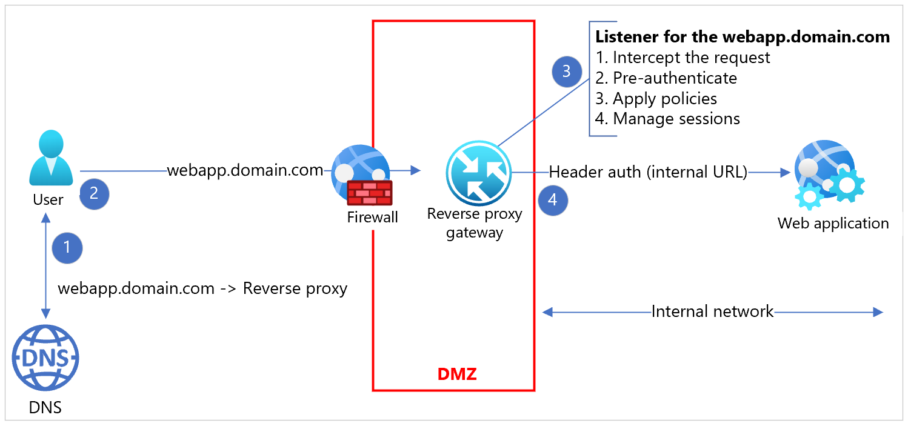
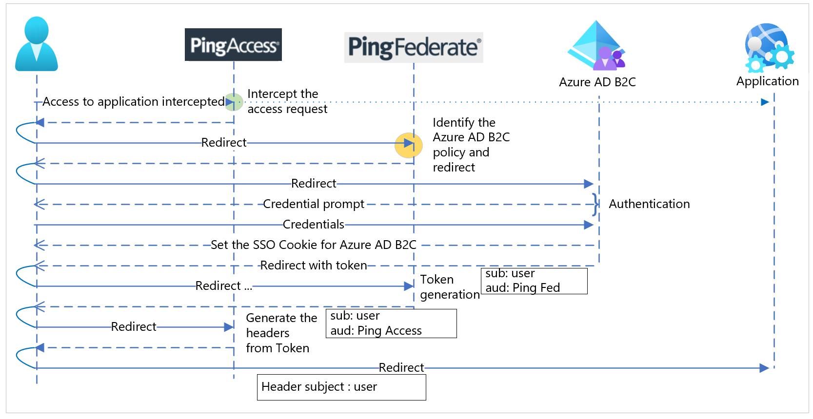
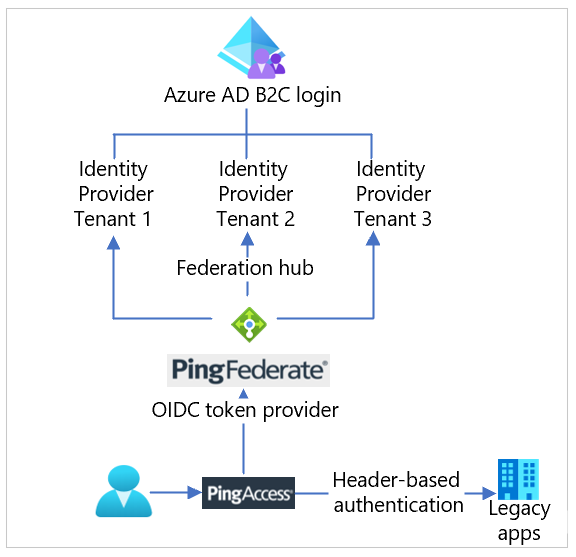

# Tutorial: Configure Ping Identity with Azure Active Directory B2C for secure hybrid access

In this sample tutorial, learn how to extend Azure Active Directory (AD) B2C with  [PingAccess](https://www.pingidentity.com/en/software/pingaccess.html#:~:text=%20Modern%20Access%20Managementfor%20the%20Digital%20Enterprise%20,consistent%20enforcement%20of%20security%20policies%20by...%20More) and [PingFederate](https://www.pingidentity.com/en/software/pingfederate.html) to enable secure hybrid access.

Many existing web properties such as eCommerce sites and web applications that are exposed to the internet are deployed behind a proxy system, sometimes referred as a reverse proxy system. These proxy systems provide various functions including pre-authentication, policy enforcement, and traffic routing. Example use cases include protecting the web application from inbound web traffic and providing a uniform session management across distributed server deployments.

In most cases, this configuration includes an authentication translation layer that externalizes the authentication from the web application. Reverse proxies in turn provide the authenticated users’ context to the web applications, in a simpler form such as a header value in clear or digest form. In such a configuration, the applications aren't using any industry standard tokens such as Security Assertion Markup Language (SAML), OAuth or Open ID Connect (OIDC), rather depend on the proxy to provide the authentication context and maintain the session with the end-user agent such as browser or the native application. As a service running in a "man-in-the-middle", proxies can provide the ultimate session control. This also means the proxy service should be highly efficient and scalable, not to become a bottleneck or a single point of failure for the applications behind the proxy service. The diagram is a depiction of a typical reverse proxy implementation and flow of the communications.

If you are in a situation where you want to modernize the identity platform in such configurations, following concerns are raised.

- How can the effort for application modernization be decoupled from the identity platform modernization?

- How can a coexistence environment be established with modern and legacy authentication, consuming from the modernized identity service provider?

  a. How to drive the end-user experience consistency?

  b. How to provide a single sign-in experience across the coexisting applications?

We discuss an approach to solve such concerns by integrating Azure AD B2C with [PingAccess](https://www.pingidentity.com/en/software/pingaccess.html#:~:text=%20Modern%20Access%20Managementfor%20the%20Digital%20Enterprise%20,consistent%20enforcement%20of%20security%20policies%20by...%20More) and [PingFederate](https://www.pingidentity.com/en/software/pingfederate.html) technologies.

## Coexistence environment

A technically viable simple solution that is also cost effective is to configure the reverse proxy system to use the modernized identity system, delegating the authentication.  
Proxies in this case will support the modern authentication protocols and use the redirect based (passive) authentication that will send user to the new Identity provider (IdP).

### Azure AD B2C as an Identity provider

Azure AD B2C has the ability to define **policies** that drives different user experiences and behaviors that are also called **user journeys** as orchestrated from the server end. Each such policy exposes a protocol endpoint that can perform the authentication as if it were an IdP. There is no special handling needed on the application side for specific policies. Application simply makes an industry standard authentication request to the protocol-specific authentication endpoint exposed by the policy of interest.  
Azure AD B2C can be configured to share the same issuer across multiple policies or unique issuer for each policy. Each application can point to one or many of these policies by making a protocol native authentication request and drive desired user behaviors such as sign-in, sign-up, and profile edits. The diagram shows OIDC and SAML application workflows.

While the scenario mentioned works well for modernized applications, it can be challenging for the legacy applications to appropriately redirect the user as the access request to the applications may not include the context for user experience. In most cases the proxy layer or an integrated agent on the web application intercepts the access request.

### PingAccess as a reverse proxy

Many customers have deployed PingAccess as the reverse proxy to play one or many roles as noted earlier in this article. PingAccess can intercept a direct request by way of being the man-in-the-middle or as a redirect that comes from an agent running on the web application server.

PingAccess can be configured with OIDC, OAuth2, or SAML to perform authentication against an upstream authentication provider. A single upstream IdP can be configured for this purpose on the PingAccess server. The following diagram shows this configuration.

In a typical Azure AD B2C deployment where multiple policies are exposing multiple **IdPs**, it poses a challenge. Since PingAccess can only be configured with a single upstream IdP.  

### PingFederate as a federation proxy

PingFederate is an enterprise identity bridge that can be fully configured as an authentication provider or a proxy for other multiple upstream IdPs if needed. The following diagram shows this capability.

This capability can be used to contextually/dynamically or declaratively switch an inbound request to a specific Azure AD B2C policy. The following is a depiction of protocol sequence flow for this configuration.

## Prerequisites

To get started, you'll need:

- An Azure subscription. If you don't have one, get a [free account](https://azure.microsoft.com/free/).

- An [Azure AD B2C tenant](./tutorial-create-tenant.md) that is linked to your Azure subscription.

- PingAccess and PingFederate deployed in Docker containers or directly on Azure VMs.

## Connectivity

Check that the following is connected.

- **PingAccess server** – Able to communicate with the PingFederate server, client browser, OIDC, OAuth well-known and keys discovery published by the Azure AD B2C service and PingFederate server.

- **PingFederate server** – Able to communicate with the PingAccess server, client browser, OIDC, OAuth well-known and keys discovery published by the Azure AD B2C service.

- **Legacy or header-based AuthN application** – Able to communicate to and from PingAccess server.

- **SAML relying party application** – Able to reach the browser traffic from the client. Able to access the SAML federation metadata published by the Azure AD B2C service.

- **Modern application** – Able to reach the browser traffic from the client. Able to access the OIDC, OAuth well-known, and keys discovery published by the Azure AD B2C service.

- **REST API** – Able to reach the traffic from a native or web client. Able to access the OIDC, OAuth well-known, and keys discovery published by the Azure AD B2C service.

## Configure Azure AD B2C

You can use the basic user flows or advanced Identity enterprise framework (IEF) policies for this purpose. PingAccess generates the metadata endpoint based on the **Issuer** value using the [WebFinger](https://tools.ietf.org/html/rfc7033) based discovery convention.
To follow this convention, update the Azure AD B2C issuer update using the policy properties in user flows.

In the advanced policies, this can be configured using the **IssuanceClaimPattern** metadata element to **AuthorityWithTfp** value in the [JWT token issuer technical profile](./jwt-issuer-technical-profile.md).

## Configure PingAccess/PingFederate

The following section covers the required configuration.
The diagram illustrates the overall user flow for the integration.

### Configure PingFederate as the token provider

To configure PingFederate as the token provider for PingAccess, ensure connectivity from PingFederate to PingAccess is established followed by connectivity from PingAccess to PingFederate.  
See [this article](https://docs.pingidentity.com/bundle/pingaccess-61/page/zgh1581446287067.html) for configuration steps.

### Configure a PingAccess application for header-based authentication

A PingAccess application must be created for the target web application for header-based authentication. Follow these steps.

#### Step 1 – Create a virtual host

>[!IMPORTANT]
>To configure for this solution, virtual host need to be created for every application. For more information regarding configuration considerations and their impacts, see [Key considerations](https://docs.pingidentity.com/bundle/pingaccess-43/page/reference/pa_c_KeyConsiderations.html).

Follow these steps to create a virtual host:

1. Go to **Settings** > **Access** > **Virtual Hosts**

2. Select **Add Virtual Host**

3. In the Host field, enter the FQDN portion of the Application URL

4. In the Port field, enter **443**

5. Select **Save**

#### Step 2 – Create a web session

Follow these steps to create a web session:

1. Navigate to **Settings** > **Access** > **Web Sessions**

2. Select **Add Web Session**

3. Provide a **Name** for the web session.

4. Select the **Cookie Type**, either **Signed JWT** or **Encrypted JWT**

5. Provide a unique value for the **Audience**

6. In the **Client ID** field, enter the **Azure AD Application ID**

7. In the **Client Secret** field, enter the **Key** you generated for the application in Azure AD.

8. Optional - You can create and use custom claims with the Microsoft Graph API. If you choose to do so, select **Advanced** and deselect the **Request Profile** and **Refresh User Attributes** options. For more information on using custom claims, see [use a custom claim](../active-directory/app-proxy/application-proxy-configure-single-sign-on-with-headers.md).

9. Select **Save**

#### Step 3 – Create identity mapping

>[!NOTE]
>Identity mapping can be used with more than one application if more than one application is expecting the same data in the header.

Follow these steps to create identity mapping:

1. Go to **Settings** > **Access** > **Identity Mappings**

2. Select **Add Identity Mapping**

3. Specify a **Name**

4. Select the identity-mapping **Type of Header Identity Mapping**

5. In the **Attribute-Mapping** table, specify the required mappings. For example,

   Attribute name | Header name |
   |-------|--------|
   |upn | x-userprinciplename |
   |email   |    x-email  |
   |oid   | x-oid  |
   |scp   |     x-scope |
   |amr    |    x-amr    |

6. Select **Save**

#### Step 4 – Create a site

>[!NOTE]
>In some configurations, it is possible that a site may contain more than one application. A site can be used with more than one application, where appropriate.

Follow these steps to create a site:

1. Go to **Main** > **Sites**

2. Select **Add Site**

3. Specify a **Name** for the site

4. Enter the site **Target**. The target is the hostname:port pair for the server hosting the application. Don't enter the path for the application in this field. For example, an application at https://mysite:9999/AppName will have a target value of mysite: 9999

5. Indicate whether or not the target is expecting secure connections.

6. If the target is expecting secure connections, set the Trusted Certificate Group to **Trust Any**.

7. Select **Save**

#### Step 5 – Create an application

Follow these steps to create an application in PingAccess for each application in Azure that you want to protect.

1. Go to **Main** > **Applications**

2. Select **Add Application**

3. Specify a **Name** for the application

4. Optionally, enter a **Description** for the application

5. Specify the **Context Root** for the application. For example, an application at https://mysite:9999/AppName will have a context root of /AppName. The context root must begin with a slash (/), must not end with a slash (/), and can be more than one layer deep, for example, /Apps/MyApp.

6. Select the **virtual host** you created

   >[!NOTE]
   >The combination of virtual host and context root must be unique in PingAccess.

7. Select the **web session** you created

8. Select the **Site** you created that contains the application

9. Select the **Identity Mapping** you created

10. Select **Enabled** to enable the site when you save

11. Select **Save**

### Configure the PingFederate authentication policy

Configure the PingFederate authentication policy to federate to the multiple IdPs provided by the Azure AD B2C tenants

1. Create a contract to bridge the attributes between the IdPs and the SP. For more information, see [Federation hub and authentication policy contracts](https://docs.pingidentity.com/bundle/pingfederate-101/page/ope1564002971971.html). You likely need only one contract unless the SP requires a different set of attributes from each IdP.

2. For each IdP, create an IdP connection between the IdP and PingFederate, the federation hub as the SP.

3. On the **Target Session Mapping** window, add the applicable authentication policy contracts to the IdP connection.

4. On the **Selectors** window, configure an authentication selector. For example, see an instance of the **Identifier First Adapter** to map each IdP to the corresponding IdP connection in an authentication policy.

5. Create an SP connection between PingFederate, the federation hub as the IdP, and the SP.

6. Add the corresponding authentication policy contract to the SP connection on the **Authentication Source Mapping** window.

7. Work with each IdP to connect to PingFederate, the federation hub as the SP.

8. Work with the SP to connect to PingFederate, the federation hub as the IdP.

## Next steps

For additional information, review the following articles

- [Custom policies in Azure AD B2C](./custom-policy-overview.md)

- [Get started with custom policies in Azure AD B2C](tutorial-create-user-flows.md?pivots=b2c-custom-policy)