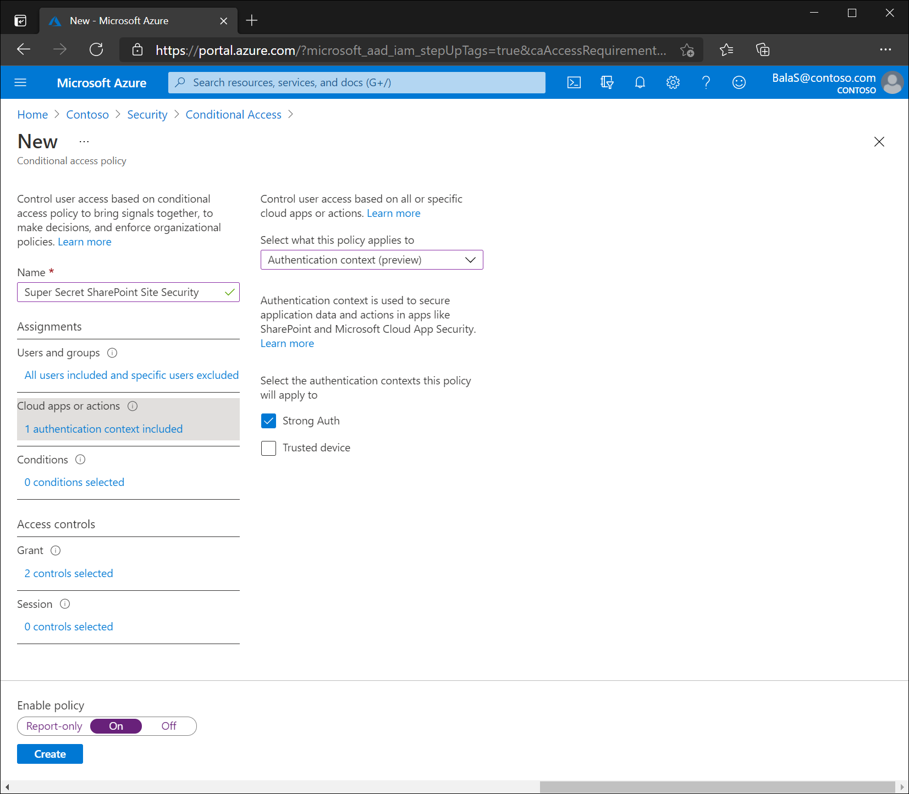
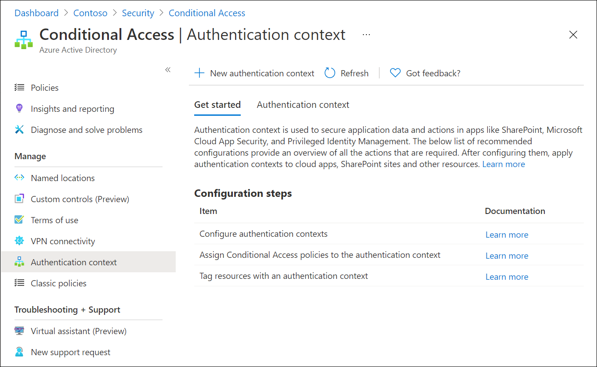

# Conditional Access: Cloud apps, actions, and authentication context

Cloud apps, actions, and authentication context are key signals in a Conditional Access policy. Conditional Access policies allow administrators to assign controls to specific applications, actions, or authentication context.

- Administrators can choose from the list of applications that include built-in Microsoft applications and any [Azure AD integrated applications](../manage-apps/what-is-application-management.md) including gallery, non-gallery, and applications published through [Application Proxy](../app-proxy/what-is-application-proxy.md).
- Administrators may choose to define policy not based on a cloud application but on a [user action](#user-actions) like **Register security information** or **Register or join devices (Preview)**, allowing Conditional Access to enforce controls around those actions.
- Administrators can use [authentication context](#authentication-context-preview) to provide an extra layer of security in applications. 

## Microsoft cloud applications

Many of the existing Microsoft cloud applications are included in the list of applications you can select from. 

Administrators can assign a Conditional Access policy to the following cloud apps from Microsoft. Some apps like Office 365 and Microsoft Azure Management include multiple related child apps or services. We continually add more apps, so the following list isn't exhaustive and is subject to change.

- [Office 365](#office-365)
- Azure Analysis Services
- Azure DevOps
- Azure Event Hubs
- Azure Service Bus
- [Azure SQL Database and Azure Synapse Analytics](../../azure-sql/database/conditional-access-configure.md)
- Dynamics CRM Online
- Microsoft Application Insights Analytics
- [Microsoft Azure Information Protection](/azure/information-protection/faqs#i-see-azure-information-protection-is-listed-as-an-available-cloud-app-for-conditional-accesshow-does-this-work)
- [Microsoft Azure Management](#microsoft-azure-management)
- Microsoft Azure Subscription Management
- Microsoft Cloud App Security
- Microsoft Commerce Tools Access Control Portal
- Microsoft Commerce Tools Authentication Service
- Microsoft Flow
- Microsoft Forms
- Microsoft Intune
- [Microsoft Intune Enrollment](/intune/enrollment/multi-factor-authentication)
- Microsoft Planner
- Microsoft PowerApps
- Microsoft Search in Bing
- Microsoft StaffHub
- Microsoft Stream
- Microsoft Teams
- Exchange Online
- SharePoint
- Yammer
- Office Delve
- Office Sway
- Outlook Groups
- Power BI Service
- Project Online
- Skype for Business Online
- Virtual Private Network (VPN)
- Windows Defender ATP

Applications that are available to Conditional Access have gone through an onboarding and validation process. This list doesn't include all Microsoft apps, as many are backend services and not meant to have policy directly applied to them. If you're looking for an application that is missing, you can contact the specific application team or make a request on [UserVoice](https://feedback.azure.com/forums/169401-azure-active-directory?category_id=167259).

### Office 365

Microsoft 365 provides cloud-based productivity and collaboration services like Exchange, SharePoint, and Microsoft Teams. Microsoft 365 cloud services are deeply integrated to ensure smooth and collaborative experiences. This integration can cause confusion when creating policies as some apps such as Microsoft Teams have dependencies on others such as SharePoint or Exchange.

The Office 365 suite makes it possible to target these services all at once. We recommend using the new Office 365 suite, instead of targeting individual cloud apps to avoid issues with [service dependencies](service-dependencies.md). 

Targeting this group of applications helps to avoid issues that may arise because of inconsistent policies and dependencies. For example: The Exchange Online app is tied to traditional Exchange Online data like mail, calendar, and contact information. Related metadata may be exposed through different resources like search. To ensure that all metadata is protected by as intended, administrators should assign policies to the Office 365 app.

Administrators can exclude specific apps from policy if they wish, including the Office 365 suite and excluding the specific apps in policy.

The following key applications are included in the Office 365 client app:

   - Microsoft Flow
   - Microsoft Forms
   - Microsoft Stream
   - Microsoft To-Do
   - Microsoft Teams
   - Exchange Online
   - SharePoint Online
   - Microsoft 365 Search Service
   - Yammer
   - Office Delve
   - Office Online
   - Office.com
   - OneDrive
   - PowerApps
   - Skype for Business Online
   - Sway

### Microsoft Azure Management

The Microsoft Azure Management application includes multiple services. 

   - Azure portal
   - Azure Resource Manager provider
   - Classic deployment model APIs
   - Azure PowerShell
   - Azure CLI
   - Visual Studio subscriptions administrator portal
   - Azure DevOps
   - Azure Data Factory portal

> [!NOTE]
> The Microsoft Azure Management application applies to Azure PowerShell, which calls the Azure Resource Manager API. It does not apply to Azure AD PowerShell, which calls Microsoft Graph.

### Other applications

Administrators can add any Azure AD registered application to Conditional Access policies. These applications may include: 

- Applications published through [Azure AD Application Proxy](../app-proxy/what-is-application-proxy.md)
- [Applications added from the gallery](../manage-apps/add-application-portal.md)
- [Custom applications not in the gallery](../manage-apps/view-applications-portal.md)
- [Legacy applications published through app delivery controllers and networks](../manage-apps/secure-hybrid-access.md)
- Applications that use [password based single sign-on](../manage-apps/configure-password-single-sign-on-non-gallery-applications.md)

> [!NOTE]
> Since Conditional Access policy sets the requirements for accessing a service you are not able to apply it to a client (public/native) application. Other words the policy is not set directly on a client (public/native) application, but is applied when a client calls a service. For example, a policy set on SharePoint service applies to the clients calling SharePoint. A policy set on Exchange applies to the attempt to access the email using Outlook client. That is why client (public/native) applications are not available for selection in the Cloud Apps picker and Conditional Access option is not available in the application settings for the client (public/native) application registered in your tenant. 

## User actions

User actions are tasks that can be performed by a user. Currently, Conditional Access supports two user actions: 

- **Register security information**: This user action allows Conditional Access policy to enforce when users who are enabled for combined registration attempt to register their security information. More information can be found in the article, [Combined security information registration](../authentication/concept-registration-mfa-sspr-combined.md).

- **Register or join devices (preview)**: This user action enables administrators to enforce Conditional Access policy when users [register](../devices/concept-azure-ad-register.md) or [join](../devices/concept-azure-ad-join.md) devices to Azure AD. It provides granularity in configuring multi-factor authentication for registering or joining devices instead of a tenant-wide policy that currently exists. There are three key considerations with this user action: 
   - `Require multi-factor authentication` is the only access control available with this user action and all others are disabled. This restriction prevents conflicts with access controls that are either dependent on Azure AD device registration or not applicable to Azure AD device registration. 
   - `Client apps` and `Device state` conditions aren't available with this user action since they're dependent on Azure AD device registration to enforce Conditional Access policies.
   - When a Conditional Access policy is enabled with this user action, you must set **Azure Active Directory** > **Devices** > **Device Settings** - `Devices to be Azure AD joined or Azure AD registered require Multi-Factor Authentication` to **No**. Otherwise, the Conditional Access policy with this user action isn't properly enforced. More information about this device setting can found in [Configure device settings](../devices/device-management-azure-portal.md#configure-device-settings). 

## Authentication context (Preview)

Authentication context can be used to further secure data and actions in applications. These applications can be your own custom applications, custom line of business (LOB) applications, applications like SharePoint, or applications protected by Microsoft Cloud App Security (MCAS). 

For example, an organization may keep files in SharePoint sites like the lunch menu or their secret BBQ sauce recipe. Everyone may have access to the lunch menu site, but users who have access to the secret BBQ sauce recipe site may need to access from a managed device and agree to specific terms of use.

### Configure authentication contexts

Authentication contexts are managed in the Azure portal under **Azure Active Directory** > **Security** > **Conditional Access** > **Authentication context**.

> [!WARNING]
> * Deleting authentication context definitions is not possible during the preview. 
> * The preview is limited to a total of 25 authentication context definitions in the Azure portal.

Create new authentication context definitions by selecting **New authentication context** in the Azure portal. Configure the following attributes:

- **Display name** is the name that is used to identify the authentication context in Azure AD and across applications that consume authentication contexts. We recommend names that can be used across resources, like “trusted devices”, to reduce the number of authentication contexts needed. Having a reduced set limits the number of redirects and provides a better end to end-user experience.
- **Description** provides more information about the policies it is used by Azure AD administrators and those applying authentication contexts to resources.
- **Publish to apps** checkbox when checked, advertises the authentication context to apps and makes them available to be assigned. If not checked the authentication context will be unavailable to downstream resources. 
- **ID** is read-only and used in tokens and apps for request-specific authentication context definitions. It is listed here for troubleshooting and development use cases. 

#### Add to Conditional Access policy

Administrators can select published authentication contexts in their Conditional Access policies under **Assignments** > **Cloud apps or actions** and selecting **Authentication context** from the **Select what this policy applies to** menu.

:::image type="content" source="media/concept-conditional-access-cloud-apps/conditional-access-authentication-context-in-policy.png" alt-text="Adding a Conditional Access authentication context to a policy":::

### Tag resources with authentication contexts 

For more information about authentication context use in applications, see the following articles.

- [Microsoft Information Protection sensitivity labels to protect SharePoint sites](/microsoft-365/compliance/sensitivity-labels-teams-groups-sites?view=o365-worldwide#more-information-about-the-dependencies-for-the-authentication-context-option)
- [Microsoft Cloud App Security](/cloud-app-security/session-policy-aad?branch=pr-en-us-2082#require-step-up-authentication-authentication-context)
- [Custom applications](../develop/developer-guide-conditional-access-authentication-context.md)

## Next steps

- [Conditional Access: Conditions](concept-conditional-access-conditions.md)
- [Conditional Access common policies](concept-conditional-access-policy-common.md)
- [Client application dependencies](service-dependencies.md)