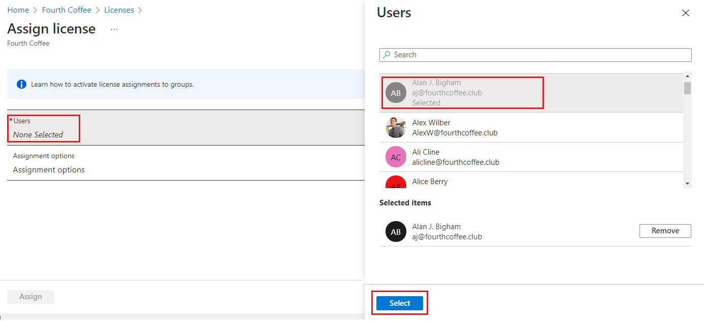
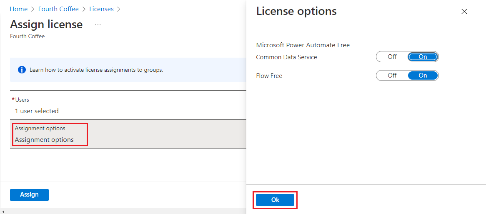
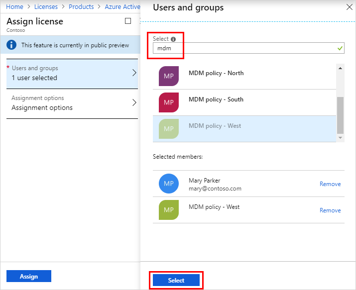
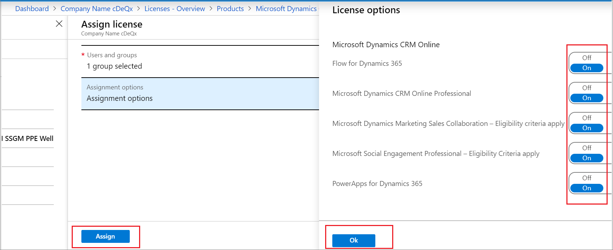
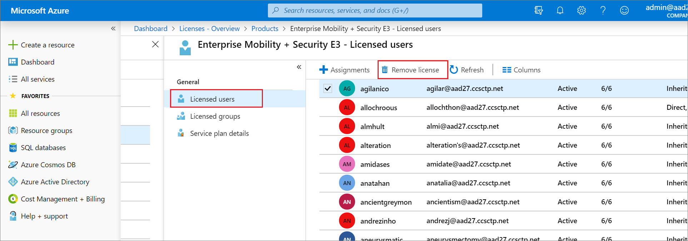
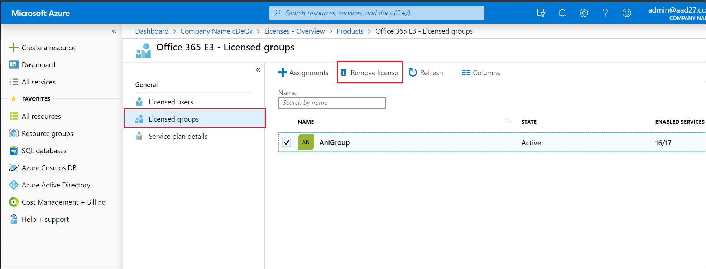

# Assign or remove licenses in the Azure Active Directory portal

Many Azure Active Directory (Azure AD) services require you to license each of your users or groups (and associated members) for that service. Only users with active licenses will be able to access and use the licensed Azure AD services for which that's true. Licenses are applied per tenant and do not transfer to other tenants. 

## Available license plans

There are several license plans available for the Azure AD service, including:

- Azure AD Free

- Azure AD Premium P1

- Azure AD Premium P2

For specific information about each license plan and the associated licensing details, see [What license do I need?](https://azure.microsoft.com/pricing/details/active-directory/). To sign up for Azure AD premium license plans see [here](./active-directory-get-started-premium.md).

Not all Microsoft services are available in all locations. Before a license can be assigned to a group, you must specify the **Usage location** for all members. You can set this value in the **Azure Active Directory &gt; Users &gt; Profile &gt; Settings** area in Azure AD. Any user whose usage location is not specified inherits the location of the Azure AD organization.

## View license plans and plan details

You can view your available service plans, including the individual licenses, check pending expiration dates, and view the number of available assignments.

### To find your service plan and plan details

1. Sign in to the [Azure portal](https://portal.azure.com/) using a License administrator account in your Azure AD organization.

1. Select **Azure Active Directory**, and then select **Licenses**.

1. Select **All products** to view the All Products page and to see the **Total**, **Assigned**, **Available**, and **Expiring soon** numbers for your license plans.

    :::image type="content" source="media/license-users-groups/license-products-blade-with-products.png" alt-text="services page - with service license plans - associated license info":::

    > [!NOTE]
    > The numbers are defined as: 
    > - Total: Total number of licenses purchased
    > - Assigned: Number of licenses assigned to users
    > - Available: Number of licenses available for assignment including expiring soon
    > - Expiring soon: Number of licenses expiring soon

1. Select a plan name to see its licensed users and groups.

## Assign licenses to users or groups

Make sure that anyone needing to use a licensed Azure AD service has the appropriate license. You can add the licensing rights to users or to an entire group.

### To assign a license to a user

1. On the **Products** page, select the name of the license plan you want to assign to the user.

1. After you select the license plan, select **Assign**.

    

1. On the **Assign** page, select **Users and groups**, and then search for and select the user you're assigning the license.

    

1. Select **Assignment options**, make sure you have the appropriate license options turned on, and then select **OK**.

    

    The **Assign license** page updates to show that a user is selected and that the assignments are configured.

    > [!NOTE]
    > Not all Microsoft services are available in all locations. Before a license can be assigned to a user, you must specify the **Usage location**. You can set this value in the **Azure Active Directory &gt; Users &gt; Profile &gt; Settings** area in Azure AD. Any user whose usage location is not specified inherits the location of the Azure AD organization.

1. Select **Assign**.

    The user is added to the list of licensed users and has access to the included Azure AD services.
    > [!NOTE]
    > Licenses can also be assigned directly to a user from the user's **Licenses** page. If a user has a license assigned through a group membership and you want to assign the same license to the user directly, it can be done only from the **Products** page mentioned in step 1 only.

### To assign a license to a group

1. On the **Products** page, select the name of the license plan you want to assign to the user.

    

1. On the **Azure Active Directory Premium Plan 2** page, select **Assign**.

    

1. On the **Assign** page, select **Users and groups**, and then search for and select the group you're assigning the license.

    

1. Select **Assignment options**, make sure you have the appropriate license options turned on, and then select **OK**.

    

    The **Assign license** page updates to show that a user is selected and that the assignments are configured.

1. Select **Assign**.

    The group is added to the list of licensed groups and all of the members have access to the included Azure AD services.

## Remove a license

You can remove a license from a user's Azure AD user page, from the group overview page for a group assignment, or starting from the Azure AD **Licenses** page to see the users and groups for a license.

### To remove a license from a user

1. On the **Licensed users** page for the service plan, select the user that should no longer have the license. For example, _Alain Charon_.

1. Select **Remove license**.

    

> [!IMPORTANT]
> Licenses that a user inherits from a group can't be removed directly. Instead, you have to remove the user from the group from which they're inheriting the license.

### To remove a license from a group

1. On the **Licensed groups** page for the license plan, select the group that should no longer have the license.

1. Select **Remove license**.

    
    
    > [!NOTE]
    > When an on-premises user account synced to Azure AD falls out of scope for the sync or when the sync is removed, the user is soft-deleted in Azure AD. When this occurs, licenses assigned to the user directly or via group-based licensing will be marked as **suspended** rather than **deleted**.

## Next steps

After you've assigned your licenses, you can perform the following processes:

- [Identify and resolve license assignment problems](../enterprise-users/licensing-groups-resolve-problems.md)

- [Add licensed users to a group for licensing](../enterprise-users/licensing-groups-migrate-users.md)

- [Scenarios, limitations, and known issues using groups to manage licensing in Azure Active Directory](../enterprise-users/licensing-group-advanced.md)

- [Add or change profile information](active-directory-users-profile-azure-portal.md)
