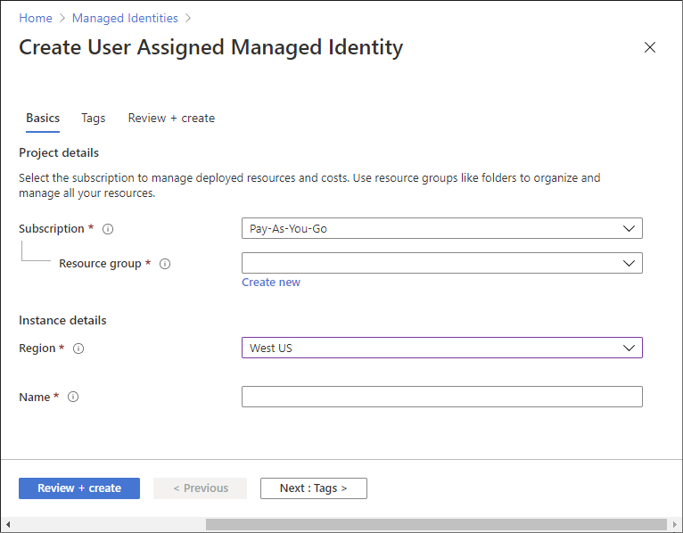
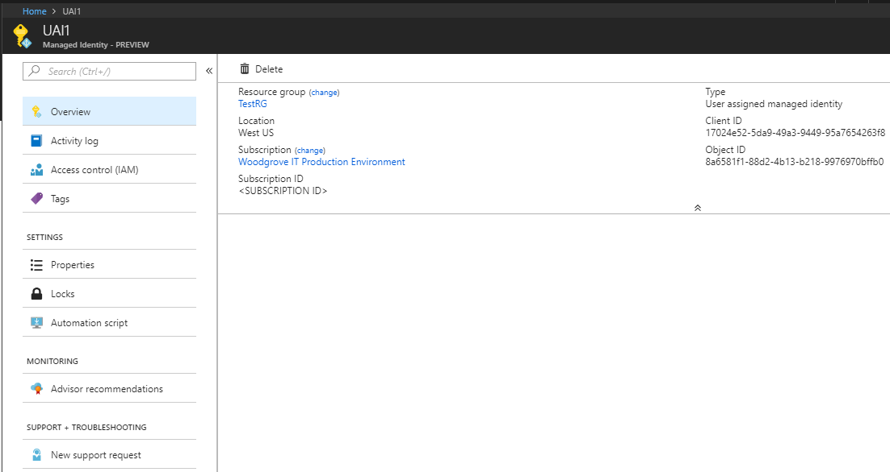
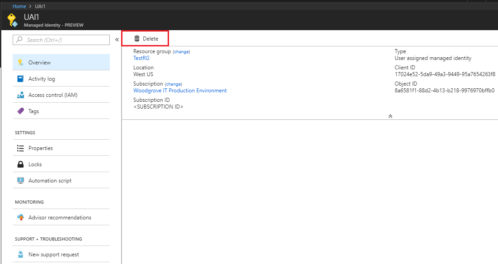

# Create, list, delete, or assign a role to a user-assigned managed identity using the Azure portal

Managed identities for Azure resources provide Azure services with a managed identity in Azure Active Directory. You can use this identity to authenticate to services that support Azure AD authentication, without needing credentials in your code. 

In this article, you learn how to create, list, delete, or assign a role to a user-assigned managed identity using the Azure portal.

## Prerequisites

- If you're unfamiliar with managed identities for Azure resources, check out the [overview section](overview.md). **Be sure to review the [difference between a system-assigned and user-assigned managed identity](overview.md#managed-identity-types)**.
- If you don't already have an Azure account, [sign up for a free account](https://azure.microsoft.com/free/) before continuing.

## Create a user-assigned managed identity

To create a user-assigned managed identity, your account needs the [Managed Identity Contributor](../../role-based-access-control/built-in-roles.md#managed-identity-contributor) role assignment.

1. Sign in to the [Azure portal](https://portal.azure.com) using an account associated with the Azure subscription to create the user-assigned managed identity.
2. In the search box, type *Managed Identities*, and under **Services**, click **Managed Identities**.
3. Click **Add** and enter values in the following fields under **Create user assigned managed** identity pane:
    - **Subscription**: Choose the subscription to create the user-assigned managed identity under.
    - **Resource group**: Choose a resource group to create the user-assigned managed identity in or click **Create new** to create a new resource group.
    - **Region**: Choose a region to deploy the user-assigned managed identity, for example **West US**.
    - **Name**: This is the name for your user-assigned managed identity, for example UAI1.
    
4. Click **Review + create** to review the changes.
5. Click **Create**.

## List user-assigned managed identities

To list/read a user-assigned managed identity, your account needs the [Managed Identity Operator](../../role-based-access-control/built-in-roles.md#managed-identity-operator) or [Managed Identity Contributor](../../role-based-access-control/built-in-roles.md#managed-identity-contributor) role assignment.

1. Sign in to the [Azure portal](https://portal.azure.com) using an account associated with the Azure subscription to list the user-assigned managed identities.
2. In the search box, type *Managed Identities*, and under Services, click **Managed Identities**.
3. A list of the user-assigned managed identities for your subscription is returned.  To see the details of a user-assigned managed identity click its name.

## Delete a user-assigned managed identity

To delete a user-assigned managed identity, your account needs the [Managed Identity Contributor](../../role-based-access-control/built-in-roles.md#managed-identity-contributor) role assignment.

Deleting a user assigned identity does not remove it from the VM or resource it was assigned to.  To remove the user assigned identity from a VM see, [Remove a user-assigned managed identity from a VM](./qs-configure-portal-windows-vm.md#remove-a-user-assigned-managed-identity-from-a-vm).

1. Sign in to the [Azure portal](https://portal.azure.com) using an account associated with the Azure subscription to delete a user-assigned managed identity.
2. Select the user-assigned managed identity and click **Delete**.
3. Under the confirmation box choose, **Yes**.

## Assign a role to a user-assigned managed identity 

To assign a role to a user-assigned managed identity, your account needs the [User Access Administrator](../../role-based-access-control/built-in-roles.md#user-access-administrator) role assignment.

For detailed steps, see [Assign Azure roles using the Azure portal](../../role-based-access-control/role-assignments-portal.md).

## Next steps

- [Assign a managed identity access to a resource using Azure CLI](howto-assign-access-cli.md)
- [Assign a managed identity access to a resource using PowerShell](howto-assign-access-powershell.md)