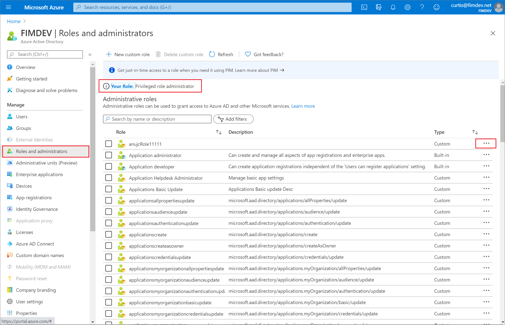

# List Azure AD role definitions

A role definition is a collection of permissions that can be performed, such as read, write, and delete. It's typically just called a role. Azure Active Directory has over 60 built-in roles or you can create your own custom roles. If you ever wondered "What the do these roles really do?", you can see a detailed list of permissions for each of the roles.

This article describes how to list the Azure AD built-in and custom roles along with their permissions.

## List all roles

1. Sign in to the [Azure AD admin center](https://aad.portal.azure.com) and select **Azure Active Directory**.

1. Select **Roles and administrators** to see the list of all available roles.

    

1. On the right, select the ellipsis and then **Description** to see the complete list of permissions for a role.

    The page includes links to relevant documentation to help guide you through managing roles.

    

## Next steps

* Feel free to share with us on the [Azure AD administrative roles forum](https://feedback.azure.com/forums/169401-azure-active-directory?category_id=166032).
* For more about role permissions, see [Azure AD built-in roles](permissions-reference.md).
* For default user permissions, see a [comparison of default guest and member user permissions](../fundamentals/users-default-permissions.md).
