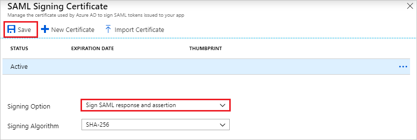
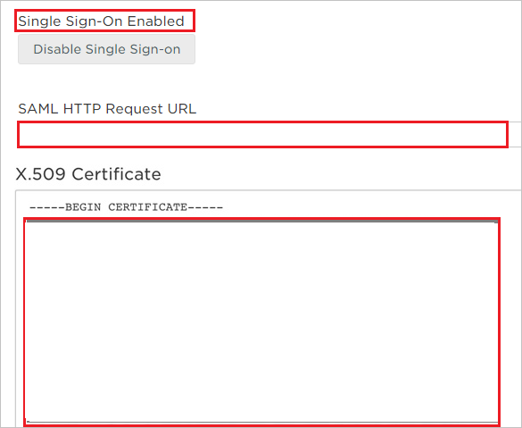
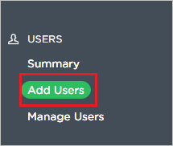
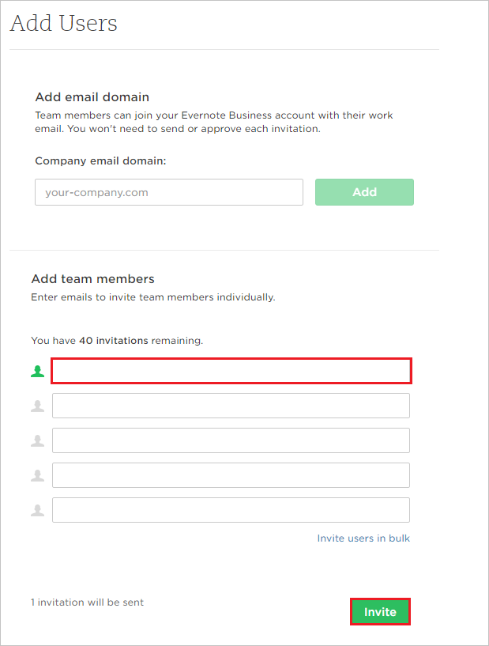

# Tutorial: Azure Active Directory single sign-on (SSO) integration with Evernote

In this tutorial, you'll learn how to integrate Evernote with Azure Active Directory (Azure AD). When you integrate Evernote with Azure AD, you can:

* Control in Azure AD who has access to Evernote.
* Enable your users to be automatically signed-in to Evernote with their Azure AD accounts.
* Manage your accounts in one central location - the Azure portal.

## Prerequisites

To get started, you need the following items:

* An Azure AD subscription. If you don't have a subscription, you can get a [free account](https://azure.microsoft.com/free/).
* Evernote single sign-on (SSO) enabled subscription.

## Scenario description

In this tutorial, you configure and test Azure AD SSO in a test environment.

* Evernote supports **SP and IDP** initiated SSO.

> [!NOTE]
> Identifier of this application is a fixed string value so only one instance can be configured in one tenant.

## Add Evernote from the gallery

To configure the integration of Evernote into Azure AD, you need to add Evernote from the gallery to your list of managed SaaS apps.

1. Sign in to the Azure portal using either a work or school account, or a personal Microsoft account.
1. On the left navigation pane, select the **Azure Active Directory** service.
1. Navigate to **Enterprise Applications** and then select **All Applications**.
1. To add new application, select **New application**.
1. In the **Add from the gallery** section, type **Evernote** in the search box.
1. Select **Evernote** from results panel and then add the app. Wait a few seconds while the app is added to your tenant.

## Configure and test Azure AD SSO for Evernote

Configure and test Azure AD SSO with Evernote using a test user called **B.Simon**. For SSO to work, you need to establish a link relationship between an Azure AD user and the related user in Evernote.

To configure and test Azure AD SSO with Evernote, perform the following steps:

1. **[Configure Azure AD SSO](#configure-azure-ad-sso)** - to enable your users to use this feature.
    1. **[Create an Azure AD test user](#create-an-azure-ad-test-user)** - to test Azure AD single sign-on with B.Simon.
    1. **[Assign the Azure AD test user](#assign-the-azure-ad-test-user)** - to enable B.Simon to use Azure AD single sign-on.
1. **[Configure Evernote SSO](#configure-evernote-sso)** - to configure the single sign-on settings on application side.
    1. **[Create Evernote test user](#create-evernote-test-user)** - to have a counterpart of B.Simon in Evernote that is linked to the Azure AD representation of user.
1. **[Test SSO](#test-sso)** - to verify whether the configuration works.

## Configure Azure AD SSO

Follow these steps to enable Azure AD SSO in the Azure portal.

1. In the Azure portal, on the **Evernote** application integration page, find the **Manage** section and select **single sign-on**.
1. On the **Select a single sign-on method** page, select **SAML**.
1. On the **Set up single sign-on with SAML** page, click the pencil icon for **Basic SAML Configuration** to edit the settings.

   

1. On the **Basic SAML Configuration** section, if you wish to configure the application in **IDP** initiated mode,perform the following steps: 

    In the **Identifier** text box, type the URL:
    `https://www.evernote.com/saml2`

1. Click **Set additional URLs** and perform the following step if you wish to configure the application in **SP** initiated mode:

    In the **Sign-on URL** text box, type the URL:
    `https://www.evernote.com/Login.action`

1. On the **Set up single sign-on with SAML** page, in the **SAML Signing Certificate** section,  find **Certificate (Base64)** and select **Download** to download the certificate and save it on your computer.

	

7. To modify the **Signing** options, click the **Edit** button to open the **SAML Signing Certificate** dialog.

	 

	

	a. Select the **Sign SAML response and assertion** option for **Signing Option**.

	b. Click **Save**

1. On the **Set up Evernote** section, copy the appropriate URL(s) based on your requirement.

	

### Create an Azure AD test user

In this section, you'll create a test user in the Azure portal called B.Simon.

1. From the left pane in the Azure portal, select **Azure Active Directory**, select **Users**, and then select **All users**.
1. Select **New user** at the top of the screen.
1. In the **User** properties, follow these steps:
   1. In the **Name** field, enter `B.Simon`.  
   1. In the **User name** field, enter the username@companydomain.extension. For example, `B.Simon@contoso.com`.
   1. Select the **Show password** check box, and then write down the value that's displayed in the **Password** box.
   1. Click **Create**.

### Assign the Azure AD test user

In this section, you'll enable B.Simon to use Azure single sign-on by granting access to Evernote.

1. In the Azure portal, select **Enterprise Applications**, and then select **All applications**.
1. In the applications list, select **Evernote**.
1. In the app's overview page, find the **Manage** section and select **Users and groups**.
1. Select **Add user**, then select **Users and groups** in the **Add Assignment** dialog.
1. In the **Users and groups** dialog, select **B.Simon** from the Users list, then click the **Select** button at the bottom of the screen.
1. If you are expecting a role to be assigned to the users, you can select it from the **Select a role** dropdown. If no role has been set up for this app, you see "Default Access" role selected.
1. In the **Add Assignment** dialog, click the **Assign** button.

## Configure Evernote SSO

1. To automate the configuration within Evernote, you need to install **My Apps Secure Sign-in browser extension** by clicking **Install the extension**.

	

2. After adding extension to the browser, click on **setup Evernote** will direct you to the Evernote application. From there, provide the admin credentials to sign into Evernote. The browser extension will automatically configure the application for you and automate steps 3-6.

	

3. If you want to setup Evernote manually, open a new web browser window and sign into your Evernote company site as an administrator and perform the following steps:

4. Go to **'Admin Console'**

	

5. From the **'Admin Console'**, go to **‘Security’** and select **‘Single Sign-On’**

	

6. Configure the following values:

	
	
	a.  **Enable SSO:** SSO is enabled by default (Click **Disable Single Sign-on** to remove the SSO requirement)

	b. Paste **Login URL** value, which you have copied from the Azure portal into the **SAML HTTP Request URL** textbox.

	c. Open the downloaded certificate from Azure AD in a notepad and copy the content including "BEGIN CERTIFICATE" and "END CERTIFICATE" and paste it into the **X.509 Certificate** textbox. 

	d.Click **Save Changes**

### Create Evernote test user

In order to enable Azure AD users to sign into Evernote, they must be provisioned into Evernote.  
In the case of Evernote, provisioning is a manual task.

**To provision a user accounts, perform the following steps:**

1. Sign in to your Evernote company site as an administrator.

2. Click the **'Admin Console'**.

	

3. From the **'Admin Console'**, go to **‘Add users’**.

	

4. **Add team members** in the **Email** textbox, type the email address of user account and click **Invite.**

	
	
5. After invitation is sent, the Azure Active Directory account holder will receive an email to accept the invitation.

## Test SSO 

In this section, you test your Azure AD single sign-on configuration with following options. 

#### SP initiated:

* Click on **Test this application** in Azure portal. This will redirect to Evernote Sign on URL where you can initiate the login flow.  

* Go to Evernote Sign-on URL directly and initiate the login flow from there.

#### IDP initiated:

* Click on **Test this application** in Azure portal and you should be automatically signed in to the Evernote for which you set up the SSO. 

You can also use Microsoft My Apps to test the application in any mode. When you click the Evernote tile in the My Apps, if configured in SP mode you would be redirected to the application sign on page for initiating the login flow and if configured in IDP mode, you should be automatically signed in to the Evernote for which you set up the SSO. For more information about the My Apps, see [Introduction to the My Apps](../user-help/my-apps-portal-end-user-access.md).

## Next steps

Once you configure Evernote you can enforce session control, which protects exfiltration and infiltration of your organization’s sensitive data in real time. Session control extends from Conditional Access. [Learn how to enforce session control with Microsoft Cloud App Security](/cloud-app-security/proxy-deployment-aad).
