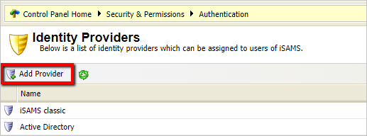
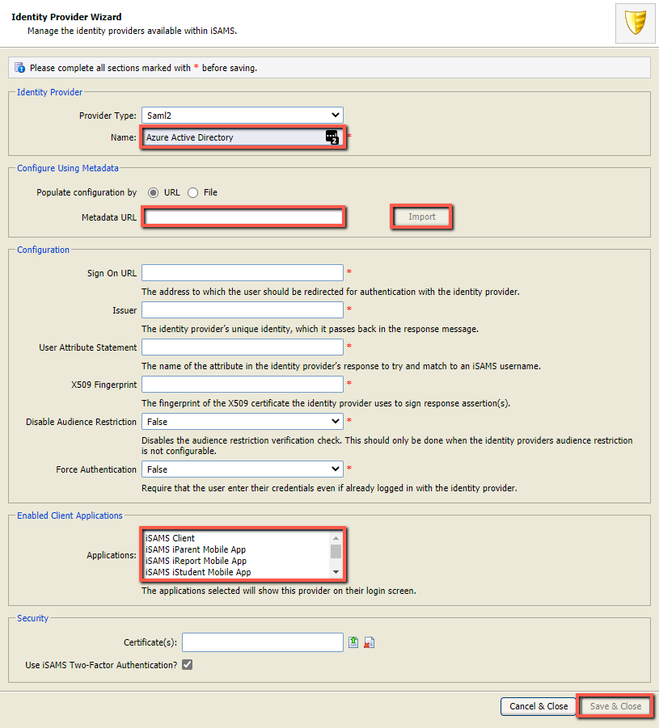
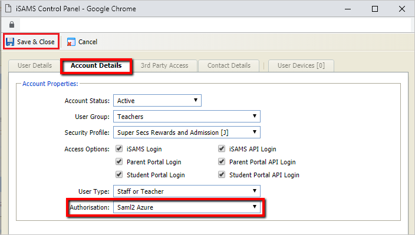

# Tutorial: Azure Active Directory single sign-on (SSO) integration with iSAMS

In this tutorial, you'll learn how to integrate iSAMS with Azure Active Directory (Azure AD). When you integrate iSAMS with Azure AD, you can:

* Control in Azure AD who has access to iSAMS.
* Enable your users to be automatically signed-in to iSAMS with their Azure AD accounts.
* Manage your accounts in one central location - the Azure portal.

## Prerequisites

To get started, you need the following items:

* An Azure AD subscription. If you don't have a subscription, you can get a [free account](https://azure.microsoft.com/free/).
* iSAMS single sign-on (SSO) enabled subscription.

## Scenario description

In this tutorial, you configure and test Azure AD SSO in a test environment.

* iSAMS supports **SP and IDP** initiated SSO.

## Add iSAMS from the gallery

To configure the integration of iSAMS into Azure AD, you need to add iSAMS from the gallery to your list of managed SaaS apps.

1. Sign in to the Azure portal using either a work or school account, or a personal Microsoft account.
1. On the left navigation pane, select the **Azure Active Directory** service.
1. Navigate to **Enterprise Applications** and then select **All Applications**.
1. To add new application, select **New application**.
1. In the **Add from the gallery** section, type **iSAMS** in the search box.
1. Select **iSAMS** from results panel and then add the app. Wait a few seconds while the app is added to your tenant.

## Configure and test Azure AD SSO for iSAMS

Configure and test Azure AD SSO with iSAMS using a test user called **B.Simon**. For SSO to work, you need to establish a link relationship between an Azure AD user and the related user in iSAMS.

To configure and test Azure AD SSO with iSAMS, perform the following steps:

1. **[Configure Azure AD SSO](#configure-azure-ad-sso)** - to enable your users to use this feature.
    1. **[Create an Azure AD test user](#create-an-azure-ad-test-user)** - to test Azure AD single sign-on with B.Simon.
    1. **[Assign the Azure AD test user](#assign-the-azure-ad-test-user)** - to enable B.Simon to use Azure AD single sign-on.
1. **[Configure iSAMS SSO](#configure-isams-sso)** - to configure the single sign-on settings on application side.
    1. **[Create iSAMS test user](#create-isams-test-user)** - to have a counterpart of B.Simon in iSAMS that is linked to the Azure AD representation of user.
1. **[Test SSO](#test-sso)** - to verify whether the configuration works.

## Configure Azure AD SSO

Follow these steps to enable Azure AD SSO in the Azure portal.

1. In the Azure portal, on the **iSAMS** application integration page, find the **Manage** section and select **single sign-on**.
1. On the **Select a single sign-on method** page, select **SAML**.
1. On the **Set up single sign-on with SAML** page, click the pencil icon for **Basic SAML Configuration** to edit the settings.

   

1. On the **Basic SAML Configuration** section, if you wish to configure the application in **IDP** initiated mode, perform the following steps:

    a. In the **Identifier** text box, type a URL using the following pattern:
    `https://<SUBDOMAIN>.isams.cloud/main/sso/saml2`

    b. In the **Reply URL** text box, type a URL using the following pattern:
    `https://<SUBDOMAIN>.isams.cloud/main/sso/saml2/acs`

1. Click **Set additional URLs** and perform the following step if you wish to configure the application in **SP** initiated mode:

    In the **Sign-on URL** text box, type a URL using the following pattern:
    `https://<SUBDOMAIN>.isams.cloud/`

	> [!NOTE]
	> These values are not real. Update these values with the actual Identifier, Reply URL and Sign-on URL. Contact [iSAMS Client support team](mailto:support@isams.com) to get these values. You can also refer to the patterns shown in the **Basic SAML Configuration** section in the Azure portal.

1. On the **Set up single sign-on with SAML** page, In the **SAML Signing Certificate** section, click copy button to copy **App Federation Metadata Url** and save it on your computer.

	

### Create an Azure AD test user

In this section, you'll create a test user in the Azure portal called B.Simon.

1. From the left pane in the Azure portal, select **Azure Active Directory**, select **Users**, and then select **All users**.
1. Select **New user** at the top of the screen.
1. In the **User** properties, follow these steps:
   1. In the **Name** field, enter `B.Simon`.  
   1. In the **User name** field, enter the username@companydomain.extension. For example, `B.Simon@contoso.com`.
   1. Select the **Show password** check box, and then write down the value that's displayed in the **Password** box.
   1. Click **Create**.

### Assign the Azure AD test user

In this section, you'll enable B.Simon to use Azure single sign-on by granting access to iSAMS.

1. In the Azure portal, select **Enterprise Applications**, and then select **All applications**.
1. In the applications list, select **iSAMS**.
1. In the app's overview page, find the **Manage** section and select **Users and groups**.
1. Select **Add user**, then select **Users and groups** in the **Add Assignment** dialog.
1. In the **Users and groups** dialog, select **B.Simon** from the Users list, then click the **Select** button at the bottom of the screen.
1. If you are expecting a role to be assigned to the users, you can select it from the **Select a role** dropdown. If no role has been set up for this app, you see "Default Access" role selected.
1. In the **Add Assignment** dialog, click the **Assign** button.

## Configure iSAMS SSO

1. Log in to iSAMS as an Administrator.

1. Navigate to the Control Panel and open the **Authentication** module.

1. From the right-hand menu, select **Identity Providers**

    

1. Select **Add Provider**

    

1. Perform the following steps in the following page:

    

    a. In the **Name** textbox, give a valid name like `Saml2 Azure`. This is the name that will appear on the login page.

    b. In the Metadata URL box, enter the **App Federation Metadata Url** value which you have copied from the Azure portal.
    
    c. Press **Import**.
    
    d. In the **Applications** listbox within the **Enabled Client Applications** section, select all of the iSAMS applications you wish your provider to appear on the login page for.

    e. Click on **Save & Close**.

### Create iSAMS test user

1. Log in to iSAMS as an Administrator.

2.  Go to the **Control Panel Home** -> **Security & Permissions** -> **User Accounts** -> **User Options & Tasks** -> **Modify User Properties**.

    

3. In the resulting popup window, select the **Account Details** tab, and change the **Authorization** to that of your newly created Identity Provider.

    

4. Click on **Save & Close**.

## Test SSO 

In this section, you test your Azure AD single sign-on configuration with following options. 

#### SP initiated:

* Click on **Test this application** in Azure portal. This will redirect to iSAMS Sign on URL where you can initiate the login flow.  

* Go to iSAMS Sign-on URL directly and initiate the login flow from there.

#### IDP initiated:

* Click on **Test this application** in Azure portal and you should be automatically signed in to the iSAMS for which you set up the SSO. 

You can also use Microsoft My Apps to test the application in any mode. When you click the iSAMS tile in the My Apps, if configured in SP mode you would be redirected to the application sign on page for initiating the login flow and if configured in IDP mode, you should be automatically signed in to the iSAMS for which you set up the SSO. For more information about the My Apps, see [Introduction to the My Apps](../user-help/my-apps-portal-end-user-access.md).

## Next steps

Once you configure iSAMS you can enforce session control, which protects exfiltration and infiltration of your organization’s sensitive data in real time. Session control extends from Conditional Access. [Learn how to enforce session control with Microsoft Cloud App Security](/cloud-app-security/proxy-deployment-aad).
