# Tutorial: Azure Active Directory integration with Kantega SSO for JIRA

In this tutorial, you'll learn how to integrate Kantega SSO for JIRA with Azure Active Directory (Azure AD). When you integrate Kantega SSO for JIRA with Azure AD, you can:

* Control in Azure AD who has access to Kantega SSO for JIRA.
* Enable your users to be automatically signed-in to Kantega SSO for JIRA with their Azure AD accounts.
* Manage your accounts in one central location - the Azure portal.

## Prerequisites

To configure Azure AD integration with Kantega SSO for JIRA, you need the following items:

* An Azure AD subscription. If you don't have an Azure AD environment, you can get a [free account](https://azure.microsoft.com/free/).

* Kantega SSO for JIRA single sign-on enabled subscription.

## Scenario description

In this tutorial, you configure and test Azure AD single sign-on in a test environment.

* Kantega SSO for JIRA supports **SP and IDP** initiated SSO.

## Add Kantega SSO for JIRA from the gallery

To configure the integration of Kantega SSO for JIRA into Azure AD, you need to add Kantega SSO for JIRA from the gallery to your list of managed SaaS apps.

1. Sign in to the Azure portal using either a work or school account, or a personal Microsoft account.
1. On the left navigation pane, select the **Azure Active Directory** service.
1. Navigate to **Enterprise Applications** and then select **All Applications**.
1. To add new application, select **New application**.
1. In the **Add from the gallery** section, type **Kantega SSO for JIRA** in the search box.
1. Select **Kantega SSO for JIRA** from results panel and then add the app. Wait a few seconds while the app is added to your tenant.

## Configure and test Azure AD SSO for Kantega SSO for JIRA

Configure and test Azure AD SSO with Kantega SSO for JIRA using a test user called **B.Simon**. For SSO to work, you need to establish a link relationship between an Azure AD user and the related user in Kantega SSO for JIRA.

To configure and test Azure AD SSO with Kantega SSO for JIRA, perform the following steps:

1. **[Configure Azure AD SSO](#configure-azure-ad-sso)** - to enable your users to use this feature.
    1. **[Create an Azure AD test user](#create-an-azure-ad-test-user)** - to test Azure AD single sign-on with B.Simon.
    1. **[Assign the Azure AD test user](#assign-the-azure-ad-test-user)** - to enable B.Simon to use Azure AD single sign-on.
1. **[Configure Kantega SSO for JIRA SSO](#configure-kantega-sso-for-jira-sso)** - to configure the single sign-on settings on application side.
    1. **[Create Kantega SSO for JIRA test user](#create-kantega-sso-for-jira-test-user)** - to have a counterpart of B.Simon in Kantega SSO for JIRA that is linked to the Azure AD representation of user.
1. **[Test SSO](#test-sso)** - to verify whether the configuration works.

## Configure Azure AD SSO

Follow these steps to enable Azure AD SSO in the Azure portal.

1. In the Azure portal, on the **Kantega SSO for JIRA** application integration page, find the **Manage** section and select **single sign-on**.
1. On the **Select a single sign-on method** page, select **SAML**.
1. On the **Set up single sign-on with SAML** page, click the pencil icon for **Basic SAML Configuration** to edit the settings.

   

4. On the **Basic SAML Configuration** section, if you wish to configure the application in **IDP** initiated mode, perform the following steps:

    a. In the **Identifier** text box, type a URL using the following pattern:
    `https://<server-base-url>/plugins/servlet/no.kantega.saml/sp/<UNIQUE_ID>/login`

    b. In the **Reply URL** text box, type a URL using the following pattern:
    `https://<server-base-url>/plugins/servlet/no.kantega.saml/sp/<UNIQUE_ID>/login`

5. Click **Set additional URLs** and perform the following step if you wish to configure the application in **SP** initiated mode:

    In the **Sign-on URL** text box, type a URL using the following pattern:
    `https://<server-base-url>/plugins/servlet/no.kantega.saml/sp/<UNIQUE_ID>/login`

	> [!NOTE]
	> These values are not real. Update these values with the actual Identifier, Reply URL, and Sign-On URL. These values are received during the configuration of Jira plugin, which is explained later in the tutorial.

6. On the **Set up Single Sign-On with SAML** page, in the **SAML Signing Certificate** section, click **Download** to download the **Federation Metadata XML** from the given options as per your requirement and save it on your computer.

	

7. On the **Set up Kantega SSO for JIRA** section, copy the appropriate URL(s) as per your requirement.

	

### Create an Azure AD test user

In this section, you'll create a test user in the Azure portal called B.Simon.

1. From the left pane in the Azure portal, select **Azure Active Directory**, select **Users**, and then select **All users**.
1. Select **New user** at the top of the screen.
1. In the **User** properties, follow these steps:
   1. In the **Name** field, enter `B.Simon`.  
   1. In the **User name** field, enter the username@companydomain.extension. For example, `B.Simon@contoso.com`.
   1. Select the **Show password** check box, and then write down the value that's displayed in the **Password** box.
   1. Click **Create**.

### Assign the Azure AD test user

In this section, you'll enable B.Simon to use Azure single sign-on by granting access to Kantega SSO for JIRA.

1. In the Azure portal, select **Enterprise Applications**, and then select **All applications**.
1. In the applications list, select **Kantega SSO for JIRA**.
1. In the app's overview page, find the **Manage** section and select **Users and groups**.
1. Select **Add user**, then select **Users and groups** in the **Add Assignment** dialog.
1. In the **Users and groups** dialog, select **B.Simon** from the Users list, then click the **Select** button at the bottom of the screen.
1. If you are expecting a role to be assigned to the users, you can select it from the **Select a role** dropdown. If no role has been set up for this app, you see "Default Access" role selected.
1. In the **Add Assignment** dialog, click the **Assign** button.

## Configure Kantega SSO for JIRA SSO

1. In a different web browser window, sign in to your JIRA on-premises server as an administrator.

1. However on cog and click the **Add-ons**.

	

1. Under Add-ons tab section, click **Find new add-ons**. Search **Kantega SSO for JIRA (SAML & Kerberos)** and click **Install** button to install the new SAML plugin.

	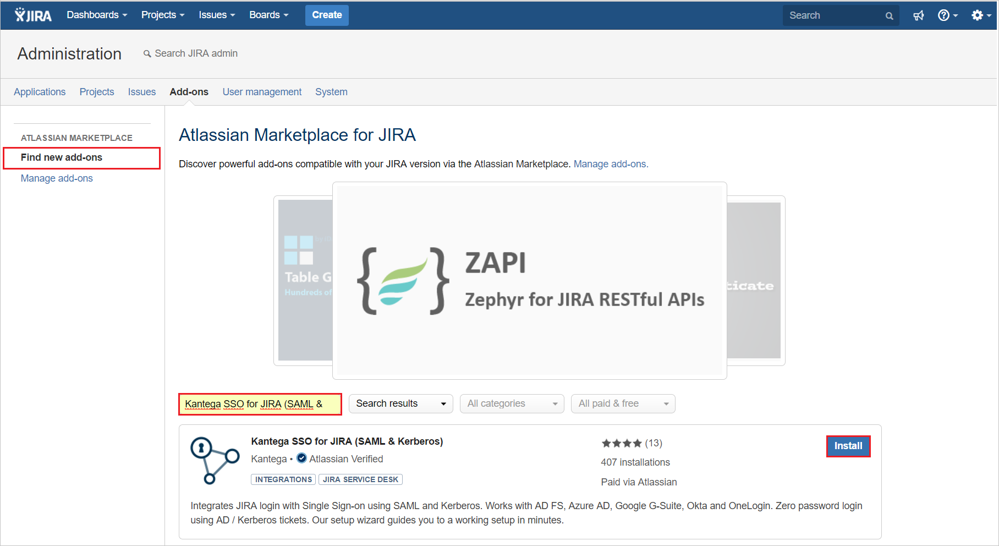

1. The plugin installation starts.

	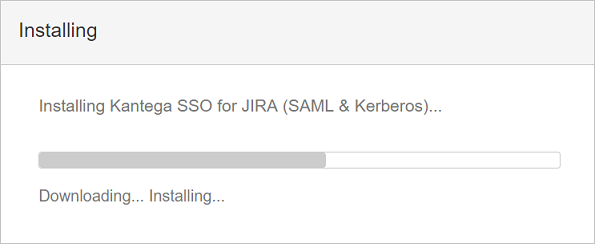

1. Once the installation is complete. Click **Close**.

	

1.	Click **Manage**.

	
    
1. New plugin is listed under **INTEGRATIONS**. Click **Configure** to configure the new plugin.

	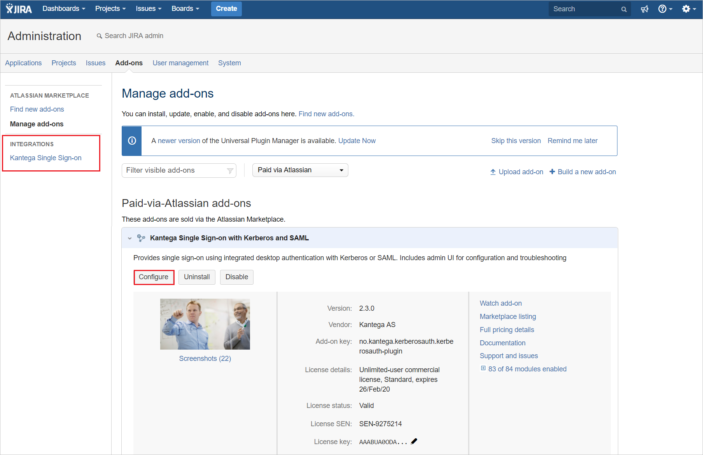

1. In the **SAML** section. Select **Azure Active Directory (Azure AD)** from the **Add identity provider** dropdown.

    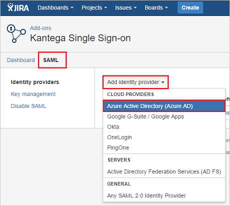

1. Select subscription level as **Basic**.

    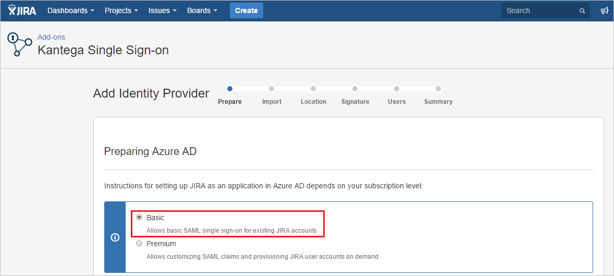

1. On the **App properties** section, perform following steps: 

    

    1. Copy the **App ID URI** value and use it as **Identifier, Reply URL, and Sign-On URL** on the **Basic SAML Configuration** section in Azure portal.

    1. Click **Next**.

1. On the **Metadata import** section, perform following steps: 

    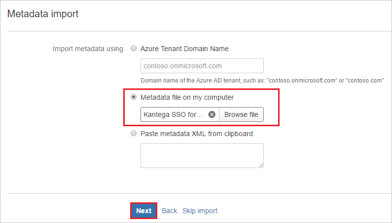

    1. Select **Metadata file on my computer**, and upload metadata file, which you have downloaded from Azure portal.

    1. Click **Next**.

1. On the **Name and SSO location** section, perform following steps:

    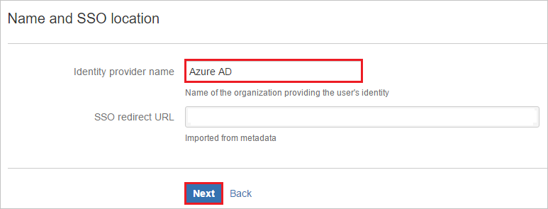

    1. Add Name of the Identity Provider in **Identity provider name** textbox (e.g Azure AD).

    1. Click **Next**.

1. Verify the Signing certificate and click **Next**.

    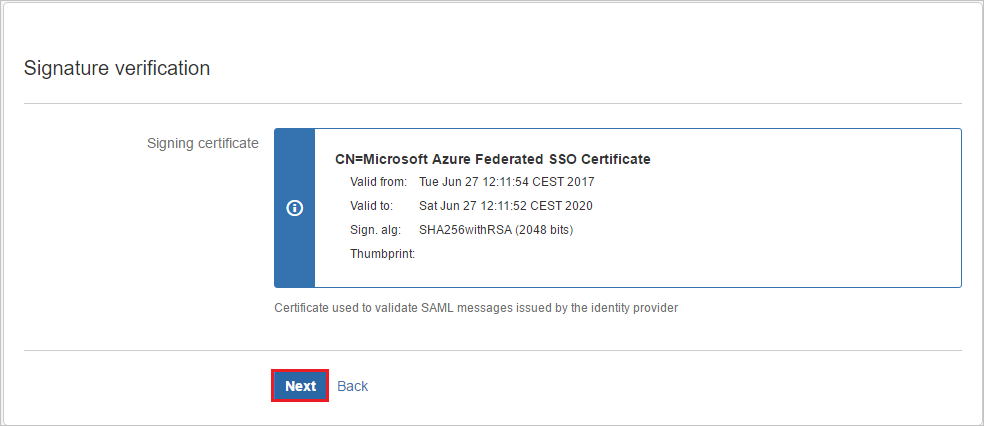

1. On the **JIRA user accounts** section, perform following steps:

    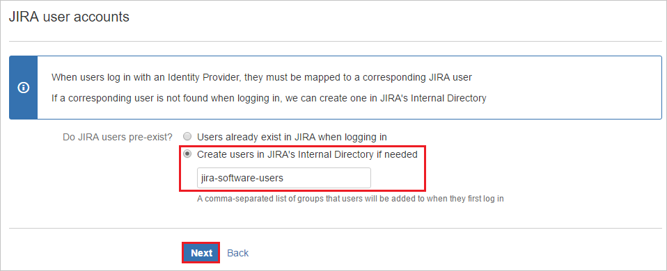

    1. Select **Create users in JIRA's internal Directory if needed** and enter the appropriate name of the group for users (can be multiple no. of groups separated by comma).

    1. Click **Next**.

1. Click **Finish**.

    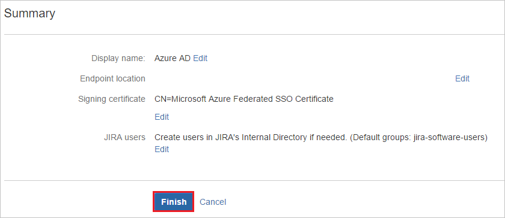

1. On the **Known domains for Azure AD** section, perform following steps:

    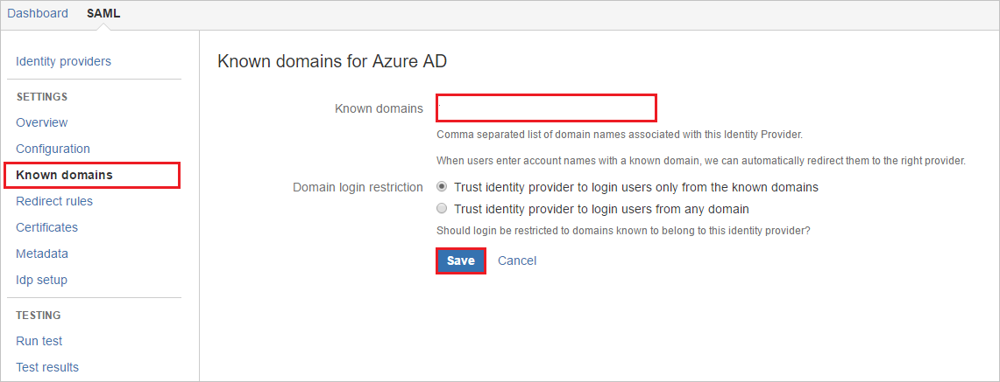

    1. Select **Known domains** from the left panel of the page.

    2. Enter domain name in the **Known domains** textbox.

    3. Click **Save**.

### Create Kantega SSO for JIRA test user

To enable Azure AD users to sign in to JIRA, they must be provisioned into JIRA. In Kantega SSO for JIRA, provisioning is a manual task.

**To provision a user account, perform the following steps:**

1. Sign in to your JIRA on-premises server as an administrator.

1. Hover on cog and click the **User management**.

    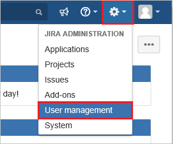 

1. Under **User management** tab section, click **Create user**.

     

1. On the **“Create new user”** dialog page, perform the following steps:

    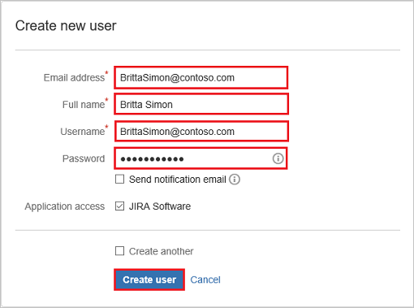 

    1. In the **Email address** textbox, type the email address of user like Brittasimon@contoso.com.

    2. In the **Full Name** textbox, type full name of the user like Britta Simon.

    3. In the **Username** textbox, type the email of user like Brittasimon@contoso.com.

    4. In the **Password** textbox, type the password of user.

    5. Click **Create user**.

## Test SSO

In this section, you test your Azure AD single sign-on configuration with following options. 

#### SP initiated:

* Click on **Test this application** in Azure portal. This will redirect to Kantega SSO for JIRA Sign on URL where you can initiate the login flow.  

* Go to Kantega SSO for JIRA Sign-on URL directly and initiate the login flow from there.

#### IDP initiated:

* Click on **Test this application** in Azure portal and you should be automatically signed in to the Kantega SSO for JIRA for which you set up the SSO. 

You can also use Microsoft My Apps to test the application in any mode. When you click the Kantega SSO for JIRA tile in the My Apps, if configured in SP mode you would be redirected to the application sign on page for initiating the login flow and if configured in IDP mode, you should be automatically signed in to the Kantega SSO for JIRA for which you set up the SSO. For more information about the My Apps, see [Introduction to the My Apps](../user-help/my-apps-portal-end-user-access.md).

## Next steps

Once you configure Kantega SSO for JIRA you can enforce session control, which protects exfiltration and infiltration of your organization’s sensitive data in real time. Session control extends from Conditional Access. [Learn how to enforce session control with Microsoft Cloud App Security](/cloud-app-security/proxy-deployment-aad).
