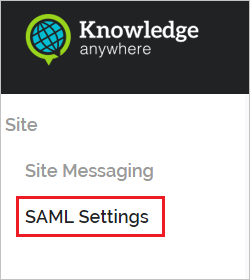
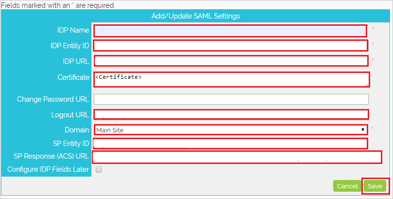

# Tutorial: Integrate Knowledge Anywhere LMS with Azure Active Directory

In this tutorial, you'll learn how to integrate Knowledge Anywhere LMS with Azure Active Directory (Azure AD). When you integrate Knowledge Anywhere LMS with Azure AD, you can:

* Control in Azure AD who has access to Knowledge Anywhere LMS.
* Enable your users to be automatically signed-in to Knowledge Anywhere LMS with their Azure AD accounts.
* Manage your accounts in one central location - the Azure portal.

## Prerequisites

To get started, you need the following items:

* An Azure AD subscription. If you don't have a subscription, you can get a [free account](https://azure.microsoft.com/free/).
* Knowledge Anywhere LMS single sign-on (SSO) enabled subscription.

## Scenario description

In this tutorial, you configure and test Azure AD SSO in a test environment. 
* Knowledge Anywhere LMS supports **SP** initiated SSO.
* Knowledge Anywhere LMS supports **Just In Time** user provisioning.

## Add Knowledge Anywhere LMS from the gallery

To configure the integration of Knowledge Anywhere LMS into Azure AD, you need to add Knowledge Anywhere LMS from the gallery to your list of managed SaaS apps.

1. Sign in to the Azure portal using either a work or school account, or a personal Microsoft account.
1. On the left navigation pane, select the **Azure Active Directory** service.
1. Navigate to **Enterprise Applications** and then select **All Applications**.
1. To add new application, select **New application**.
1. In the **Add from the gallery** section, type **Knowledge Anywhere LMS** in the search box.
1. Select **Knowledge Anywhere LMS** from results panel and then add the app. Wait a few seconds while the app is added to your tenant.

## Configure and test Azure AD SSO for Knowledge Anywhere LMS

Configure and test Azure AD SSO with Knowledge Anywhere LMS using a test user called **B.Simon**. For SSO to work, you need to establish a link relationship between an Azure AD user and the related user in Knowledge Anywhere LMS.

To configure and test Azure AD SSO with Knowledge Anywhere LMS, perform the following steps:

1. **[Configure Azure AD SSO](#configure-azure-ad-sso)** - to enable your users to use this feature.
    1. **[Create an Azure AD test user](#create-an-azure-ad-test-user)** - to test Azure AD single sign-on with B.Simon.
    1. **[Assign the Azure AD test user](#assign-the-azure-ad-test-user)** - to enable B.Simon to use Azure AD single sign-on.
1. **[Configure Knowledge Anywhere LMS SSO](#configure-knowledge-anywhere-lms-sso)** - to configure the single sign-on settings on application side.
    1. **[Create Knowledge Anywhere LMS test user](#create-knowledge-anywhere-lms-test-user)** - to have a counterpart of B.Simon in Knowledge Anywhere LMS that is linked to the Azure AD representation of user.
1. **[Test SSO](#test-sso)** - to verify whether the configuration works.

## Configure Azure AD SSO

Follow these steps to enable Azure AD SSO in the Azure portal.

1. In the Azure portal, on the **Knowledge Anywhere LMS** application integration page, find the **Manage** section and select **Single sign-on**.
1. On the **Select a Single sign-on method** page, select **SAML**.
1. On the **Set up Single Sign-On with SAML** page, click the pencil icon for **Basic SAML Configuration** to edit the settings.

   

1. On the **Basic SAML Configuration** section, if you wish to configure the application in **IDP** initiated mode, perform the following steps:

    1. In the **Identifier** text box, type a URL using the following pattern:
    `https://<CLIENT_NAME>.knowledgeanywhere.com/`

    1. In the **Reply URL** text box, type a URL using the following pattern:
    `https://<CLIENT_NAME>.knowledgeanywhere.com/SSO/SAML/Response.aspx?<IDP_NAME>`

    > [!NOTE]
    > These values are not real. Update these values with the actual Identifier and Reply URL which is explained later in the tutorial.

1. Click **Set additional URLs** and perform the following step if you wish to configure the application in **SP** initiated mode:

    In the **Sign-on URL** text box, type a URL using the following pattern:
    `https://<CLIENTNAME>.knowledgeanywhere.com/`

	> [!NOTE]
	> The Sign-on URL value is not real. Update this value with the actual Sign-on URL. Contact [Knowledge Anywhere LMS Client support team](https://knowany.zendesk.com/hc/en-us/articles/360000469034-SAML-2-0-Single-Sign-On-SSO-Set-Up-Guide) to get this value. You can also refer to the patterns shown in the **Basic SAML Configuration** section in the Azure portal.

1. On the **Set up Single Sign-On with SAML** page, in the **SAML Signing Certificate** section, find **Certificate (Base64)** and select **Download** to download the certificate and save it on your computer.

   

1. On the **Set up Knowledge Anywhere LMS** section, copy the appropriate URL(s) based on your requirement.

   

### Create an Azure AD test user

In this section, you'll create a test user in the Azure portal called B. Simon.

1. From the left pane in the Azure portal, select **Azure Active Directory**, select **Users**, and then select **All users**.
1. Select **New user** at the top of the screen.
1. In the **User** properties, follow these steps:
   1. In the **Name** field, enter `B. Simon`.  
   1. In the **User name** field, enter the username@companydomain.extension. For example, `BrittaSimon@contoso.com`.
   1. Select the **Show password** check box, and then write down the value that's displayed in the **Password** box.
   1. Click **Create**.

### Assign the Azure AD test user

In this section, you'll enable B.Simon to use Azure single sign-on by granting access to Knowledge Anywhere LMS.

1. In the Azure portal, select **Enterprise Applications**, and then select **All applications**.
1. In the applications list, select **Knowledge Anywhere LMS**.
1. In the app's overview page, find the **Manage** section and select **Users and groups**.
1. Select **Add user**, then select **Users and groups** in the **Add Assignment** dialog.
1. In the **Users and groups** dialog, select **B.Simon** from the Users list, then click the **Select** button at the bottom of the screen.
1. If you are expecting a role to be assigned to the users, you can select it from the **Select a role** dropdown. If no role has been set up for this app, you see "Default Access" role selected.
1. In the **Add Assignment** dialog, click the **Assign** button.

## Configure Knowledge Anywhere LMS SSO

1. To automate the configuration within Knowledge Anywhere LMS, you need to install **My Apps Secure Sign-in browser extension** by clicking **Install the extension**.

	

2. After adding extension to the browser, click on **Setup Knowledge Anywhere LMS** will direct you to the Knowledge Anywhere LMS application. From there, provide the admin credentials to sign into Knowledge Anywhere LMS. The browser extension will automatically configure the application for you and automate steps 3-7.

	

3. If you want to setup Knowledge Anywhere LMS manually, open a new web browser window and sign into your Knowledge Anywhere LMS company site as an administrator and perform the following steps:

4. Select on the **Site** tab.

    

5. Select on the **SAML Settings** tab.

    

6. Click on the **Add New**.

    

7. On the **Add/Update SAML Settings** page, perform the following steps:

    

    a. Enter the IDP Name as per your organization. For ex:- `Azure`.

    b. In the **IDP Entity ID** textbox, paste **Azure AD Identifier** value ,which you have copied from Azure portal.

    c. In the **IDP URL** textbox, paste **Login URL** value, which you have copied from Azure portal.

    d. Open the downloaded certificate file from the Azure portal into notepad, copy the content of the certificate and paste it into **Certificate** textbox.

    e. In the **Logout URL** textbox, paste **Logout URL** value, which you have copied from Azure portal.

    f. Select **Main Site** from the dropdown for the **Domain**.

    g. Copy the **SP Entity ID** value and paste it into **Identifier** text box in the **Basic SAML Configuration** section in the Azure portal.

    h. Copy the **SP Response(ACS) URL** value and paste it into **Reply URL** text box in the **Basic SAML Configuration** section in the Azure portal.

    i. Click **Save**.

### Create Knowledge Anywhere LMS test user

In this section, a user called B. Simon is created in Knowledge Anywhere LMS. Knowledge Anywhere LMS supports just-in-time user provisioning, which is enabled by default. There is no action item for you in this section. If a user doesn't already exist in Knowledge Anywhere LMS, a new one is created after authentication.

## Test SSO

In this section, you test your Azure AD single sign-on configuration with following options. 

* Click on **Test this application** in Azure portal. This will redirect to Knowledge Anywhere LMS Sign-on URL where you can initiate the login flow. 

* Go to Knowledge Anywhere LMS Sign-on URL directly and initiate the login flow from there.

* You can use Microsoft My Apps. When you click the Knowledge Anywhere LMS tile in the My Apps, this will redirect to Knowledge Anywhere LMS Sign-on URL. For more information about the My Apps, see [Introduction to the My Apps](../user-help/my-apps-portal-end-user-access.md).

## Next steps

Once you configure Knowledge Anywhere LMS you can enforce session control, which protects exfiltration and infiltration of your organization’s sensitive data in real time. Session control extends from Conditional Access. [Learn how to enforce session control with Microsoft Cloud App Security](/cloud-app-security/proxy-deployment-aad).
