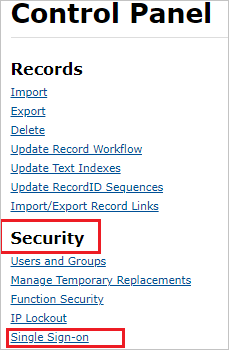
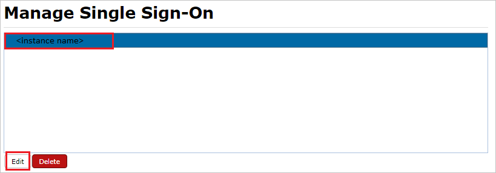
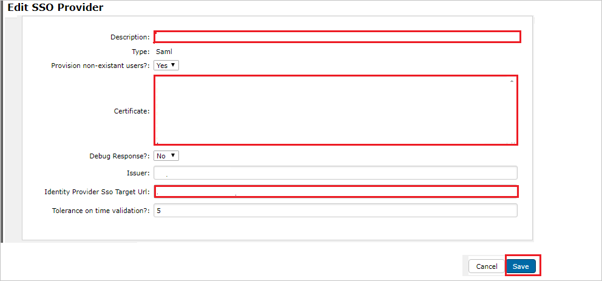

# Tutorial: Azure Active Directory integration with Nimblex

In this tutorial, you'll learn how to integrate Nimblex with Azure Active Directory (Azure AD). When you integrate Nimblex with Azure AD, you can:

* Control in Azure AD who has access to Nimblex.
* Enable your users to be automatically signed-in to Nimblex with their Azure AD accounts.
* Manage your accounts in one central location - the Azure portal.

## Prerequisites

To get started, you need the following items:

* An Azure AD subscription. If you don't have a subscription, you can get a [free account](https://azure.microsoft.com/free/).
* Nimblex single sign-on (SSO) enabled subscription.

## Scenario description

In this tutorial, you configure and test Azure AD single sign-on in a test environment.

* Nimblex supports **SP** initiated SSO.

* Nimblex supports **Just In Time** user provisioning.

## Add Nimblex from the gallery

To configure the integration of Nimblex into Azure AD, you need to add Nimblex from the gallery to your list of managed SaaS apps.

1. Sign in to the Azure portal using either a work or school account, or a personal Microsoft account.
1. On the left navigation pane, select the **Azure Active Directory** service.
1. Navigate to **Enterprise Applications** and then select **All Applications**.
1. To add new application, select **New application**.
1. In the **Add from the gallery** section, type **Nimblex** in the search box.
1. Select **Nimblex** from results panel and then add the app. Wait a few seconds while the app is added to your tenant.

## Configure and test Azure AD SSO for Nimblex

Configure and test Azure AD SSO with Nimblex using a test user called **B.Simon**. For SSO to work, you need to establish a link relationship between an Azure AD user and the related user in Nimblex.

To configure and test Azure AD SSO with Nimblex, perform the following steps:

1. **[Configure Azure AD SSO](#configure-azure-ad-sso)** - to enable your users to use this feature.
    1. **[Create an Azure AD test user](#create-an-azure-ad-test-user)** - to test Azure AD single sign-on with B.Simon.
    1. **[Assign the Azure AD test user](#assign-the-azure-ad-test-user)** - to enable B.Simon to use Azure AD single sign-on.
1. **[Configure Nimblex SSO](#configure-nimblex-sso)** - to configure the single sign-on settings on application side.
    1. **[Create Nimblex test user](#create-nimblex-test-user)** - to have a counterpart of B.Simon in Nimblex that is linked to the Azure AD representation of user.
1. **[Test SSO](#test-sso)** - to verify whether the configuration works.

## Configure Azure AD SSO

Follow these steps to enable Azure AD SSO in the Azure portal.

1. In the Azure portal, on the **Nimblex** application integration page, find the **Manage** section and select **single sign-on**.
1. On the **Select a single sign-on method** page, select **SAML**.
1. On the **Set up single sign-on with SAML** page, click the pencil icon for **Basic SAML Configuration** to edit the settings.

   

4. On the **Basic SAML Configuration** section, perform the following steps:

    a. In the **Sign-on URL** text box, type a URL using the following pattern:
    `https://<YOUR_APPLICATION_PATH>/Login.aspx`

    b. In the **Identifier** box, type a URL using the following pattern:
    `https://<YOUR_APPLICATION_PATH>/`

    c. In the **Reply URL** text box, type a URL using the following pattern:
    `https://<path-to-application>/SamlReply.aspx`

	> [!NOTE]
	> These values are not real. Update these values with the actual Sign-On URL, Identifier and Reply URL. Contact [Nimblex Client support team](mailto:support@ebms.com.au) to get these values. You can also refer to the patterns shown in the **Basic SAML Configuration** section in the Azure portal.

4. On the **Set-up Single Sign-On with SAML** page, in the **SAML Signing Certificate** section, click **Download** to download the **Certificate (Base64)** from the given options as per your requirement and save it on your computer.

	

6. On the **Set up Nimblex** section, copy the appropriate URL(s) as per your requirement.

	

### Create an Azure AD test user 

In this section, you'll create a test user in the Azure portal called B.Simon.

1. From the left pane in the Azure portal, select **Azure Active Directory**, select **Users**, and then select **All users**.
1. Select **New user** at the top of the screen.
1. In the **User** properties, follow these steps:
   1. In the **Name** field, enter `B.Simon`.  
   1. In the **User name** field, enter the username@companydomain.extension. For example, `B.Simon@contoso.com`.
   1. Select the **Show password** check box, and then write down the value that's displayed in the **Password** box.
   1. Click **Create**.

### Assign the Azure AD test user

In this section, you'll enable B.Simon to use Azure single sign-on by granting access to NAVEX One.

1. In the Azure portal, select **Enterprise Applications**, and then select **All applications**.
1. In the applications list, select **NAVEX One**.
1. In the app's overview page, find the **Manage** section and select **Users and groups**.
1. Select **Add user**, then select **Users and groups** in the **Add Assignment** dialog.
1. In the **Users and groups** dialog, select **B.Simon** from the Users list, then click the **Select** button at the bottom of the screen.
1. If you are expecting a role to be assigned to the users, you can select it from the **Select a role** dropdown. If no role has been set up for this app, you see "Default Access" role selected.
1. In the **Add Assignment** dialog, click the **Assign** button.

## Configure Nimblex SSO

1. In a different web browser window, sign in to Nimblex as a Security Administrator.

2. On the top right-side of the page, click **Settings** logo.

	

3. On the **Control Panel** page, under **Security** section click **Single Sign-on**.

	

4. On the **Manage Single Sign-On** page, select your instance name and click **Edit**.

	

5. On the **Edit SSO Provider** page, perform the following steps:

	

	a. In the **Description** textbox, type your instance name.

	b. In Notepad, open the base-64 encoded certificate that you downloaded from the Azure portal, copy its content, and then paste it into the **Certificate** box.

	c. In the **Identity Provider Sso Target Url** textbox, paste the value of **Login URL**, which you have copied from the Azure portal.

	d. Click **Save**.

### Create Nimblex test user

In this section, a user called Britta Simon is created in Nimblex. Nimblex supports just-in-time user provisioning, which is enabled by default. There is no action item for you in this section. If a user doesn't already exist in Nimblex, a new one is created after authentication.

>[!Note]
>If you need to create a user manually, contact [Nimblex Client support team](mailto:support@ebms.com.au).

## Test SSO 

In this section, you test your Azure AD single sign-on configuration with following options. 

* Click on **Test this application** in Azure portal. This will redirect to Nimblex Sign-on URL where you can initiate the login flow. 

* Go to Nimblex Sign-on URL directly and initiate the login flow from there.

* You can use Microsoft My Apps. When you click the Nimblex tile in the My Apps, this will redirect to Nimblex Sign-on URL. For more information about the My Apps, see [Introduction to the My Apps](../user-help/my-apps-portal-end-user-access.md).

## Next steps

Once you configure Nimblex you can enforce session control, which protects exfiltration and infiltration of your organization’s sensitive data in real time. Session control extends from Conditional Access. [Learn how to enforce session control with Microsoft Cloud App Security](/cloud-app-security/proxy-deployment-aad).
