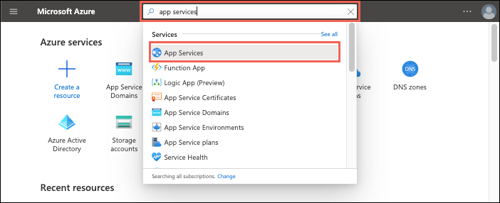
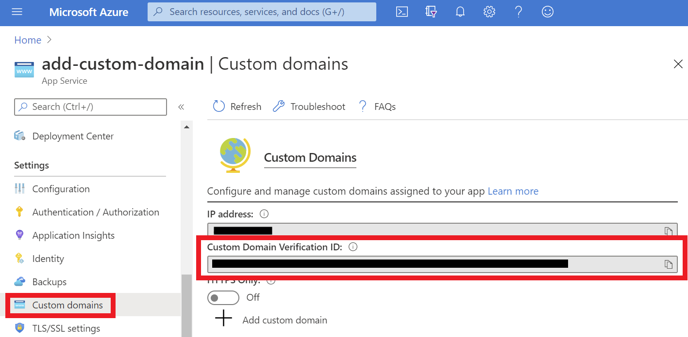
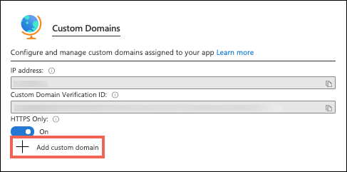
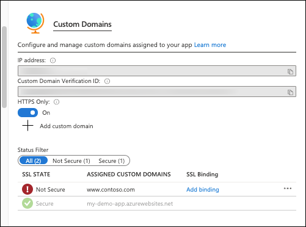
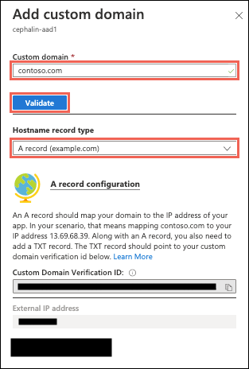
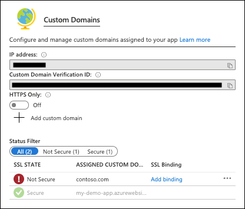
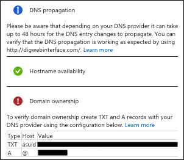
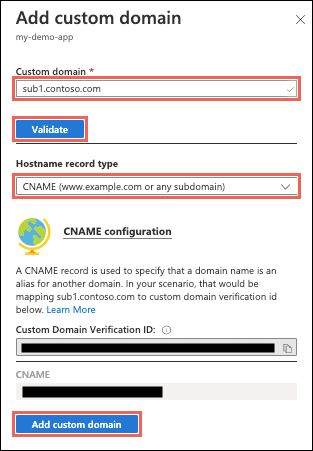
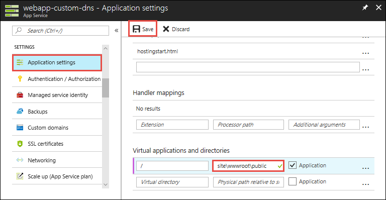

# Tutorial: Map an existing custom DNS name to Azure App Service

This tutorial shows you how to map any existing <abbr title="A domain name that you purchased from a domain registrar such as GoDaddy, or a subdomain of your purchased domain.">custom DNS domain name</abbr> to <abbr title="An HTTP-based service for hosting web applications, REST APIs, and mobile back-end applications.">Azure App Service</abbr>.

In this tutorial, you'll learn how to:

> [!div class="checklist"]
> * Map a subdomain by using a <abbr title="A DNS canonical name record maps one domain name to another.">CNAME record</abbr>.
> * Map a root domain by using an <abbr title="An address record in DNS maps a hostname to an IP address.">A record</abbr>.
> * Map a wildcard domain by using a CNAME record.
> * Redirect the default URL to a custom directory.

<hr/> 

## 1. Prepare your environment

* [Create an App Service app](./index.yml), or use an app that you created for another tutorial.
* Make sure you can edit DNS records for your custom domain. If you don't have a custom domain yet, you can [purchase an App Service domain](manage-custom-dns-buy-domain.md).

    <details>
        <summary>What do I need to edit DNS records?</summary>
        Requires access to the DNS registry for your domain provider, such as GoDaddy. For example, to add DNS entries for <code>contoso.com</code> and <code>www.contoso.com</code>, you must be able to configure the DNS settings for the <code>contoso.com</code> root domain.
    </details>

<hr/> 

## 2. Prepare the app

To map a custom DNS name to an app, the app's <abbr title="Specifies the location, size, and features of the web server farm that hosts your app.">App Service plan</abbr> must be a paid tier (not <abbr title="An Azure App Service tier in which your app runs on the same VMs as other apps, including other customers’ apps. This tier is intended for development and testing.">**Free (F1)**</abbr>). For more information, see [Azure App Service plan overview](overview-hosting-plans.md).

#### Sign in to Azure

Open the [Azure portal](https://portal.azure.com), and sign in with your Azure account.

#### Select the app in the Azure portal

1. Search for and select **App Services**.

   

1. On the **App Services** page, select the name of your Azure app.

   

    You see the management page of the App Service app.

<a name="checkpricing" aria-hidden="true"></a>

#### Check the pricing tier

1. In the left pane of the app page, scroll to the **Settings** section and select **Scale up (App Service plan)**.

   

1. The app's current tier is highlighted by a blue border. Check to make sure that the app isn't in the **F1** tier. Custom DNS isn't supported in the **F1** tier.

   

1. If the App Service plan isn't in the **F1** tier, close the **Scale up** page and skip to [3. Get a domain verification ID](#3-get-a-domain-verification-id).

<a name="scaleup" aria-hidden="true"></a>

#### Scale up the App Service plan

1. Select any of the non-free tiers (**D1**, **B1**, **B2**, **B3**, or any tier in the **Production** category). For additional options, select **See additional options**.

1. Select **Apply**.

   

   When you see the following notification, the scale operation is complete.

   

<hr/> 

<a name="cname" aria-hidden="true"></a>

## 3. Get a domain verification ID

To add a custom domain to your app, you need to verify your ownership of the domain by adding a verification ID as a TXT record with your domain provider. 

1. In the left pane of your app page, select **Custom domains**. 
1. Copy the ID in the **Custom Domain Verification ID** box in the **Custom Domains** page for the next step.

    

    <details>
        <summary>Why do I need this?</summary>
        Adding domain verification IDs to your custom domain can prevent dangling DNS entries and help to avoid subdomain takeovers. For custom domains you previously configured without this verification ID, you should protect them from the same risk by adding the verification ID to your DNS record. For more information on this common high-severity threat, see <a href="/azure/security/fundamentals/subdomain-takeover">Subdomain takeover</a>.
    </details>
    
<a name="info"></a>

3. **(A record only)** To map an <abbr title="An address record in DNS maps a hostname to an IP address.">A record</abbr>, you need the app's external IP address. In the **Custom domains** page, copy the value of **IP address**.

   

<hr/> 

## 4. Create the DNS records

1. Sign in to the website of your domain provider.

    <details>
        <summary>Can I manage DNS from my domain provider using Azure?</summary>
        If you like, you can use Azure DNS to manage DNS records for your domain and configure a custom DNS name for Azure App Service. For more information, see <a href="/azure/dns/dns-delegate-domain-azure-dns">Tutorial: Host your domain in Azure DNS></a>.
    </details>

1. Find the page for managing DNS records. 

    <details>
        <summary>How do I find the page?</summary>
        <p>Every domain provider has its own DNS records interface, so consult the provider's documentation. Look for areas of the site labeled <strong>Domain Name</strong>, <strong>DNS</strong>, or <strong>Name Server Management</strong>.</p>
        <p>Often, you can find the DNS records page by viewing your account information and then looking for a link such as <strong>My domains</strong>. Go to that page, and then look for a link that's named something like <strong>Zone file</strong>, <strong>DNS Records</strong>, or <strong>Advanced configuration</strong>.</p>
    </details>

   The following screenshot is an example of a DNS records page:

   

1. Select **Add** or the appropriate widget to create a record. 

1. Select the type of record to create and follow the instructions. You can use either a <abbr title="A Canonical Name record in DNS maps one domain name (an alias) to another (the canonical name).">CNAME record</abbr> or an <abbr title="An address record in DNS maps a hostname to an IP address.">A record</abbr> to map a custom DNS name to App Service. 

    <details>
        <summary>Which record should I choose?</summary>
        <div>
            <ul>
            <li>To map the root domain (for example, <code>contoso.com</code>), use an A record. Don't use the CNAME record for the root record (for information, see the <a href="https://en.wikipedia.org/wiki/CNAME_record">Wikipedia entry</a>).</li>
            <li>To map a subdomain (for example, <code>www.contoso.com</code>), use a CNAME record.</li>
            <li>You can map a subdomain to the app's IP address directly with an A record, but it's possible for <a href="/azure/app-service/overview-inbound-outbound-ips#when-inbound-ip-changes">the IP address to change</a>. The CNAME maps to the app's hostname instead, which is less susceptible to change.</li>
            <li>To map a <a href="https://en.wikipedia.org/wiki/Wildcard_DNS_record">wildcard domain</a> (for example, <code>*.contoso.com</code>), use a CNAME record.</li>
            </ul>
        </div>
    </details>
    
# [CNAME](#tab/cname)

For a subdomain like `www` in `www.contoso.com`, create two records according to the following table:

| Record type | Host | Value | Comments |
| - | - | - |
| CNAME | `<subdomain>` (for example, `www`) | `<app-name>.azurewebsites.net` | The domain mapping itself. |
| TXT | `asuid.<subdomain>` (for example, `asuid.www`) | [The verification ID you got earlier](#3-get-a-domain-verification-id) | App Service accesses the `asuid.<subdomain>` TXT record to verify your ownership of the custom domain. |


    
# [A](#tab/a)

For a root domain like `contoso.com`, create two records according to the following table:

| Record type | Host | Value | Comments |
| - | - | - |
| A | `@` | IP address from [Copy the app's IP address](#3-get-a-domain-verification-id) | The domain mapping itself (`@` typically represents the root domain). |
| TXT | `asuid` | [The verification ID you got earlier](#3-get-a-domain-verification-id) | App Service accesses the `asuid.<subdomain>` TXT record to verify your ownership of the custom domain. For the root domain, use `asuid`. |


<details>
<summary>What if I want to map a subdomain with an A record?</summary>
To map a subdomain like `www.contoso.com` with an A record instead of a recommended CNAME record, your A record and TXT record should look like the following table instead:

<div class="table-scroll-wrapper"><table class="table"><caption class="visually-hidden">Table 3</caption>
<thead>
<tr>
<th>Record type</th>
<th>Host</th>
<th>Value</th>
</tr>
</thead>
<tbody>
<tr>
<td>A</td>
<td><code>&lt;subdomain&gt;</code> (for example, <code>www</code>)</td>
<td>IP address from <a href="#info" data-linktype="self-bookmark">Copy the app's IP address</a></td>
</tr>
<tr>
<td>TXT</td>
<td><code>asuid.&lt;subdomain&gt;</code> (for example, <code>asuid.www</code>)</td>
<td><a href="#3-get-a-domain-verification-id" data-linktype="self-bookmark">The verification ID you got earlier</a></td>
</tr>
</tbody>
</table></div>
</details>

# [Wildcard (CNAME)](#tab/wildcard)

For a wildcard name like `*` in `*.contoso.com`, create two records according to the following table:

| Record type | Host | Value | Comments |
| - | - | - |
| CNAME | `*` | `<app-name>.azurewebsites.net` | The domain mapping itself. |
| TXT | `asuid` | [The verification ID you got earlier](#3-get-a-domain-verification-id) | App Service accesses the `asuid` TXT record to verify your ownership of the custom domain. |


    
-----

<details>
<summary>My changes are erased after I leave the page.</summary>
<p>For certain providers, such as GoDaddy, changes to DNS records don't become effective until you select a separate <strong>Save Changes</strong> link.</p>
</details>

<hr/>

## 5. Enable the mapping in your app

1. In the left pane of the app page in the Azure portal, select **Custom domains**.

    

1. Select **Add custom domain**.

    

# [CNAME](#tab/cname)

3. Type the fully qualified domain name that you added a CNAME record for, such as `www.contoso.com`.

1. Select **Validate**. The **Add custom domain** page appears.

1. Make sure that **Hostname record type** is set to **CNAME (www\.example.com or any subdomain)**. Select **Add custom domain**.

    

    It might take some time for the new custom domain to be reflected in the app's **Custom Domains** page. Refresh the browser to update the data.

    

    <details>
        <summary>What's with the <strong>Not Secure</strong> warning label?</summary>
        A warning label for your custom domain means that it's not yet bound to a TLS/SSL certificate. Any HTTPS request from a browser to your custom domain will receive an error or warning, depending on the browser. To add a TLS binding, see <a href="/azure/app-service/configure-ssl-bindings">Secure a custom DNS name with a TLS/SSL binding in Azure App Service</a>.
    </details>

    If you missed a step or made a typo somewhere earlier, a verification error appears at the bottom of the page.

    

<a name="a" aria-hidden="true"></a>

<a name="enable-a" aria-hidden="true"></a>

# [A](#tab/a)

3. Type the fully qualified domain name that you configured the A record for, such as `contoso.com`. 

1. Select **Validate**. The **Add custom domain** page is shown.

1. Make sure that **Hostname record type** is set to **A record (example.com)**. Select **Add custom domain**.

    

    It might take some time for the new custom domain to be reflected in the app's **Custom Domains** page. Refresh the browser to update the data.

    

    <details>
        <summary>What's with the <strong>Not Secure</strong> warning label?</summary>
        A warning label for your custom domain means that it's not yet bound to a TLS/SSL certificate. Any HTTPS request from a browser to your custom domain will receive an error or warning, depending on the browser. To add a TLS binding, see <a href="/azure/app-service/configure-ssl-bindings">Secure a custom DNS name with a TLS/SSL binding in Azure App Service</a>.
    </details>
    
    If you missed a step or made a typo somewhere earlier, a verification error appears at the bottom of the page.
    
    
    
<a name="wildcard" aria-hidden="true"></a>

# [Wildcard (CNAME)](#tab/wildcard)

3. Type a fully qualified domain name that matches the wildcard domain. For example, for the example `*.contoso.com`, you can use `sub1.contoso.com`, `sub2.contoso.com`, `*.contoso.com`, or any other string that matches the wildcard pattern. Then, select **Validate**.

    The **Add custom domain** button is activated.

1. Make sure that **Hostname record type** is set to **CNAME record (www\.example.com or any subdomain)**. Select **Add custom domain**.

    

    It might take some time for the new custom domain to be reflected in the app's **Custom Domains** page. Refresh the browser to update the data.

    <details>
        <summary>What's with the <strong>Not Secure</strong> warning label?</summary>
        A warning label for your custom domain means that it's not yet bound to a TLS/SSL certificate. Any HTTPS request from a browser to your custom domain will receive an error or warning, depending on the browser. To add a TLS binding, see <a href="/azure/app-service/configure-ssl-bindings">Secure a custom DNS name with a TLS/SSL binding in Azure App Service</a>.
    </details>

-----

<hr/> 

## 6. Test in a browser

Browse to the DNS names that you configured earlier.


<a name="resolve-404-not-found" aria-hidden="true"></a>
<details>
<summary>I get an HTTP 404 (Not Found) error.</summary>
<ul>
<li>The custom domain configured is missing an A record or a CNAME record.  Check if the DNS records are exposed using an <a href="https://www.nslookup.io/">online DNS lookup</a> tool.</li>
<li>The browser client has cached the old IP address of your domain. Clear the cache, and test DNS resolution again. On a Windows machine, you clear the cache with <code>ipconfig /flushdns</code>.</li>
</ul>
</details>

<hr/> 

## Migrate an active domain

To migrate a live site and its DNS domain name to App Service with no downtime, see [Migrate an active DNS name to Azure App Service](manage-custom-dns-migrate-domain.md).

<hr/> 

<a name="virtualdir" aria-hidden="true"></a>

## Redirect to a custom directory

<details>
<summary>Do I need this?</summary>
<p>It depends on your app. By default, App Service directs web requests to the root directory of your app code. But certain web frameworks don&#39;t start in the root directory. For example, <a href="https://laravel.com/">Laravel</a> starts in the <code>public</code> subdirectory. To continue the <code>contoso.com</code> DNS example, such an app is accessible at <code>http://contoso.com/public</code>, but you want to direct <code>http://contoso.com</code> to the <code>public</code> directory instead. </p>
</details>

While this is a common scenario, it doesn't actually involve custom domain mapping, but is about customizing the virtual directory within your app.

1. Select **Application settings** in the left pane of your web app page.

1. At the bottom of the page, the root virtual directory `/` points to `site\wwwroot` by default, which is the root directory of your app code. Change it to point to the `site\wwwroot\public` instead, for example, and save your changes.

    

1. After the operation finishes, verify by navigating to your app's root path in the browser (for example, `http://contoso.com` or `http://<app-name>.azurewebsites.net`).

<hr/> 

## Automate with scripts

You can automate management of custom domains with scripts by using the [Azure CLI](/cli/azure/install-azure-cli) or [Azure PowerShell](/powershell/azure/).

#### Azure CLI

The following command adds a configured custom DNS name to an App Service app.

```bash 
az webapp config hostname add \
    --webapp-name <app-name> \
    --resource-group <resource_group_name> \
    --hostname <fully_qualified_domain_name>
``` 

For more information, see [Map a custom domain to a web app](scripts/cli-configure-custom-domain.md).

#### Azure PowerShell

[!INCLUDE [updated-for-az](../../includes/updated-for-az.md)]

The following command adds a configured custom DNS name to an App Service app.

```powershell  
Set-AzWebApp `
    -Name <app-name> `
    -ResourceGroupName <resource_group_name> ` 
    -HostNames @("<fully_qualified_domain_name>","<app-name>.azurewebsites.net")
```

For more information, see [Assign a custom domain to a web app](scripts/powershell-configure-custom-domain.md).

<hr/> 

## Next steps

Continue to the next tutorial to learn how to bind a custom TLS/SSL certificate to a web app.

> [!div class="nextstepaction"]
> [Secure a custom DNS name with a TLS/SSL binding in Azure App Service](configure-ssl-bindings.md)
