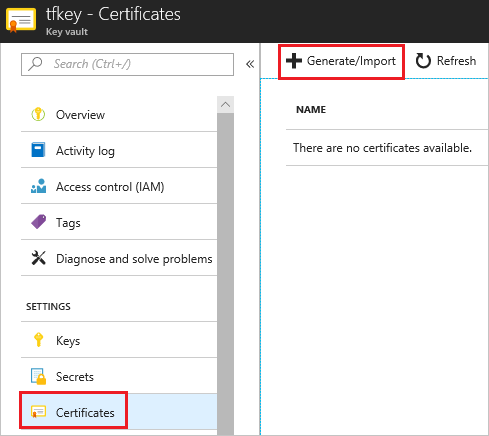

# Guidance on deploying web apps by using Azure Resource Manager templates

This article provides recommendations for creating Azure Resource Manager templates to deploy Azure App Service solutions. These recommendations can help you avoid common problems.

## Define dependencies

Defining dependencies for web apps requires an understanding of how the resources within a web app interact. If you specify dependencies in an incorrect order, you might cause deployment errors or create a race condition that stalls the deployment.

> [!WARNING]
> If you include an MSDeploy site extension in your template, you must set any configuration resources as dependent on the MSDeploy resource. Configuration changes cause the site to restart asynchronously. By making the configuration resources dependent on MSDeploy, you ensure that MSDeploy finishes before the site restarts. Without these dependencies, the site might restart during the deployment process of MSDeploy. For an example template, see [WordPress Template with Web Deploy Dependency](https://github.com/davidebbo/AzureWebsitesSamples/blob/master/ARMTemplates/WordpressTemplateWebDeployDependency.json).

The following image shows the dependency order for various App Service resources:


You deploy resources in the following order:

**Tier 1**
* App Service plan.
* Any other related resources, like databases or storage accounts.

**Tier 2**
* Web app--depends on the App Service plan.
* Azure Application Insights instance that targets the server farm--depends on the App Service plan.

**Tier 3**
* Source control--depends on the web app.
* MSDeploy site extension--depends on the web app.
* Azure Application Insights instance that targets the web app--depends on the web app.

**Tier 4**
* App Service certificate--depends on source control or MSDeploy if either is present. Otherwise, it depends on the web app.
* Configuration settings (connection strings, web.config values, app settings)--depends on source control or MSDeploy if either is present. Otherwise, it depends on the web app.

**Tier 5**
* Host name bindings--depends on the certificate if present. Otherwise, it depends on a higher-level resource.
* Site extensions--depends on configuration settings if present. Otherwise, it depends on a higher-level resource.

Typically, your solution includes only some of these resources and tiers. For missing tiers, map lower resources to the next-higher tier.

The following example shows part of a template. The value of the connection string configuration depends on the MSDeploy extension. The MSDeploy extension depends on the web app and database.

```json
{
    "name": "[parameters('appName')]",
    "type": "Microsoft.Web/Sites",
    ...
    "resources": [
      {
          "name": "MSDeploy",
          "type": "Extensions",
          "dependsOn": [
            "[concat('Microsoft.Web/Sites/', parameters('appName'))]",
            "[concat('Microsoft.Sql/servers/', parameters('dbServerName'), '/databases/', parameters('dbName'))]",
          ],
          ...
      },
      {
          "name": "connectionstrings",
          "type": "config",
          "dependsOn": [
            "[concat('Microsoft.Web/Sites/', parameters('appName'), '/Extensions/MSDeploy')]"
          ],
          ...
      }
    ]
}
```

For a ready-to-run sample that uses the code above, see [Template: Build a simple Umbraco Web App](https://github.com/Azure/azure-quickstart-templates/tree/master/application-workloads/umbraco/umbraco-webapp-simple).

## Find information about MSDeploy errors

If your Resource Manager template uses MSDeploy, the deployment error messages can be difficult to understand. To get more information after a failed deployment, try the following steps:

1. Go to the site's [Kudu console](https://github.com/projectkudu/kudu/wiki/Kudu-console).
2. Browse to the folder at D:\home\LogFiles\SiteExtensions\MSDeploy.
3. Look for the appManagerStatus.xml and appManagerLog.xml files. The first file logs the status. The second file logs information about the error. If the error isn't clear to you, you can include it when you're asking for help on the [forum](/answers/topics/azure-webapps.html).

## Choose a unique web app name

The name for your web app must be globally unique. You can use a naming convention that's likely to be unique, or you can use the [uniqueString function](../azure-resource-manager/templates/template-functions-string.md#uniquestring) to assist with generating a unique name.

```json
{
  "apiVersion": "2016-08-01",
  "name": "[concat(parameters('siteNamePrefix'), uniqueString(resourceGroup().id))]",
  "type": "Microsoft.Web/sites",
  ...
}
```

## Deploy web app certificate from Key Vault

[!INCLUDE [updated-for-az](../../includes/updated-for-az.md)]

If your template includes a [Microsoft.Web/certificates](/azure/templates/microsoft.web/certificates) resource for TLS/SSL binding, and the certificate is stored in a Key Vault, you must make sure the App Service identity can access the certificate.

In global Azure, the App Service service principal has the ID of **abfa0a7c-a6b6-4736-8310-5855508787cd**. To grant access to Key Vault for the App Service service principal, use:

```azurepowershell-interactive
Set-AzKeyVaultAccessPolicy `
  -VaultName KEY_VAULT_NAME `
  -ServicePrincipalName abfa0a7c-a6b6-4736-8310-5855508787cd `
  -PermissionsToSecrets get `
  -PermissionsToCertificates get
```

In Azure Government, the App Service service principal has the ID of **6a02c803-dafd-4136-b4c3-5a6f318b4714**. Use that ID in the preceding example.

In your Key Vault, select **Certificates** and **Generate/Import** to upload the certificate.



In your template, provide the name of the certificate for the `keyVaultSecretName`.

For an example template, see [Deploy a Web App certificate from Key Vault secret and use it for creating SSL binding](https://github.com/Azure/azure-quickstart-templates/tree/master/quickstarts/microsoft.web/web-app-certificate-from-key-vault).

## Next steps

* For a tutorial on deploying web apps with a template, see [Provision and deploy microservices predictably in Azure](deploy-complex-application-predictably.md).
* To learn about JSON syntax and properties for resource types in templates, see [Azure Resource Manager template reference](/azure/templates/).
