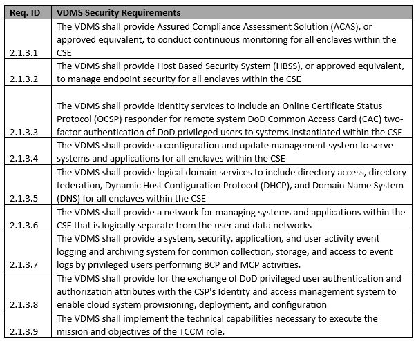
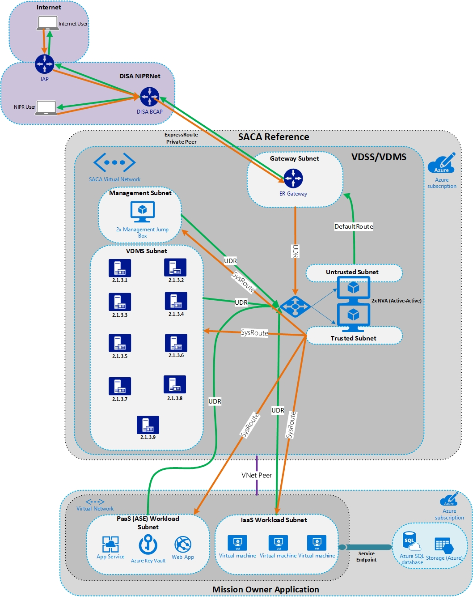
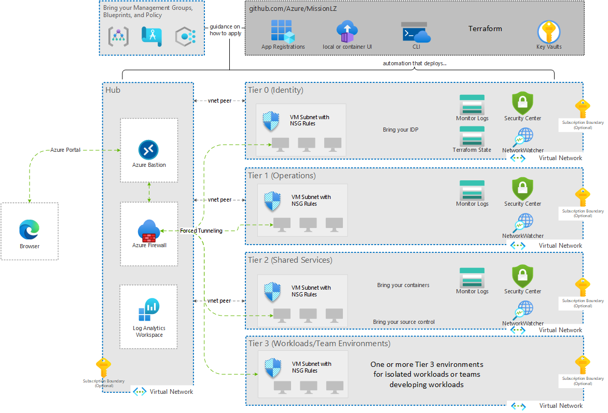
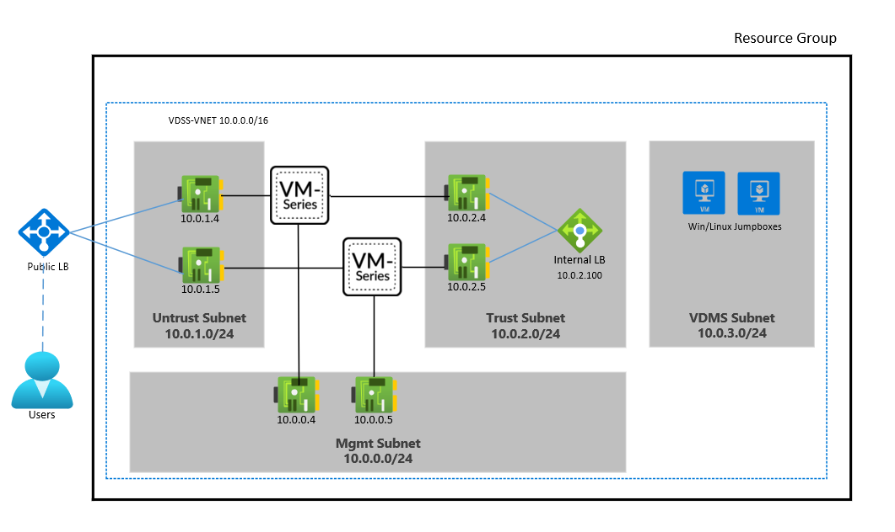

# Secure Azure Computing Architecture

U.S. Department of Defense (DoD) customers who deploy workloads to Azure have asked for guidance to set up secure virtual networks and configure the security tools and services that are stipulated by DoD standards and practice. 

The Defense Information System Agency (DISA) published the [Secure Cloud Computing Architecture (SCCA) Functional Requirements Document (FRD)](https://rmf.org/wp-content/uploads/2018/05/SCCA_FRD_v2-9.pdf) in 2017. SCCA describes the functional objectives for securing the Defense Information System Network’s (DISN) and commercial cloud provider connection points. SCCA also describes how mission owners secure cloud applications at the connection boundary. Every DoD entity that connects to the commercial cloud must follow the guidelines set forth in the SCCA FRD.
 
The SCCA has four components:
 
- Boundary Cloud Access Point (BCAP)
- Virtual Datacenter Security Stack (VDSS)
- Virtual Datacenter Managed Services (VDMS)
- Trusted Cloud Credential Manager (TCCM) 

Microsoft has developed a solution that meets the SCCA requirements for both IL4 and IL5 workloads that run in Azure. This Azure-specific solution is called the Secure Azure Computing Architecture (SACA). Customers who deploy SACA are in compliance with the SCCA FRD. They can enable DoD customers to move workloads into Azure after they're connected.

SCCA guidance and architectures are specific to DoD customers, but they also help civilian customers comply with trusted internet connection (TIC) guidance and help commercial customers that want to implement a secure DMZ to protect their Azure environments.

## Secure Cloud Computing Architecture components

### BCAP

The purpose of the BCAP is to protect the DISN from attacks that originate in the cloud environment. BCAP performs intrusion detection and prevention. it also filters out unauthorized traffic. This component can be colocated with other components of the SCCA. We recommend that you deploy this component by using physical hardware. BCAP security requirements are listed in the following table.

#### BCAP security requirements

### VDSS

The purpose of the VDSS is to protect DoD mission-owner applications that are hosted in Azure. VDSS performs the bulk of the security operations in the SCCA. It conducts traffic inspection to secure the applications that run in Azure. This component can be provided within your Azure environment.

#### VDSS security requirements

### VDMS

The purpose of VDMS is to provide host security and shared data center services. The functions of VDMS can either run in the hub of your SCCA or the mission owner can deploy pieces of it in their own Azure subscription. This component can be provided within your Azure environment.

#### VDMS security requirements

### TCCM

TCCM is a business role. This individual is responsible for managing the SCCA. Their duties are to: 

- Establish plans and policies for account access to the cloud environment. 
- Ensure that identity and access management is operating properly. 
- Maintain the Cloud Credential Management Plan. 

This individual is appointed by the authorizing official. The BCAP, VDSS, and VDMS provide the capabilities that the TCCM needs to perform their job.

#### TCCM security requirements

 

## SACA components and planning considerations 

The SACA reference architecture is designed to deploy the VDSS and VDMS components in Azure and to enable the TCCM. This architecture is modular. All the pieces of VDSS and VDMS can live in a centralized hub or in multiple virtual networks. Some of the controls can be met in the mission-owner space or even on-premises. The following diagram shows this architecture: 

When you plan your SCCA compliancy strategy and technical architecture, consider the following topics from the beginning because they affect every customer. The following issues have come up with DoD customers and tend to slow down planning and execution. 

#### Which BCAP will your organization use?

- DISA BCAP:
     - DISA has two Gen 2 BCAPs that they currently operate and maintain, with three new Gen 3 BCAPs coming online soon. 
     - DISA’s BCAPs all have Azure ExpressRoute circuits to Azure, which can be used by Government and DoD customers for connectivity. 
     - DISA has an enterprise-level Microsoft peering session for customers who want to subscribe to Microsoft software as a service (SaaS) tools, such as Microsoft 365. By using the DISA BCAP, you can enable connectivity and peering to your SACA instance. 
     - We recommend that you use the DISA BCAP. This option is readily available, has built-in redundancy, and has customers that operate on it today in production.
- Build your own BCAP:
     - This option requires you to lease space in a colocated data center and set up an ExpressRoute circuit to Azure. 
     - This option requires additional approval from the DoD CIO.
     - Because of the additional approval and a physical build-out, this option takes the most time, and is difficult to attain. 
- DoD routable IP space:
    - You must use DoD routable IP space at your edge. The option to use NAT to connect those spaces to private IP space in Azure is available.
    - Contact the DoD Network Information Center (NIC) to obtain IP space. You need it as part of your System/Network Approval Process (SNAP) submission with DISA. 
    - If you plan to use NAT to connect private address space in Azure, you need a minimum of a /24 subnet of address space assigned from the NIC for each region where you plan to deploy SACA.
- Redundancy:
    - Deploy a SACA instance to at least two regions for failover capabilities.
    - Connect to at least two BCAPs via separate ExpressRoute circuits. Both ExpressRoute connections can then be linked to each region’s SACA instance. 
- DoD component-specific requirements:
    - Does your organization have any specific requirements outside the SCCA requirements? Some organizations have specific IPS requirements.
- SACA is a modular architecture:
    - Use only the components you need for your environment. 
      - Deploy network virtual appliances in a single tier or multi-tier.
      - Use cloud-native IPS or bring-your-own IPS.

#### Which automated solution will you use to deploy VDSS?

As mentioned earlier, you can build this SACA reference by using a variety of appliances and Azure services. Microsoft has automated solution templates to deploy the SACA architecture with native services or by partners like Palo Alto Networks, F5, and Citrix. These solutions are covered in the following section.

#### Which Azure services will you use?

- There are Azure services that can meet requirements for log analytics, host-based protection, and IDS functionality. It's possible that some services aren’t generally available in Microsoft Azure DoD regions. In this case, you might need to use third-party tools if these Azure services can’t meet your requirements. Look at the tools you're comfortable with and the feasibility of using Azure native tooling.
- We recommend that you use as many Azure native tools as possible. They're built with cloud security in mind and seamlessly integrate with the rest of the Azure platform. Use the Azure native tools in the following list to meet various requirements of SCCA:

    - [Azure Monitor](../../azure-monitor/overview.md)
    - [Azure Security Center](../../security-center/security-center-introduction.md) 
    - [Azure Network Watcher](../../network-watcher/network-watcher-monitoring-overview.md) 
    - [Azure Key Vault](../../key-vault/general/overview.md) 
    - [Azure Active Directory](../../active-directory/fundamentals/active-directory-whatis.md)
    - [Azure Application Gateway](../../application-gateway/overview.md)
    - [Azure Firewall](../../firewall/overview.md) 
    - [Azure Front Door](../../frontdoor/front-door-overview.md)
    - [Azure security groups](../../virtual-network/network-security-groups-overview.md)
    - [Azure DDoS Protection](../../ddos-protection/ddos-protection-overview.md)
    - [Azure Sentinel](../../sentinel/overview.md)
- Sizing
    - A sizing exercise must be completed. Look at the number of concurrent connections you might have through the SACA instance and the network throughput requirements. 
    - This step is critical. It helps to size the VMs, ExpressRoute circuits, and identify the licenses that are required from the various vendors you use in your SACA deployment. 
    - A good cost analysis can’t be done without this sizing exercise. Correct sizing also allows for best performance. 

## Most common deployment scenario

 Several Microsoft customers have gone through the full deployment or at least the planning stages of their SACA environments. Their experiences revealed insight into the most common deployment scenario. The following diagram shows the most common architecture: 

 

As you can see from the diagram, customers typically subscribe to two of the DISA BCAPs. An ExpressRoute private peer is enabled to Azure at each DISA BCAP location. These ExpressRoute peers are then linked to the virtual network gateway in each Azure region. All ingress and egress traffic flows through SACA, via the ExpressRoute connection to the DISA BCAP.

Mission-owner applications then choose the Azure regions in which they plan to deploy their applications. They use virtual network peering to connect their application’s virtual network to the SACA virtual network. Then they force tunnel all their traffic through the VDSS instance.

We recommend this architecture because it meets SCCA requirements. It’s highly available, easily scalable, and simplifies deployment and management.

## Automated SACA deployment options

As previously mentioned, Microsoft has partnered with vendors to create automated SACA infrastructure templates. These templates deploy the following Azure components:

- SACA virtual network
     - VDMS subnet
        - This subnet is where VMs and services used for VDMS are deployed, including the jump box VMs.
     - Untrusted, trusted, management, or AzureFirewallSubnet subnets
        - These subnets are where virtual appliances or Azure Firewall are deployed.
- Management jump box virtual machines
    - They're used for out-of-band management of the environment.
- Network virtual appliances
- Azure Bastion
    - Bastion is used to securely connect to VMs over SSL
- Public IPs
    - They're used for the front end until ExpressRoute is brought online. These IPs translate to the back-end Azure private address space.
- Route tables 
    - Applied during automation, these route tables force tunnel all traffic through the virtual appliance via the internal load balancer.
- Azure load balancers - Standard SKU
    - They're used to load-balance traffic across the third-party appliances.
- Network security groups
    - They're used to control which types of traffic can traverse to certain endpoints.

### Azure SACA Deployment

You can use the Mission Landing Zone deployment template to deploy into one or multiple subscriptions, depending on the requirements of your environment. It uses built-in Azure services that have no dependencies on third-party licenses. The template uses Azure Firewall and other security services to deploy an architecture that is SCCA-compliant. 

For the Azure documentation and deployment scripts, see [this GitHub link](https://github.com/Azure/missionlz).

### Palo Alto Networks SACA deployment

The Palo Alto Networks deployment template deploys one to many VM-Series appliances, as well as the VDMS staging and routing to enable a one-tier, VDSS-compliant architecture. This architecture meets the requirements of SCCA. 

For the Palo Alto Networks documentation and deployment script, see [this GitHub link](https://github.com/PaloAltoNetworks/Palo-Azure-SACA).

### F5 Networks SACA deployment

Two separate F5 deployment templates cover two different architectures. The first template has only one layer of F5 appliances in an active-active highly available configuration. This architecture meets the requirements of SCCA. The second template adds a second layer of active-active highly available F5s. This second layer allows customers to add their own IPS separate from F5 in between the F5 layers. Not all DoD components have specific IPS prescribed for use. If that's the case, the single layer of F5 appliances works for most because that architecture includes IPS on the F5 devices.

For the F5 documentation and deployment script, see [this GitHub link](https://github.com/f5devcentral/f5-azure-saca).

### Citrix SACA deployment

A Citrix deployment template deploys two layers of highly available Citrix ADC appliances. This architecture meets the requirements of VDSS. 

For the Citrix documentation and deployment script, see [this GitHub link](https://github.com/citrix/netscaler-azure-templates/tree/master/templates/saca).

