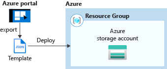
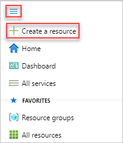
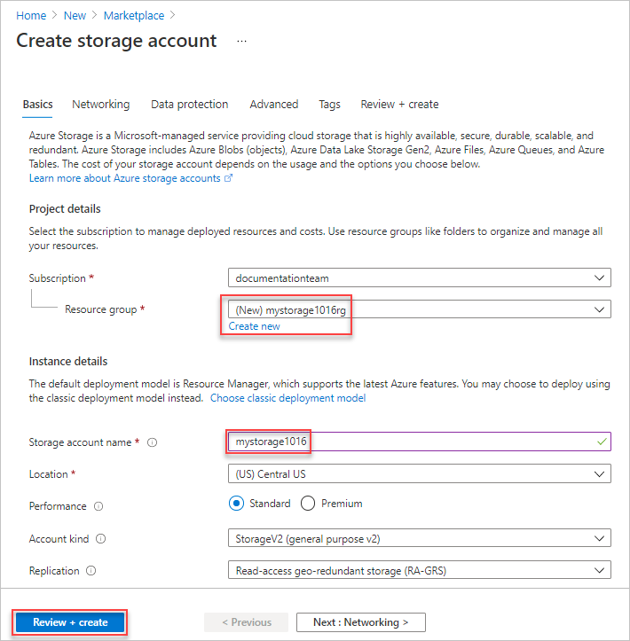
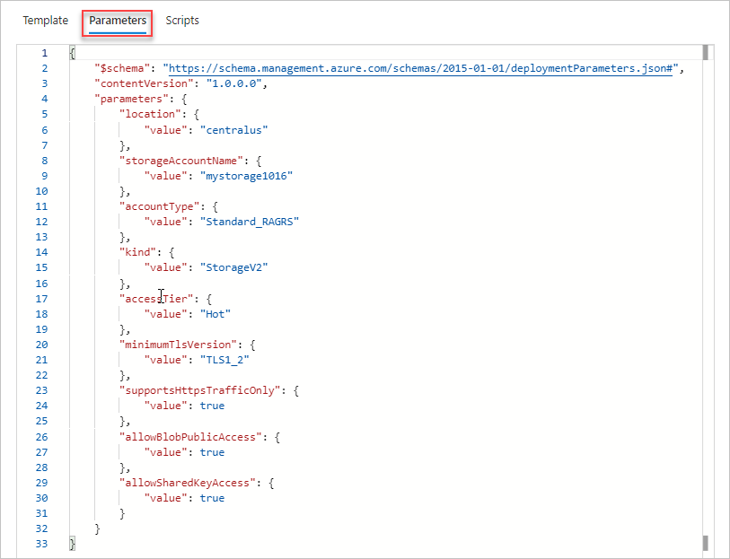
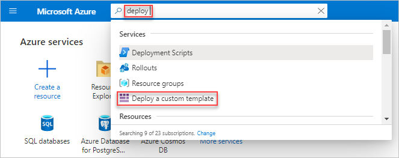
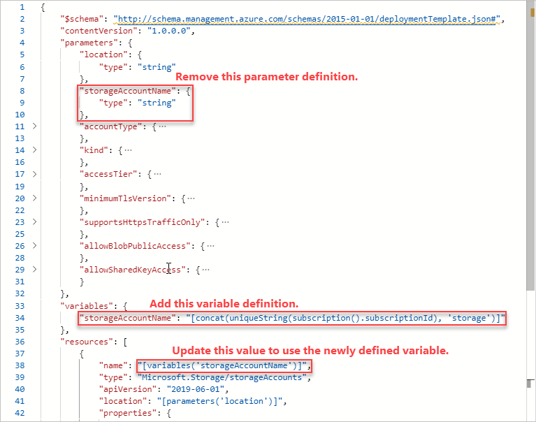
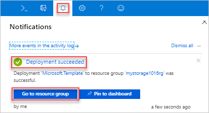
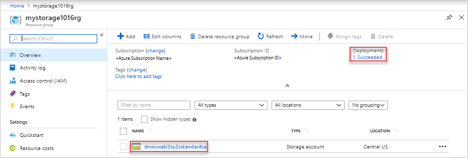

# Quickstart: Create and deploy ARM templates by using the Azure portal

Learn how to generate an Azure Resource Manager template (ARM template) using the Azure portal, and the process of editing and deploying the template from the portal. ARM templates are JSON files that define the resources you need to deploy for your solution. To understand the concepts associated with deploying and managing your Azure solutions, see [template deployment overview](overview.md).

After completing the tutorial, you deploy an Azure Storage account. The same process can be used to deploy other Azure resources.



If you don't have an Azure subscription, [create a free account](https://azure.microsoft.com/free/) before you begin.

## Generate a template using the portal

Creating an ARM template from scratch is not an easy task, especially if you are new to Azure deployment and you are not familiar with the JSON format. Using the Azure portal, you can configure a resource, for example an Azure Storage account. Before you deploy the resource, you can export your configuration into a template. You can save the template and reuse it in the future.

Many experienced template developers use this method to generate templates when they try to deploy Azure resources that they are not familiar with. For more information about exporting templates by using the portal, see [Export resource groups to templates](../management/manage-resource-groups-portal.md#export-resource-groups-to-templates). The other way to find a working template is from [Azure Quickstart templates](https://azure.microsoft.com/resources/templates/).

1. In a web browser, go to the [Azure portal](https://portal.azure.com) and sign in.
1. From the Azure portal menu, select **Create a resource**.

    

1. In the search box, type **storage account**, and then press **[ENTER]**.
1. Select the down arrow next to **Create**, and then select **Storage account**.

    

1. Enter the following information:

    |Name|Value|
    |----|----|
    |**Resource group**|Select **Create new**, and specify a resource group name of your choice. On the screenshot, the resource group name is *mystorage1016rg*. Resource group is a container for Azure resources. Resource group makes it easier to manage Azure resources. |
    |**Name**|Give your storage account a unique name. The storage account name must be unique across all of Azure, and it contain only lowercase letters and numbers. Name must be between 3 and 24 characters. If you get an error message saying "The storage account name 'mystorage1016' is already taken", try using **&lt;your name>storage&lt;Today's date in MMDD>**, for example **johndolestorage1016**. For more information, see [Naming rules and restrictions](/azure/architecture/best-practices/resource-naming).|

    You can use the default values for the rest of the properties.

    

    > [!NOTE]
    > Some of the exported templates require some edits before you can deploy them.

1. Select **Review + create** on the bottom of the screen. Do not select **Create** in the next step.
1. Select **Download a template for automation** on the bottom of the screen. The portal shows the generated template:

    

    The main pane shows the template. It is a JSON file with six top-level elements - `schema`, `contentVersion`, `parameters`, `variables`, `resources`, and `output`. For more information, see [Understand the structure and syntax of ARM templates](./syntax.md)

    There are nine parameters defined. One of them is called **storageAccountName**. The second highlighted part on the previous screenshot shows how to reference this parameter in the template. In the next section, you edit the template to use a generated name for the storage account.

    In the template, one Azure resource is defined. The type is `Microsoft.Storage/storageAccounts`. Take a look of how the resource is defined, and the definition structure.
1. Select **Download** from the top of the screen.
1. Open the downloaded zip file, and then save **template.json** to your computer. In the next section, you use a template deployment tool to edit the template.
1. Select the **Parameter** tab to see the values you provided for the parameters. Write down these values, you need them in the next section when you deploy the template.

    

    Using both the template file and the parameters file, you can create a resource, in this tutorial, an Azure storage account.

## Edit and deploy the template

The Azure portal can be used to perform some basic template editing. In this quickstart, you use a portal tool called *Template Deployment*. *Template Deployment* is used in this tutorial so you can complete the whole tutorial using one interface - the Azure portal. To edit a more complex template, consider using [Visual Studio Code](quickstart-create-templates-use-visual-studio-code.md),  which provides richer edit functionalities.

> [!IMPORTANT]
> Template Deployment provides an interface for testing simple templates. It is not recommended to use this feature in production. Instead, store your templates in an Azure storage account, or a source code repository like GitHub.

Azure requires that each Azure service has a unique name. The deployment could fail if you entered a storage account name that already exists. To avoid this issue, you modify the template to use a template function call `uniquestring()` to generate a unique storage account name.

1. From the Azure portal menu, in the search box, type **deploy**, and then select **Deploy a custom template**.

    

1. Select **Build your own template in the editor**.
1. Select **Load file**, and then follow the instructions to load template.json you downloaded in the last section.
1. Make the following three changes to the template:

    

   - Remove the **storageAccountName** parameter as shown in the previous screenshot.
   - Add one variable called **storageAccountName** as shown in the previous screenshot:

      ```json
      "storageAccountName": "[concat(uniqueString(subscription().subscriptionId), 'storage')]"
      ```

      Two template functions are used here: `concat()` and `uniqueString()`.
   - Update the name element of the **Microsoft.Storage/storageAccounts** resource to use the newly defined variable instead of the parameter:

      ```json
      "name": "[variables('storageAccountName')]",
      ```

      The final template shall look like:

      ```json
      {
        "$schema": "http://schema.management.azure.com/schemas/2015-01-01/deploymentTemplate.json#",
        "contentVersion": "1.0.0.0",
        "parameters": {
          "location": {
            "type": "string"
          },
          "accountType": {
            "type": "string"
          },
          "kind": {
            "type": "string"
          },
          "accessTier": {
            "type": "string"
          },
          "minimumTlsVersion": {
            "type": "string"
          },
          "supportsHttpsTrafficOnly": {
            "type": "bool"
          },
          "allowBlobPublicAccess": {
            "type": "bool"
          },
          "allowSharedKeyAccess": {
            "type": "bool"
          }
        },
        "variables": {
          "storageAccountName": "[concat(uniqueString(subscription().subscriptionId), 'storage')]"
        },
        "resources": [
          {
            "name": "[variables('storageAccountName')]",
            "type": "Microsoft.Storage/storageAccounts",
            "apiVersion": "2019-06-01",
            "location": "[parameters('location')]",
            "properties": {
              "accessTier": "[parameters('accessTier')]",
              "minimumTlsVersion": "[parameters('minimumTlsVersion')]",
              "supportsHttpsTrafficOnly": "[parameters('supportsHttpsTrafficOnly')]",
              "allowBlobPublicAccess": "[parameters('allowBlobPublicAccess')]",
              "allowSharedKeyAccess": "[parameters('allowSharedKeyAccess')]"
            },
            "dependsOn": [],
            "sku": {
              "name": "[parameters('accountType')]"
            },
            "kind": "[parameters('kind')]",
            "tags": {}
          }
        ],
        "outputs": {}
      }
      ```

1. Select **Save**.
1. Enter the following values:

    |Name|Value|
    |----|----|
    |**Resource group**|Select the resource group name you created in the last section. |
    |**Region**|Select a location for the resource group. For example, **Central US**. |
    |**Location**|Select a location for the storage account. For example, **Central US**. |
    |**Account Type**|Enter **Standard_LRS** for this quickstart. |
    |**Kind**|Enter **StorageV2** for this quickstart. |
    |**Access Tier**|Enter **Hot** for this quickstart. |
    |**Minimum TLS Version**|Enter **TLS1_0**. |
    |**Supports Https Traffic Only**| Select **true** for this quickstart. |
    |**Allow Blob Public Access**| Select **false** for this quickstart. |
    |**Allow Shared Key Access**| Select **true** for this quickstart. |

1. Select **Review + create**.
1. Select **Create**.
1. Select the bell icon (notifications) from the top of the screen to see the deployment status. You shall see **Deployment in progress**. Wait until the deployment is completed.

    

1. Select **Go to resource group** from the notification pane. You shall see a screen similar to:

    

    You can see the deployment status was successful, and there is only one storage account in the resource group. The storage account name is a unique string generated by the template. To learn more about using Azure storage accounts, see [Quickstart: Upload, download, and list blobs using the Azure portal](../../storage/blobs/storage-quickstart-blobs-portal.md).

## Clean up resources

When the Azure resources are no longer needed, clean up the resources you deployed by deleting the resource group.

1. In the Azure portal, select **Resource group** on the left menu.
1. Enter the resource group name in the **Filter by name** field.
1. Select the resource group name.  You shall see the storage account in the resource group.
1. Select **Delete resource group** in the top menu.

## Next steps

In this tutorial, you learned how to generate a template from the Azure portal, and how to deploy the template using the portal. The template used in this Quickstart is a simple template with one Azure resource. When the template is complex, it is easier to use Visual Studio Code or Visual Studio to develop the template. To learn more about template development, see our new beginner tutorial series:

> [!div class="nextstepaction"]
> [Beginner tutorials](./template-tutorial-create-first-template.md)