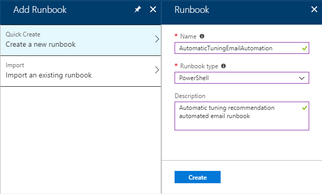
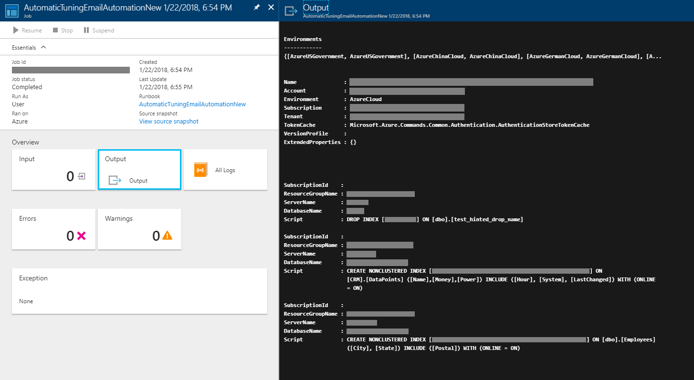
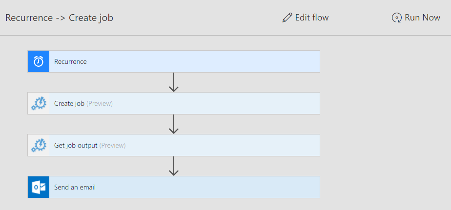
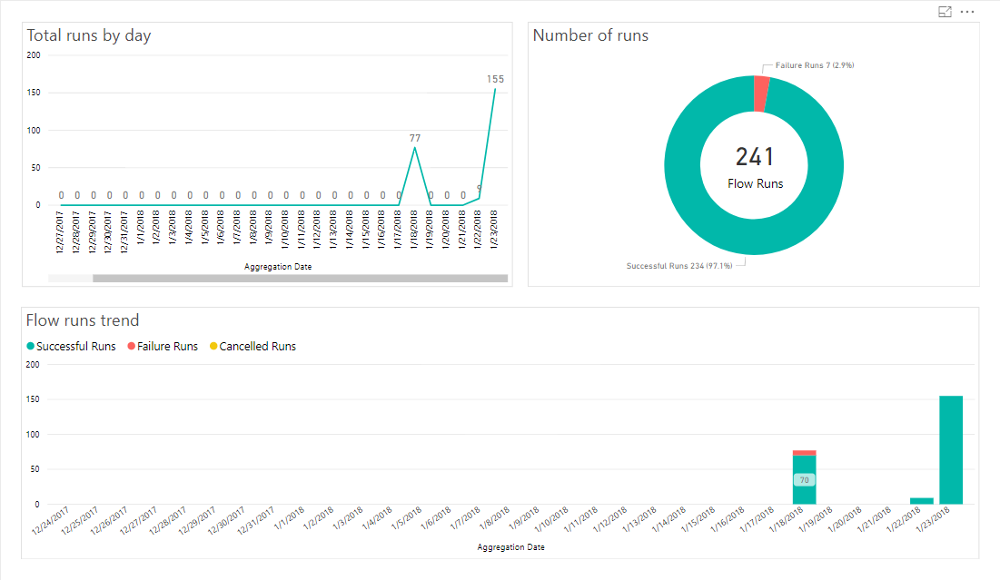

# Email notifications for automatic tuning
[!INCLUDE[appliesto-sqldb-sqlmi](../includes/appliesto-sqldb-sqlmi.md)]


Azure SQL Database tuning recommendations are generated by Azure SQL Database [automatic tuning](automatic-tuning-overview.md). This solution continuously monitors and analyzes workloads of databases providing customized tuning recommendations for each individual database related to index creation, index deletion, and optimization of query execution plans.

Azure SQL Database automatic tuning recommendations can be viewed in the [Azure portal](database-advisor-find-recommendations-portal.md), retrieved with [REST API](/rest/api/sql/databaserecommendedactions/listbydatabaseadvisor) calls, or by using [T-SQL](https://azure.microsoft.com/blog/automatic-tuning-introduces-automatic-plan-correction-and-t-sql-management/) and [PowerShell](/powershell/module/az.sql/get-azsqldatabaserecommendedaction) commands. This article is based on using a PowerShell script to retrieve automatic tuning recommendations.

[!INCLUDE [updated-for-az](../../../includes/updated-for-az.md)]
> [!IMPORTANT]
> The PowerShell Azure Resource Manager module is still supported by Azure SQL Database, but all future development is for the Az.Sql module. For these cmdlets, see [AzureRM.Sql](/powershell/module/AzureRM.Sql/). The arguments for the commands in the Az module and in the AzureRm modules are substantially identical.

## Automate email notifications for automatic tuning recommendations

The following solution automates the sending of email notifications containing automatic tuning recommendations. The solution described consists of automating execution of a PowerShell script for retrieving tuning recommendations using [Azure Automation](../../automation/automation-intro.md), and automation of scheduling email delivery job using [Microsoft Flow](https://flow.microsoft.com).

## Create Azure Automation account

To use Azure Automation, the first step is to create an automation account and to configure it with Azure resources to use for execution of the PowerShell script. To learn more about Azure Automation and its capabilities, see [Getting started with Azure automation](../../automation/index.yml).

Follow these steps to create an Azure Automation Account through the method of selecting and configuring an Automation app from Azure Marketplace:

1. Log into the Azure portal.
1. Click on "**+ Create a resource**" in the upper left corner.
1. Search for "**Automation**" (press enter).
1. Click on the Automation app in the search results.

    

1. Once inside the "Create an Automation Account" pane, click on "**Create**".
1. Populate the required information: enter a name for this automation account, select your Azure subscription ID and Azure resources to be used for the PowerShell script execution.
1. For the "**Create Azure Run As account**" option, select **Yes** to configure the type of account under which PowerShell script runs with the help of Azure Automation. To learn more about account types, see [Run As account](../../automation/manage-runas-account.md).
1. Conclude creation of the automation account by clicking on **Create**.

> [!TIP]
> Record your Azure Automation account name, subscription ID, and resources (such as copy-paste to a notepad) exactly as entered while creating the Automation app. You need this information later.

If you have several Azure subscriptions for which you would like to build the same automation, you need to repeat this process for your other subscriptions.

## Update Azure Automation modules

The PowerShell script to retrieve automatic tuning recommendation uses [Get-AzResource](/powershell/module/az.Resources/Get-azResource) and [Get-AzSqlDatabaseRecommendedAction](/powershell/module/az.Sql/Get-azSqlDatabaseRecommendedAction) commands for which Azure Module version 4 and above is required.

- In case your Azure Modules need updating, see [Az module support in Azure Automation](../../automation/shared-resources/modules.md).

## Create Azure Automation runbook

The next step is to create a Runbook in Azure Automation inside which the PowerShell script for retrieval of tuning recommendations resides.

Follow these steps to create a new Azure Automation runbook:

1. Access the Azure Automation account you created in the previous step.
1. Once in the automation account pane, click on the "**Runbooks**" menu item on the left-hand side to create a new Azure Automation runbook with the PowerShell script. To learn more about creating automation runbooks, see [Create a new runbook](../../automation/manage-runbooks.md#create-a-runbook).
1. To add a new runbook, click on the "**+Add a runbook**" menu option, and then click on the "**Quick create – Create a new runbook**"..
1. In the Runbook pane, type in the name of your runbook (for the purpose of this example, "**AutomaticTuningEmailAutomation**" is used), select the type of runbook as **PowerShell** and write a description of this runbook to describe its purpose.
1. Click on the **Create** button to finish creating a new runbook.

    

Follow these steps to load a PowerShell script inside the runbook created:

1. Inside the "**Edit PowerShell Runbook**" pane, select "**RUNBOOKS**" on the menu tree and expand the view until you see the name of your runbook (in this example "**AutomaticTuningEmailAutomation**"). Select this runbook.
1. On the first line of the "Edit PowerShell Runbook" (starting with the number 1), copy-paste the following PowerShell script code. This PowerShell script is provided as-is to get you started. Modify the script to suite your needs.

In the header of the provided PowerShell script, you need to replace `<SUBSCRIPTION_ID_WITH_DATABASES>` with your Azure subscription ID. To learn how to retrieve your Azure subscription ID, see [Getting your Azure Subscription GUID](/archive/blogs/mschray/getting-your-azure-subscription-guid-new-portal).

In the case of several subscriptions, you can add them as comma-delimited to the "$subscriptions" property in the header of the script.

```powershell
# PowerShell script to retrieve Azure SQL Database automatic tuning recommendations.
#
# Provided "as-is" with no implied warranties or support.
# The script is released to the public domain.
#
# Replace <SUBSCRIPTION_ID_WITH_DATABASES> in the header with your Azure subscription ID.
#
# Microsoft Azure SQL Database team, 2018-01-22.

# Set subscriptions : IMPORTANT – REPLACE <SUBSCRIPTION_ID_WITH_DATABASES> WITH YOUR SUBSCRIPTION ID
$subscriptions = ("<SUBSCRIPTION_ID_WITH_DATABASES>", "<SECOND_SUBSCRIPTION_ID_WITH_DATABASES>", "<THIRD_SUBSCRIPTION_ID_WITH_DATABASES>")

# Get credentials
$Conn = Get-AutomationConnection -Name AzureRunAsConnection
Connect-AzAccount -ServicePrincipal -Tenant $Conn.TenantID -ApplicationId $Conn.ApplicationID -CertificateThumbprint $Conn.CertificateThumbprint

# Define the resource types
$resourceTypes = ("Microsoft.Sql/servers/databases")
$advisors = ("CreateIndex", "DropIndex");
$results = @()

# Loop through all subscriptions
foreach($subscriptionId in $subscriptions) {
    Select-AzSubscription -SubscriptionId $subscriptionId
    $rgs = Get-AzResourceGroup

    # Loop through all resource groups
    foreach($rg in $rgs) {
        $rgname = $rg.ResourceGroupName;

        # Loop through all resource types
        foreach($resourceType in $resourceTypes) {
            $resources = Get-AzResource -ResourceGroupName $rgname -ResourceType $resourceType

            # Loop through all databases
            # Extract resource groups, servers and databases
            foreach ($resource in $resources) {
                $resourceId = $resource.ResourceId
                if ($resourceId -match ".*RESOURCEGROUPS/(?<content>.*)/PROVIDERS.*") {
                    $ResourceGroupName = $matches['content']
                } else {
                    continue
                }
                if ($resourceId -match ".*SERVERS/(?<content>.*)/DATABASES.*") {
                    $ServerName = $matches['content']
                } else {
                    continue
                }
                if ($resourceId -match ".*/DATABASES/(?<content>.*)") {
                    $DatabaseName = $matches['content']
                } else {
                    continue
                }

                # Skip if master
                if ($DatabaseName -eq "master") {
                    continue
                }

                # Loop through all automatic tuning recommendation types
                foreach ($advisor in $advisors) {
                    $recs = Get-AzSqlDatabaseRecommendedAction -ResourceGroupName $ResourceGroupName -ServerName $ServerName  -DatabaseName $DatabaseName -AdvisorName $advisor
                    foreach ($r in $recs) {
                        if ($r.State.CurrentValue -eq "Active") {
                            $object = New-Object -TypeName PSObject
                            $object | Add-Member -Name 'SubscriptionId' -MemberType Noteproperty -Value $subscriptionId
                            $object | Add-Member -Name 'ResourceGroupName' -MemberType Noteproperty -Value $r.ResourceGroupName
                            $object | Add-Member -Name 'ServerName' -MemberType Noteproperty -Value $r.ServerName
                            $object | Add-Member -Name 'DatabaseName' -MemberType Noteproperty -Value $r.DatabaseName
                            $object | Add-Member -Name 'Script' -MemberType Noteproperty -Value $r.ImplementationDetails.Script
                            $results += $object
                        }
                    }
                }
            }
        }
    }
}

# Format and output results for the email
$table = $results | Format-List
Write-Output $table
```

Click the "**Save**" button in the upper right corner to save the script. When you are satisfied with the script, click the "**Publish**" button to publish this runbook.

At the main runbook pane, you can choose to click on the "**Start**" button to **test** the script. Click on the "**Output**" to view results of the script executed. This output is going to be the content of your email. The sample output from the script can be seen in the following screenshot.



Ensure to adjust the content by customizing the PowerShell script to your needs.

With the above steps, the PowerShell script to retrieve automatic tuning recommendations is loaded in Azure Automation. The next step is to automate and schedule the email delivery job.

## Automate the email jobs with Microsoft Flow

To complete the solution, as the final step, create an automation flow in Microsoft Flow consisting of three actions (jobs):

- "**Azure Automation - Create job**" – used to execute the PowerShell script to retrieve automatic tuning recommendations inside the Azure Automation runbook.
- "**Azure Automation - Get job output**" – used to retrieve output from the executed PowerShell script.
- "**Office 365 Outlook – Send an email**" – used to send out email. E-mails are sent out using the work or school account of the individual creating the flow.

To learn more about Microsoft Flow capabilities, see [Getting started with Microsoft Flow](/flow/getting-started).

Prerequisite for this step is to sign up for a [Microsoft Flow](https://flow.microsoft.com) account and to log in. Once inside the solution, follow these steps to set up a **new flow**:

1. Access "**My flows**" menu item.
1. Inside My flows, select the "**+Create from blank**" link at the top of the page.
1. Click on the link "**Search for hundreds of connectors and triggers**" at the bottom of the page.
1. In the search field type "**recurrence**", and select "**Schedule - Recurrence**" from the search results to schedule the email delivery job to run.
1. In the Recurrence pane in the Frequency field, select the scheduling frequency for this flow to execute, such as send automated email each Minute, Hour, Day, Week, etc.

The next step is to add three jobs (create, get output and send email) to the newly created recurring flow. To accomplish adding the required jobs to the flow, follow these steps:

1. Create action to execute PowerShell script to retrieve tuning recommendations

   - Select "**+New step**", followed by "**Add an action**" inside the Recurrence flow pane.
   - In the search field type "**automation**" and select "**Azure Automation – Create job**" from the search results.
   - In the Create job pane, configure the job properties. For this configuration, you will need details of your Azure subscription ID, Resource Group and Automation Account **previously recorded** at the **Automation Account pane**. To learn more about options available in this section, see [Azure Automation - Create Job](/connectors/azureautomation/#create-job).
   - Complete creating this action by clicking on "**Save flow**".

2. Create an action to retrieve output from the executed PowerShell script

   - Select "**+New step**", followed by "**Add an action**" inside the Recurrence flow pane
   - In the search field type "**automation**" and select "**Azure Automation – Get job output**" from the search results. To learn more about options available in this section, see [Azure Automation – Get job output](/connectors/azureautomation/#get-job-output).
   - Populate fields required (similar to creating the previous job) - populate your Azure subscription ID, Resource Group, and Automation Account (as entered in the Automation Account pane).
   - Click inside the field "**Job ID**" for the "**Dynamic content**" menu to show up. From within this menu, select the option "**Job ID**".
   - Complete creating this action by clicking on "**Save flow**".

3. Create an action to send out email using Office 365 integration

   - Select "**+New step**", followed by "**Add an action**" inside the Recurrence flow pane.
   - In the search field type "**send an email**" and select "**Office 365 Outlook – Send an email**" from the search results.
   - In the "**To**" field type in the email address to which you need to send the notification email.
   - In the "**Subject**" field type in the subject of your email, for example "Automatic tuning recommendations email notification".
   - Click inside the field "**Body**" for the "**Dynamic content**" menu to show up. From within this menu, under "**Get job output**", select "**Content**".
   - Complete creating this action by clicking on "**Save flow**".

> [!TIP]
> To send automated emails to different recipients, create separate flows. In these additional flows, change the recipient email address in the "To" field, and the email subject line in the "Subject" field. Creating new runbooks in Azure Automation with customized PowerShell scripts (such as with change of Azure subscription ID) enables further customization of automated scenarios, such as for example emailing separate recipients on Automated tuning recommendations for separate subscriptions.

The above concludes steps required to configure the email delivery job workflow. The entire flow consisting of three actions built is shown in the following image.



To test the flow, click on "**Run Now**" in the upper right corner inside the flow pane.

Statistics of running the automated jobs, showing success of email notifications sent out, can be seen from the Flow analytics pane.



The Flow analytics pane is helpful for monitoring the success of job executions, and if required for troubleshooting.  In the case of troubleshooting, you also might want to examine the PowerShell script execution log accessible through the Azure Automation app.

The final output of the automated email looks similar to the following email received after building and running this solution:


By adjusting the PowerShell script, you can adjust the output and formatting of the automated email to your needs.

You might further customize the solution to build email notifications based on a specific tuning event, and to multiple recipients, for multiple subscriptions or databases, depending on your custom scenarios.

## Next steps

- Learn more on how automatic tuning can help you improve database performance, see [Automatic tuning in Azure SQL Database](automatic-tuning-overview.md).
- To enable automatic tuning in Azure SQL Database to manage your workload, see [Enable automatic tuning](automatic-tuning-enable.md).
- To manually review and apply automatic tuning recommendations, see [Find and apply performance recommendations](database-advisor-find-recommendations-portal.md).
