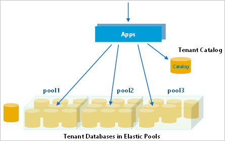
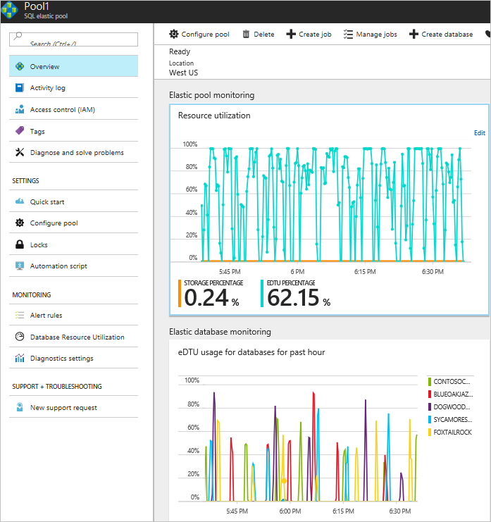
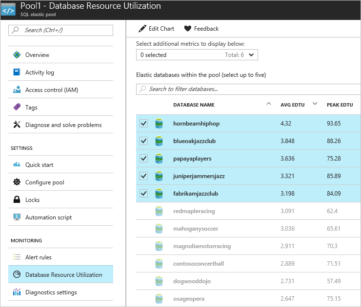
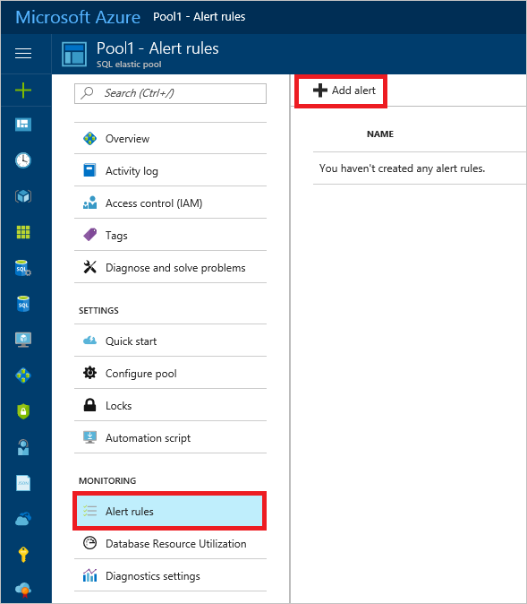
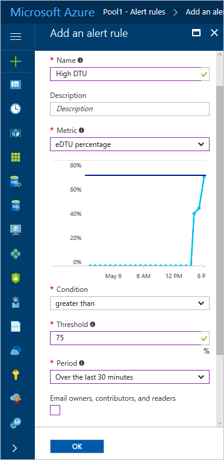
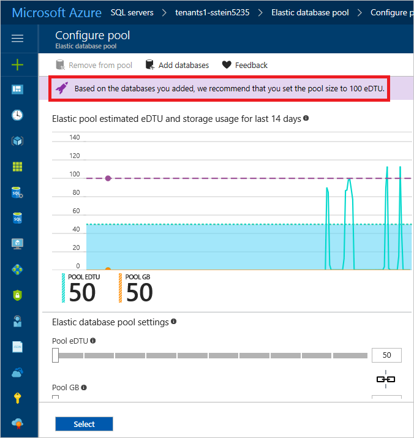

# Monitor and manage performance of Azure SQL Database in a multi-tenant SaaS app
[!INCLUDE[appliesto-sqldb](../includes/appliesto-sqldb.md)]

In this tutorial, several key performance management scenarios used in SaaS applications are explored. Using a load generator to simulate activity across all tenant databases, the built-in monitoring and alerting features of SQL Database and elastic pools are demonstrated.

The Wingtip Tickets SaaS Database Per Tenant app uses a single-tenant data model, where each venue (tenant) has their own database. Like many SaaS applications, the anticipated tenant workload pattern is unpredictable and sporadic. In other words, ticket sales may occur at any time. To take advantage of this typical database usage pattern, tenant databases are deployed into elastic pools. Elastic pools optimize the cost of a solution by sharing resources across many databases. With this type of pattern, it's important to monitor database and pool resource usage to ensure that loads are reasonably balanced across pools. You also need to ensure that individual databases have adequate resources, and that pools are not hitting their [eDTU](purchasing-models.md#dtu-based-purchasing-model) limits. This tutorial explores ways to monitor and manage databases and pools, and how to take corrective action in response to variations in workload.

In this tutorial you learn how to:

> [!div class="checklist"]
> 
> * Simulate usage on the tenant databases by running a provided load generator
> * Monitor the tenant databases as they respond to the increase in load
> * Scale up the Elastic pool in response to the increased database load
> * Provision a second Elastic pool to load balance database activity

To complete this tutorial, make sure the following prerequisites are completed:

* The Wingtip Tickets SaaS Database Per Tenant app is deployed. To deploy in less than five minutes, see [Deploy and explore the Wingtip Tickets SaaS Database Per Tenant application](./saas-dbpertenant-get-started-deploy.md)
* Azure PowerShell is installed. For details, see [Getting started with Azure PowerShell](/powershell/azure/get-started-azureps)

## Introduction to SaaS performance management patterns

Managing database performance consists of compiling and analyzing performance data, and then reacting to this data by adjusting parameters to maintain an acceptable response time for your application. When hosting multiple tenants, Elastic pools are a cost-effective way to provide and manage resources for a group of databases with unpredictable workloads. With certain workload patterns, as few as two S3 databases can benefit from being managed in a pool.

Pools, and the databases in pools, should be monitored to ensure they stay within acceptable ranges of performance. Tune the pool configuration to meet the needs of the aggregate workload of all databases, ensuring that the pool eDTUs are appropriate for the overall workload. Adjust the per-database min and per-database max eDTU values to appropriate values for your specific application requirements.

### Performance management strategies

* To avoid having to manually monitor performance, it’s most effective to **set alerts that trigger when databases or pools stray out of normal ranges**.
* To respond to short-term fluctuations in the aggregate compute size of a pool, the **pool eDTU level can be scaled up or down**. If this fluctuation occurs on a regular or predictable basis, **scaling the pool can be scheduled to occur automatically**. For example, scale down when you know your workload is light, maybe overnight, or during weekends.
* To respond to longer-term fluctuations, or changes in the number of databases, **individual databases can be moved into other pools**.
* To respond to short-term increases in *individual* database load **individual databases can be taken out of a pool and assigned an individual compute size**. Once the load is reduced, the database can then be returned to the pool. When this is known in advance, databases can be moved preemptively to ensure the database always has the resources it needs, and to avoid impact on other databases in the pool. If this requirement is predictable, such as a venue experiencing a rush of ticket sales for a popular event, then this management behavior can be integrated into the application.

The [Azure portal](https://portal.azure.com) provides built-in monitoring and alerting on most resources. Monitoring and alerting is available on databases and pools. This built-in monitoring and alerting is resource-specific, so it's convenient to use for small numbers of resources, but is not very convenient when working with many resources.

For high-volume scenarios, where you're working with many resources, [Azure Monitor logs](./saas-dbpertenant-log-analytics.md) can be used. This is a separate Azure service that provides analytics over emitted logs gathered in a Log Analytics workspace. Azure Monitor logs can collect telemetry from many services and be used to query and set alerts.

## Get the Wingtip Tickets SaaS Database Per Tenant application scripts

The Wingtip Tickets SaaS Multi-tenant Database scripts and application source code are available in the [WingtipTicketsSaaS-DbPerTenant](https://github.com/Microsoft/WingtipTicketsSaaS-DbPerTenant) GitHub repo. Check out the [general guidance](saas-tenancy-wingtip-app-guidance-tips.md) for steps to download and unblock the Wingtip Tickets SaaS scripts.

## Provision additional tenants

While pools can be cost-effective with just two S3 databases, the more databases that are in the pool the more cost-effective the averaging effect becomes. For a good understanding of how performance monitoring and management works at scale, this tutorial requires you have at least 20 databases deployed.

If you already provisioned a batch of tenants in a prior tutorial, skip to the [Simulate usage on all tenant databases](#simulate-usage-on-all-tenant-databases) section.

1. In the **PowerShell ISE**, open …\\Learning Modules\\Performance Monitoring and Management\\*Demo-PerformanceMonitoringAndManagement.ps1*. Keep this script open as you'll run several scenarios during this tutorial.
1. Set **$DemoScenario** = **1**, **Provision a batch of tenants**
1. Press **F5** to run the script.

The script will deploy 17 tenants in less than five minutes.

The *New-TenantBatch* script uses a nested or linked set of [Resource Manager](../../azure-resource-manager/index.yml) templates that create a batch of tenants, which by default copies the database **basetenantdb** on the catalog server to create the new tenant databases, then registers these in the catalog, and finally initializes them with the tenant name and venue type. This is consistent with the way the app provisions a new tenant. Any changes made to *basetenantdb* are applied to any new tenants provisioned thereafter. See the [Schema Management tutorial](saas-tenancy-schema-management.md) to see how to make schema changes to *existing* tenant databases (including the *basetenantdb* database).

## Simulate usage on all tenant databases

The *Demo-PerformanceMonitoringAndManagement.ps1* script is provided that simulates a workload running against all tenant databases. The load is generated using one of the available load scenarios:

| Demo | Scenario |
|:--|:--|
| 2 | Generate normal intensity load (approximately 40 DTU) |
| 3 | Generate load with longer and more frequent bursts per database|
| 4 | Generate load with higher DTU bursts per database (approximately 80 DTU)|
| 5 | Generate a normal load plus a high load on a single tenant (approximately 95 DTU)|
| 6 | Generate unbalanced load across multiple pools|

The load generator applies a *synthetic* CPU-only load to every tenant database. The generator starts a job for each tenant database, which calls a stored procedure periodically that generates the load. The load levels (in eDTUs), duration, and intervals are varied across all databases, simulating unpredictable tenant activity.

1. In the **PowerShell ISE**, open …\\Learning Modules\\Performance Monitoring and Management\\*Demo-PerformanceMonitoringAndManagement.ps1*. Keep this script open as you'll run several scenarios during this tutorial.
1. Set **$DemoScenario** = **2**, *Generate normal intensity load*.
1. Press **F5** to apply a load to all your tenant databases.

Wingtip Tickets SaaS Database Per Tenant is a SaaS app, and the real-world load on a SaaS app is typically sporadic and unpredictable. To simulate this, the load generator produces a randomized load distributed across all tenants. Several minutes are needed for the load pattern to emerge, so run the load generator for 3-5 minutes before attempting to monitor the load in the following sections.

> [!IMPORTANT]
> The load generator is running as a series of jobs in your local PowerShell session. Keep the *Demo-PerformanceMonitoringAndManagement.ps1* tab open! If you close the tab, or suspend your machine, the load generator stops. The load generator remains in a *job-invoking* state where it generates load on any new tenants that are provisioned after the generator is started. Use *Ctrl-C* to stop invoking new jobs and exit the script. The load generator will continue to run, but only on existing tenants.

## Monitor resource usage using the Azure portal

To monitor the resource usage that results from the load being applied, open the portal to the pool containing the tenant databases:

1. Open the [Azure portal](https://portal.azure.com) and browse to the *tenants1-dpt-&lt;USER&gt;* server.
1. Scroll down and locate elastic pools and click **Pool1**. This pool contains all the tenant databases created so far.

Observe the **Elastic pool monitoring** and **Elastic database monitoring** charts.

The pool's resource utilization is the aggregate database utilization for all databases in the pool. The database chart shows the five hottest databases:

Because there are additional databases in the pool beyond the top five, the pool utilization shows activity that is not reflected in the top five databases chart. For additional details, click **Database Resource Utilization**:

## Set performance alerts on the pool

Set an alert on the pool that triggers on \>75% utilization as follows:

1. Open *Pool1* (on the *tenants1-dpt-\<user\>* server) in the [Azure portal](https://portal.azure.com).
1. Click **Alert Rules**, and then click **+ Add alert**:

   

1. Provide a name, such as **High DTU**,
1. Set the following values:
   * **Metric = eDTU percentage**
   * **Condition = greater than**
   * **Threshold = 75**
   * **Period = Over the last 30 minutes**
1. Add an email address to the *Additional administrator email(s)* box and click **OK**.

   

## Scale up a busy pool

If the aggregate load level increases on a pool to the point that it maxes out the pool and reaches 100% eDTU usage, then individual database performance is affected, potentially slowing query response times for all databases in the pool.

**Short-term**, consider scaling up the pool to provide additional resources, or removing databases from the pool (moving them to other pools, or out of the pool to a stand-alone service tier).

**Longer term**, consider optimizing queries or index usage to improve database performance. Depending on the application's sensitivity to performance issues its best practice to scale a pool up before it reaches 100% eDTU usage. Use an alert to warn you in advance.

You can simulate a busy pool by increasing the load produced by the generator. Causing the databases to burst more frequently, and for longer, increasing the aggregate load on the pool without changing the requirements of the individual databases. Scaling up the pool is easily done in the portal or from PowerShell. This exercise uses the portal.

1. Set *$DemoScenario* = **3**, _Generate load with longer and more frequent bursts per database_ to increase the intensity of the aggregate load on the pool without changing the peak load required by each database.
1. Press **F5** to apply a load to all your tenant databases.

1. Go to **Pool1** in the Azure portal.

Monitor the increased pool eDTU usage on the upper chart. It takes a few minutes for the new higher load to kick in, but you should quickly see the pool start to hit max utilization, and as the load steadies into the new pattern, it rapidly overloads the pool.

1. To scale up the pool, click **Configure pool** at the top of the **Pool1** page.
1. Adjust the **Pool eDTU** setting to **100**. Changing the pool eDTU does not change the per-database settings (which is still 50 eDTU max per database). You can see the per-database settings on the right side of the **Configure pool** page.
1. Click **Save** to submit the request to scale the pool.

Go back to **Pool1** > **Overview** to view the monitoring charts. Monitor the effect of providing the pool with more resources (although with few databases and a randomized load it’s not always easy to see conclusively until you run for some time). While you are looking at the charts bear in mind that 100% on the upper chart now represents 100 eDTUs, while on the lower chart 100% is still 50 eDTUs as the per-database max is still 50 eDTUs.

Databases remain online and fully available throughout the process. At the last moment as each database is ready to be enabled with the new pool eDTU, any active connections are broken. Application code should always be written to retry dropped connections, and so will reconnect to the database in the scaled-up pool.

## Load balance between pools

As an alternative to scaling up the pool, create a second pool and move databases into it to balance the load between the two pools. To do this the new pool must be created on the same server as the first.

1. In the [Azure portal](https://portal.azure.com), open the **tenants1-dpt-&lt;USER&gt;** server.
1. Click **+ New pool** to create a pool on the current server.
1. On the **Elastic pool** template:

   1. Set **Name** to *Pool2*.
   1. Leave the pricing tier as **Standard Pool**.
   1. Click **Configure pool**,
   1. Set **Pool eDTU** to *50 eDTU*.
   1. Click **Add databases** to see a list of databases on the server that can be added to *Pool2*.
   1. Select any 10 databases to move these to the new pool, and then click **Select**. If you've been running the load generator, the service already knows that your performance profile requires a larger pool than the default 50 eDTU size and recommends starting with a 100 eDTU setting.

      

   1. For this tutorial, leave the default at 50 eDTUs, and click **Select** again.
   1. Select **OK** to create the new pool and to move the selected databases into it.

Creating the pool and moving the databases takes a few minutes. As databases are moved they remain online and fully accessible until the very last moment, at which point any open connections are closed. As long as you have some retry logic, clients will then connect to the database in the new pool.

Browse to **Pool2** (on the *tenants1-dpt-\<user\>* server) to open the pool and monitor its performance. If you don't see it, wait for provisioning of the new pool to complete.

You now see that resource usage on *Pool1* has dropped and that *Pool2* is now similarly loaded.

## Manage performance of an individual database

If an individual database in a pool experiences a sustained high load, depending on the pool configuration, it may tend to dominate the resources in the pool and impact other databases. If the activity is likely to continue for some time, the database can be temporarily moved out of the pool. This allows the database to have the extra resources it needs, and isolates it from the other databases.

This exercise simulates the effect of Contoso Concert Hall experiencing a high load when tickets go on sale for a popular concert.

1. In the **PowerShell ISE**, open the …\\*Demo-PerformanceMonitoringAndManagement.ps1* script.
1. Set **$DemoScenario = 5, Generate a normal load plus a high load on a single tenant (approximately 95 DTU).**
1. Set **$SingleTenantDatabaseName = contosoconcerthall**
1. Execute the script using **F5**.

1. In the [Azure portal](https://portal.azure.com), browse to the list of databases on the *tenants1-dpt-\<user\>* server. 
1. Click on the **contosoconcerthall** database.
1. Click on the pool that **contosoconcerthall** is in. Locate the pool in the **Elastic pool** section.

1. Inspect the **Elastic pool monitoring** chart and look for the increased pool eDTU usage. After a minute or two, the higher load should start to kick in, and you should quickly see that the pool hits 100% utilization.
2. Inspect the **Elastic database monitoring** display, which shows the hottest databases in the past hour. The *contosoconcerthall* database should soon appear as one of the five hottest databases.
3. **Click on the Elastic database monitoring** **chart** and it opens the **Database Resource Utilization** page where you can monitor any of the databases. This lets you isolate the display for the *contosoconcerthall* database.
4. From the list of databases, click **contosoconcerthall**.
5. Click **Pricing Tier (scale DTUs)** to open the **Configure performance** page where you can set a stand-alone compute size for the database.
6. Click on the **Standard** tab to open the scale options in the Standard tier.
7. Slide the **DTU slider** to right to select **100** DTUs. Note this corresponds to the service objective, **S3**.
8. Click **Apply** to move the database out of the pool and make it a *Standard S3* database.
9. Once scaling is complete, monitor the effect on the contosoconcerthall database and Pool1 on the elastic pool and database blades.

Once the high load on the contosoconcerthall database subsides you should promptly return it to the pool to reduce its cost. If it’s unclear when that will happen you could set an alert on the database that will trigger when its DTU usage drops below the per-database max on the pool. Moving a database into a pool is described in exercise 5.

## Other performance management patterns

**Pre-emptive scaling**
In the exercise above where you explored how to scale an isolated database, you knew which database to look for. If the management of Contoso Concert Hall had informed Wingtips of the impending ticket sale, the database could have been moved out of the pool preemptively. Otherwise, it would likely have required an alert on the pool or the database to spot what was happening. You wouldn’t want to learn about this from the other tenants in the pool complaining of degraded performance. And if the tenant can predict how long they will need additional resources you can set up an Azure Automation runbook to move the database out of the pool and then back in again on a defined schedule.

**Tenant self-service scaling**
Because scaling is a task easily called via the management API, you can easily build the ability to scale tenant databases into your tenant-facing application, and offer it as a feature of your SaaS service. For example, let tenants self-administer scaling up and down, perhaps linked directly to their billing!

**Scaling a pool up and down on a schedule to match usage patterns**

Where aggregate tenant usage follows predictable usage patterns, you can use Azure Automation to scale a pool up and down on a schedule. For example, scale a pool down after 6pm and up again before 6am on weekdays when you know there is a drop in resource requirements.

## Next steps

In this tutorial you learn how to:

> [!div class="checklist"]
> * Simulate usage on the tenant databases by running a provided load generator
> * Monitor the tenant databases as they respond to the increase in load
> * Scale up the Elastic pool in response to the increased database load
> * Provision a second Elastic pool to load balance the database activity

[Restore a single tenant tutorial](saas-dbpertenant-restore-single-tenant.md)

## Additional resources

* Additional [tutorials that build upon the Wingtip Tickets SaaS Database Per Tenant application deployment](saas-dbpertenant-wingtip-app-overview.md#sql-database-wingtip-saas-tutorials)
* [SQL Elastic pools](elastic-pool-overview.md)
* [Azure automation](../../automation/automation-intro.md)
* [Azure Monitor logs](./saas-dbpertenant-log-analytics.md) - Setting up and using Azure Monitor logs tutorial