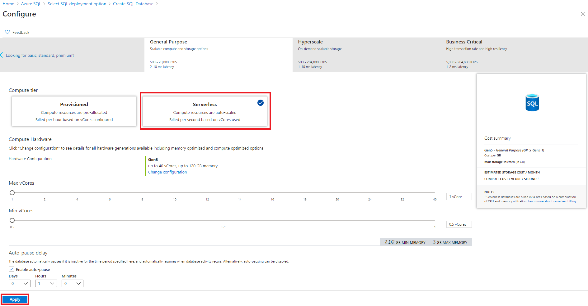
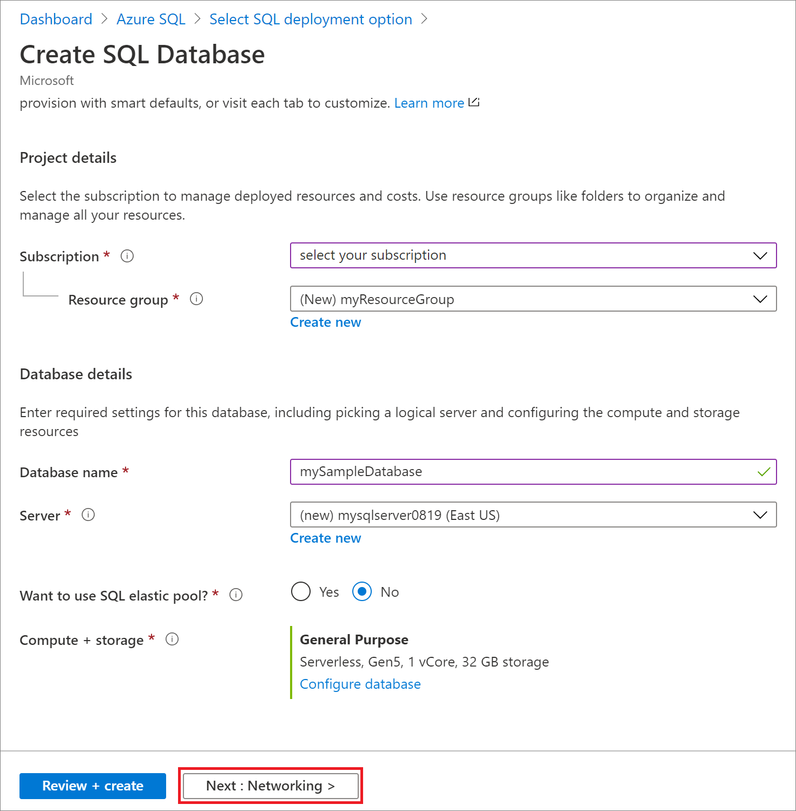
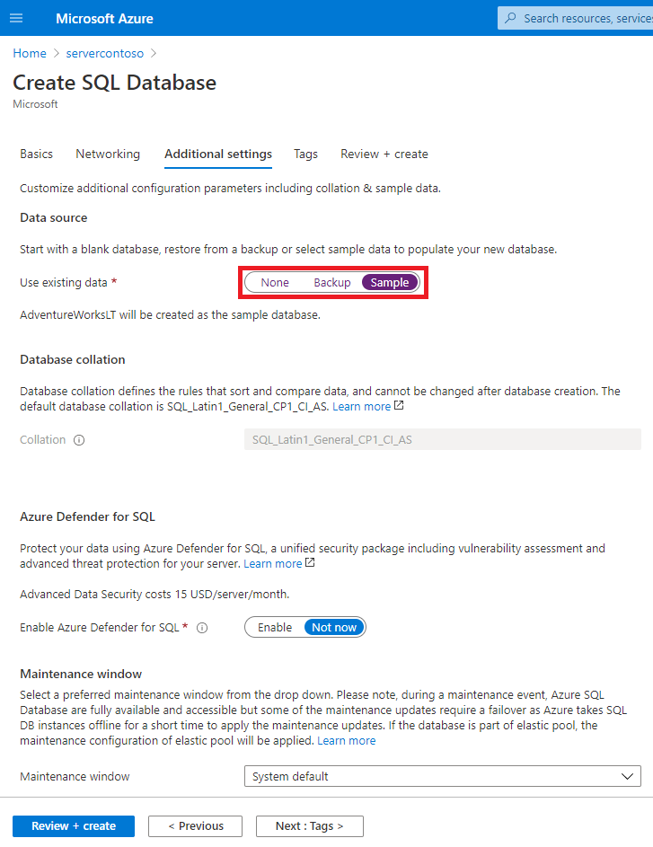
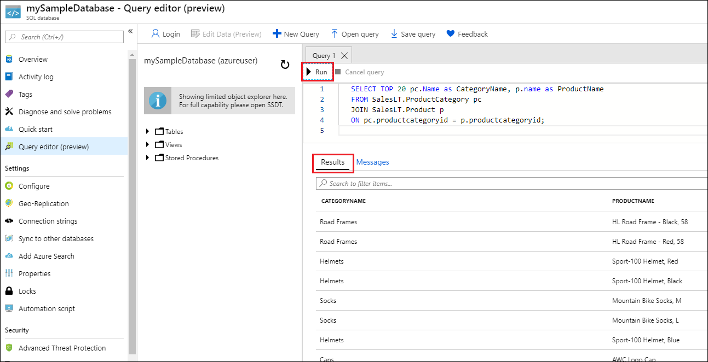

# Quickstart: Create an Azure SQL Database single database

In this quickstart, you create a [single database](single-database-overview.md) in Azure SQL Database using either the Azure portal, a PowerShell script, or an Azure CLI script. You then query the database using **Query editor** in the Azure portal.


## Prerequisite

- An active Azure subscription. If you don't have one, [create a free account](https://azure.microsoft.com/free/).

## Create a single database

This quickstart creates a single database in the [serverless compute tier](serverless-tier-overview.md).

# [Portal](#tab/azure-portal)

To create a single database in the Azure portal this quickstart starts at the Azure SQL page.

1. Browse to the [Select SQL Deployment option](https://portal.azure.com/#create/Microsoft.AzureSQL) page.
1. Under **SQL databases**, leave **Resource type** set to **Single database**, and select **Create**.

   

1. On the **Basics** tab of the **Create SQL Database** form, under **Project details**, select the desired Azure **Subscription**.
1. For **Resource group**, select **Create new**, enter *myResourceGroup*, and select **OK**.
1. For **Database name** enter *mySampleDatabase*.
1. For **Server**, select **Create new**, and fill out the **New server** form with the following values:
   - **Server name**: Enter *mysqlserver*, and add some characters for uniqueness. We can't provide an exact server name to use because server names must be globally unique for all servers in Azure, not just unique within a subscription. So enter something like mysqlserver12345, and the portal lets you know if it is available or not.
   - **Server admin login**: Enter *azureuser*.
   - **Password**: Enter a password that meets requirements, and enter it again in the **Confirm password** field.
   - **Location**: Select a location from the dropdown list.

   Select **OK**.

1. Leave **Want to use SQL elastic pool** set to **No**.
1. Under **Compute + storage**, select **Configure database**.
1. This quickstart uses a serverless database, so select **Serverless**, and then select **Apply**. 

      

1. Select **Next: Networking** at the bottom of the page.

   

1. On the **Networking** tab, for **Connectivity method**, select **Public endpoint**.
1. For **Firewall rules**, set **Add current client IP address** to **Yes**. Leave **Allow Azure services and resources to access this server** set to **No**.
1. Select **Next: Additional settings** at the bottom of the page.

   
  

1. On the **Additional settings** tab, in the **Data source** section, for **Use existing data**, select **Sample**. This creates an AdventureWorksLT sample database so there's some tables and data to query and experiment with, as opposed to an empty blank database.
1. Optionally, enable [Azure Defender for SQL](../database/azure-defender-for-sql.md).
1. Optionally, set the [maintenance window](../database/maintenance-window.md) so planned maintenance is performed at the best time for your database.
1. Select **Review + create** at the bottom of the page:

   

1. On the **Review + create** page, after reviewing, select **Create**.

# [Azure CLI](#tab/azure-cli)

## Launch Azure Cloud Shell

The Azure Cloud Shell is a free interactive shell that you can use to run the steps in this article. It has common Azure tools preinstalled and configured to use with your account. 

To open the Cloud Shell, just select **Try it** from the upper right corner of a code block. You can also launch Cloud Shell in a separate browser tab by going to [https://shell.azure.com](https://shell.azure.com). Select **Copy** to copy the blocks of code, paste it into the Cloud Shell, and press **Enter** to run it.

## Set parameter values

The following values are used in subsequent commands to create the database and required resources. Server names need to be globally unique across all of Azure so the $RANDOM function is used to create the server name. Replace the 0.0.0.0 values in the ip address range to match your specific environment.

```azurecli-interactive
# Set the resource group name and location for your server
resourceGroupName=myResourceGroup
location=eastus

# Set an admin login and password for your database
adminlogin=azureuser
password=Azure1234567!

# Set a server name that is unique to Azure DNS (<server_name>.database.windows.net)
serverName=server-$RANDOM

# Set the ip address range that can access your database
startip=0.0.0.0
endip=0.0.0.0
```

## Create a resource group

Create a resource group with the [az group create](/cli/azure/group) command. An Azure resource group is a logical container into which Azure resources are deployed and managed. The following example creates a resource group named *myResourceGroup* in the *eastus* location:

```azurecli-interactive
az group create --name $resourceGroupName --location $location
```

## Create a server

Create a server with the [az sql server create](/cli/azure/sql/server) command.

```azurecli-interactive
az sql server create \
    --name $serverName \
    --resource-group $resourceGroupName \
    --location $location  \
    --admin-user $adminlogin \
    --admin-password $password
```


## Configure a firewall rule for the server

Create a firewall rule with the [az sql server firewall-rule create](/cli/azure/sql/server/firewall-rule) command.

```azurecli-interactive
az sql server firewall-rule create \
    --resource-group $resourceGroupName \
    --server $serverName \
    -n AllowYourIp \
    --start-ip-address $startip \
    --end-ip-address $endip
```


## Create a single database with Azure CLI

Create a database with the [az sql db create](/cli/azure/sql/db) command. The following code creates


```azurecli-interactive
az sql db create \
    --resource-group $resourceGroupName \
    --server $serverName \
    --name mySampleDatabase \
    --sample-name AdventureWorksLT \
    --edition GeneralPurpose \
    --compute-model Serverless \
    --family Gen5 \
    --capacity 2
```


# [PowerShell](#tab/azure-powershell)

You can create a resource group, server, and single database using Windows PowerShell.

## Launch Azure Cloud Shell

The Azure Cloud Shell is a free interactive shell that you can use to run the steps in this article. It has common Azure tools preinstalled and configured to use with your account. 

To open the Cloud Shell, just select **Try it** from the upper right corner of a code block. You can also launch Cloud Shell in a separate browser tab by going to [https://shell.azure.com](https://shell.azure.com). Select **Copy** to copy the blocks of code, paste it into the Cloud Shell, and press **Enter** to run it.

## Set parameter values

The following values are used in subsequent commands to create the database and required resources. Server names need to be globally unique across all of Azure so the Get-Random cmdlet is used to create the server name. Replace the 0.0.0.0 values in the ip address range to match your specific environment.

```azurepowershell-interactive
   # Set variables for your server and database
   $resourceGroupName = "myResourceGroup"
   $location = "eastus"
   $adminLogin = "azureuser"
   $password = "Azure1234567!"
   $serverName = "mysqlserver-$(Get-Random)"
   $databaseName = "mySampleDatabase"

   # The ip address range that you want to allow to access your server
   $startIp = "0.0.0.0"
   $endIp = "0.0.0.0"

   # Show randomized variables
   Write-host "Resource group name is" $resourceGroupName
   Write-host "Server name is" $serverName
```


## Create resource group

Create an Azure resource group with [New-AzResourceGroup](/powershell/module/az.resources/new-azresourcegroup). A resource group is a logical container into which Azure resources are deployed and managed.

```azurepowershell-interactive
   Write-host "Creating resource group..."
   $resourceGroup = New-AzResourceGroup -Name $resourceGroupName -Location $location -Tag @{Owner="SQLDB-Samples"}
   $resourceGroup
```


## Create a server

Create a server with the [New-AzSqlServer](/powershell/module/az.sql/new-azsqlserver) cmdlet.

```azurepowershell-interactive
  Write-host "Creating primary server..."
   $server = New-AzSqlServer -ResourceGroupName $resourceGroupName `
      -ServerName $serverName `
      -Location $location `
      -SqlAdministratorCredentials $(New-Object -TypeName System.Management.Automation.PSCredential `
      -ArgumentList $adminLogin, $(ConvertTo-SecureString -String $password -AsPlainText -Force))
   $server
```

## Create a firewall rule

Create a server firewall rule with the [New-AzSqlServerFirewallRule](/powershell/module/az.sql/new-azsqlserverfirewallrule) cmdlet.

```azurepowershell-interactive
   Write-host "Configuring server firewall rule..."
   $serverFirewallRule = New-AzSqlServerFirewallRule -ResourceGroupName $resourceGroupName `
      -ServerName $serverName `
      -FirewallRuleName "AllowedIPs" -StartIpAddress $startIp -EndIpAddress $endIp
   $serverFirewallRule
```


## Create a single database with PowerShell

Create a single database with the [New-AzSqlDatabase](/powershell/module/az.sql/new-azsqldatabase) cmdlet.

```azurepowershell-interactive
   Write-host "Creating a gen5 2 vCore serverless database..."
   $database = New-AzSqlDatabase  -ResourceGroupName $resourceGroupName `
      -ServerName $serverName `
      -DatabaseName $databaseName `
      -Edition GeneralPurpose `
      -ComputeModel Serverless `
      -ComputeGeneration Gen5 `
      -VCore 2 `
      -MinimumCapacity 2 `
      -SampleName "AdventureWorksLT"
   $database
```

---


## Query the database

Once your database is created, you can use the **Query editor (preview)** in the Azure portal to connect to the database and query data.

1. In the portal, search for and select **SQL databases**, and then select your database from the list.
1. On the page for your database, select **Query editor (preview)** in the left menu.
1. Enter your server admin login information, and select **OK**.

   

1. Enter the following query in the **Query editor** pane.

   ```sql
   SELECT TOP 20 pc.Name as CategoryName, p.name as ProductName
   FROM SalesLT.ProductCategory pc
   JOIN SalesLT.Product p
   ON pc.productcategoryid = p.productcategoryid;
   ```

1. Select **Run**, and then review the query results in the **Results** pane.

   

1. Close the **Query editor** page, and select **OK** when prompted to discard your unsaved edits.

## Clean up resources

Keep the resource group, server, and single database to go on to the next steps, and learn how to connect and query your database with different methods.

When you're finished using these resources, you can delete the resource group you created, which will also delete the server and single database within it.

### [Portal](#tab/azure-portal)

To delete **myResourceGroup** and all its resources using the Azure portal:

1. In the portal, search for and select **Resource groups**, and then select **myResourceGroup** from the list.
1. On the resource group page, select **Delete resource group**.
1. Under **Type the resource group name**, enter *myResourceGroup*, and then select **Delete**.

### [Azure CLI](#tab/azure-cli)

To delete the resource group and all its resources, run the following Azure CLI command, using the name of your resource group:

```azurecli-interactive
az group delete --name $resourceGroupName
```

### [PowerShell](#tab/azure-powershell)

To delete the resource group and all its resources, run the following PowerShell cmdlet, using the name of your resource group:

```azurepowershell-interactive
Remove-AzResourceGroup -Name $resourceGroupName
```

---

## Next steps

[Connect and query](connect-query-content-reference-guide.md) your database using different tools and languages:
> [!div class="nextstepaction"]
> [Connect and query using SQL Server Management Studio](connect-query-ssms.md)
>
> [Connect and query using Azure Data Studio](/sql/azure-data-studio/quickstart-sql-database?toc=/azure/sql-database/toc.json)

Want to optimize and save on your cloud spending?

> [!div class="nextstepaction"]
> [Start analyzing costs with Cost Management](../../cost-management-billing/costs/quick-acm-cost-analysis.md?WT.mc_id=costmanagementcontent_docsacmhorizontal_-inproduct-learn)
