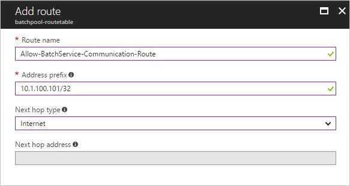

# Create an Azure Batch pool in a virtual network

When you create an Azure Batch pool, you can provision the pool in a subnet of an [Azure virtual network](../virtual-network/virtual-networks-overview.md) (VNet) that you specify. This article explains how to set up a Batch pool in a VNet.

## Why use a VNet?

Compute nodes in a pool can communicate with each other, such as to run multi-instance tasks, without requiring a separate VNet. However, by default, nodes in a pool can't communicate with virtual machines that are outside of the pool, such as license servers or a file servers.

To allow compute nodes to communicate securely with other virtual machines, or with an on-premises network, you can provision the pool in a subnet of an Azure VNet.

## Prerequisites

- **Authentication**. To use an Azure VNet, the Batch client API must use Azure Active Directory (AD) authentication. Azure Batch support for Azure AD is documented in [Authenticate Batch service solutions with Active Directory](batch-aad-auth.md).

- **An Azure VNet**. See the following section for VNet requirements and configuration. To prepare a VNet with one or more subnets in advance, you can use the Azure portal, Azure PowerShell, the Azure Command-Line Interface (CLI), or other methods.
  - To create an Azure Resource Manager-based VNet, see [Create a virtual network](../virtual-network/manage-virtual-network.md#create-a-virtual-network). A Resource Manager-based VNet is recommended for new deployments, and is supported only on pools that use Virtual Machine Configuration.
  - To create a classic VNet, see [Create a virtual network (classic) with multiple subnets](/previous-versions/azure/virtual-network/create-virtual-network-classic). A classic VNet is supported only on pools that use Cloud Services Configuration.

## VNet requirements

[!INCLUDE [batch-virtual-network-ports](../../includes/batch-virtual-network-ports.md)]

## Create a pool with a VNet in the Azure portal

Once you have created your VNet and assigned a subnet to it, you can create a Batch pool with that VNet. Follow these steps to create a pool from the Azure portal: 

1. Navigate to your Batch account in the Azure portal. This account must be in the same subscription and region as the resource group containing the VNet you intend to use.
2. In the **Settings** window on the left, select the **Pools** menu item.
3. In the **Pools** window, select **Add**.
4. On the **Add Pool** window, select the option you intend to use from the **Image Type** dropdown.
5. Select the correct **Publisher/Offer/Sku** for your custom image.
6. Specify the remaining required settings, including the **Node size**, **Target dedicated nodes**, and **Low priority nodes**, as well as any desired optional settings.
7. In **Virtual Network**, select the virtual network and subnet you wish to use.

   

## User-defined routes for forced tunneling

You might have requirements in your organization to redirect (force) internet-bound traffic from the subnet back to your on-premises location for inspection and logging. Additionally, you may have enabled forced tunneling for the subnets in your VNet.

To ensure that the nodes in your pool work in a VNet that has forced tunneling enabled, you must add the following [user-defined routes](../virtual-network/virtual-networks-udr-overview.md) (UDR) for that subnet:

- The Batch service needs to communicate with nodes for scheduling tasks. To enable this communication, add a UDR for each IP address used by the Batch service in the region where your Batch account exists. The IP addresses of the Batch service are found in the `BatchNodeManagement.<region>` service tag. To obtain the list of IP addresses, see [Service tags on-premises](../virtual-network/service-tags-overview.md).

- Ensure that outbound TCP traffic to the Azure Batch service on destination port 443 is not blocked by your on-premises network. These Azure Batch service destination IP addresses are the same as found in the `BatchNodeManagement.<region>` service tag as used for routes above.

- Ensure that outbound TCP traffic to Azure Storage on destination port 443 (specifically, URLs of the form `*.table.core.windows.net`, `*.queue.core.windows.net`, and `*.blob.core.windows.net`) is not blocked by your on-premises network.

- If you use virtual file mounts, review the [networking requirements](virtual-file-mount.md#networking-requirements) and ensure that no required traffic is blocked.

When you add a UDR, define the route for each related Batch IP address prefix, and set **Next hop type** to **Internet**.

> [!WARNING]
> Batch service IP addresses can change over time. To prevent outages due to an IP address change, create a process to refresh Batch service IP addresses automatically and keep them up to date in your route table.

## Next steps

- Learn about the [Batch service workflow and primary resources](batch-service-workflow-features.md) such as pools, nodes, jobs, and tasks.
- Learn how to [create a user-defined route in the Azure portal](../virtual-network/tutorial-create-route-table-portal.md).
