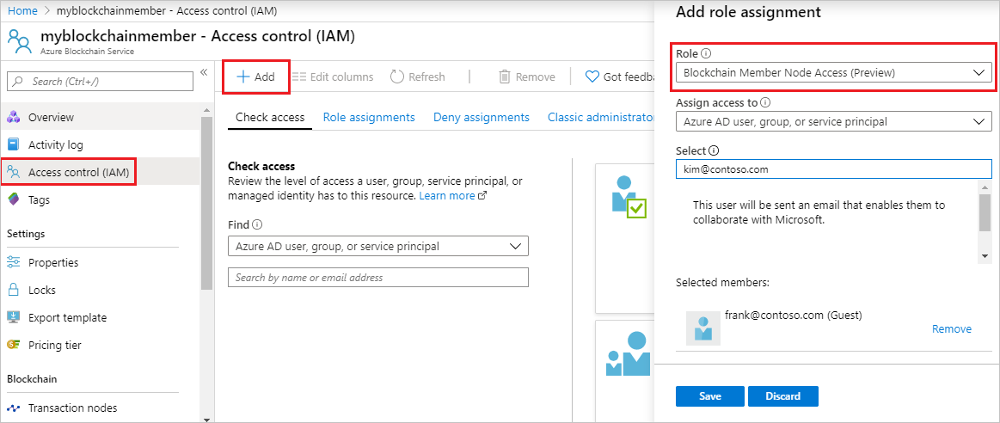

# How to configure Azure Active Directory access for Azure Blockchain Service

In this article, you learn how to grant access and connect to Azure Blockchain Service nodes using Azure Active Directory (Azure AD) user, group, or application IDs.

[!INCLUDE [Retirement note](./includes/retirement.md)]

Azure AD provides cloud-based identity management and allows you to use a single identity across an entire enterprise and access applications in Azure. Azure Blockchain Service is integrated with Azure AD and offers benefits such as ID federation, single sign-on and multi-factor authentication.

## Prerequisites

* [Create a blockchain member using the Azure portal](create-member.md)

## Grant access

You can grant access at both the member level and the node level. Granting access rights at the member level will in turn grant access to all nodes under the member.

### Grant member level access

To grant access permission at the member level.

1. Sign in to the [Azure portal](https://portal.azure.com).
1. Navigate to **Access control (IAM) > Add > Add role assignment**.
1. Select the **Blockchain Member Node Access (Preview)** role and add the Azure AD ID object you wish to grant access to. Azure AD ID object can be:

    | Azure AD object | Example |
    |-----------------|---------|
    | Azure AD user   | `kim@contoso.onmicrosoft.com` |
    | Azure AD group  | `sales@contoso.onmicrosoft.com` |
    | Application ID  | `13925ab1-4161-4534-8d18-812f5ca1ab1e` |

    

1. Select **Save**.

### Grant node level access

You can grant access at the node level by navigating to node security and click on the node name that you wish to grant access.

Select the Blockchain Member Node Access (Preview) role and add the Azure AD ID object you wish to grant access to.

For more information, see [Configure Azure Blockchain Service transaction nodes](configure-transaction-nodes.md#azure-active-directory-access-control).

## Connect using Azure Blockchain Connector

Download or clone the [Azure Blockchain Connector from GitHub](https://github.com/Microsoft/azure-blockchain-connector/).

```bash
git clone https://github.com/Microsoft/azure-blockchain-connector.git
```

The follow the quickstart section in the **readme** to build the connector from the source code.

### Connect using an Azure AD user account

1. Run the following command to authenticate using an Azure AD user account. Replace \<myAADDirectory\> with an Azure AD domain. For example, `yourdomain.onmicrosoft.com`.

    ```
    connector.exe -remote <myMemberName>.blockchain.azure.com:3200 -method aadauthcode -tenant-id <myAADDirectory>
    ```

1. Azure AD prompts for credentials.
1. Sign in with your user name and password.
1. Upon successful authentication, your local proxy connects to your blockchain node. You can now attach your Geth client with the local endpoint.

    ```bash
    geth attach http://127.0.0.1:3100
    ```

### Connect using an application ID

Many applications authenticate with Azure AD using an application ID instead of an Azure AD user account.

To connect to your node using an application ID, replace **aadauthcode** with **aadclient**.

```
connector.exe -remote <myBlockchainEndpoint>  -method aadclient -client-id <myClientID> -client-secret "<myClientSecret>" -tenant-id <myAADDirectory>
```

| Parameter | Description |
|-----------|-------------|
| tenant-id | Azure AD domain, For example, `yourdomain.onmicrosoft.com`
| client-id | Client ID of the registered application in Azure AD
| client-secret | Client secret of the registered application in Azure AD

For more information on how to register an application in Azure AD, see [How to: Use the portal to create an Azure AD application and service principal that can access resources](../../active-directory/develop/howto-create-service-principal-portal.md)

### Connect a mobile device or text browser

For a mobile device or text-based browser where the Azure AD authentication pop-up display is not possible, Azure AD generates a one-time passcode. You can copy the passcode and proceed with Azure AD authentication in another environment.

To generate the passcode, replace **aadauthcode** with **aaddevice**. Replace \<myAADDirectory\> with an Azure AD domain. For example, `yourdomain.onmicrosoft.com`.

```
connector.exe -remote <myBlockchainEndpoint>  -method aaddevice -tenant-id <myAADDirectory>
```

## Next steps

For more information about data security in Azure Blockchain Service, see [Azure Blockchain Service security](data-security.md).