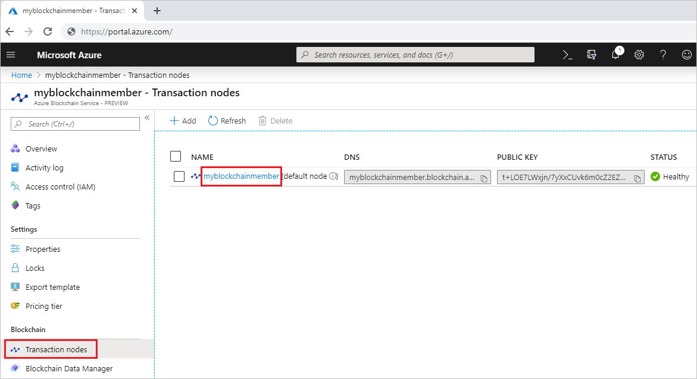
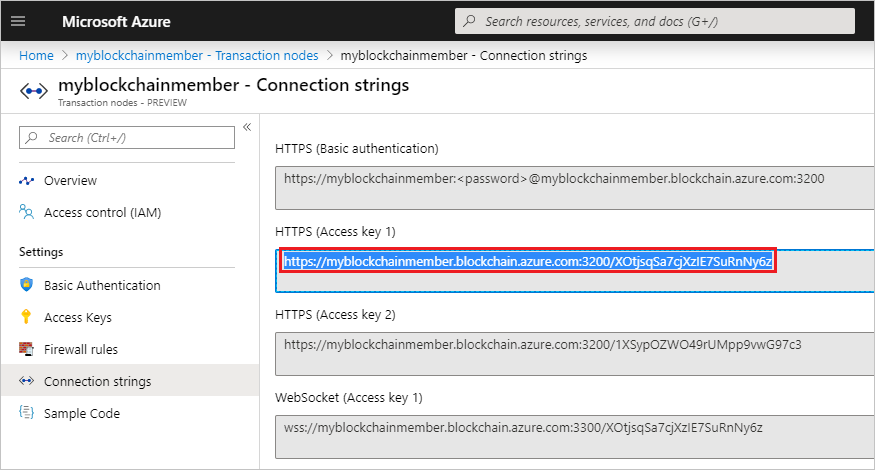
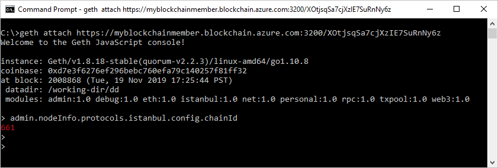

# Quickstart: Use Geth to attach to an Azure Blockchain Service transaction node

In this quickstart, you use the Geth client to attach to a Geth instance on an Azure Blockchain Service transaction node. Once attached, you use the Geth console to call an Ethereum JavaScript API.

[!INCLUDE [Retirement note](./includes/retirement.md)]

[!INCLUDE [quickstarts-free-trial-note](../../../includes/quickstarts-free-trial-note.md)]

## Prerequisites

* Install [Geth](https://github.com/ethereum/go-ethereum/wiki/geth)
* Complete [Quickstart: Create a blockchain member using the Azure portal](create-member.md) or [Quickstart: Create an Azure Blockchain Service blockchain member using Azure CLI](create-member-cli.md)

## Get Geth connection string

You can get the Geth connection string for an Azure Blockchain Service transaction node in the Azure portal.

1. Sign in to the [Azure portal](https://portal.azure.com).
1. Go to your Azure Blockchain Service member. Select **Transaction nodes** and the default transaction node link.

    

1. Select **Connection strings**.
1. Copy the connection string from **HTTPS (Access key 1)**. You need the string for the next section.

    

## Connect to Geth

1. Open a command prompt or shell.
1. Use the Geth attach subcommand to attach to the running Geth instance on your transaction node. Paste the connection string as an argument for the attach subcommand. For example:

    ``` bash
    geth attach <connection string>
    ```

1. Once connected to the transaction node's Ethereum console, you can use the Ethereum JavaScript API.

    For example, use the following API to find out the chainId.

    ``` bash
    admin.nodeInfo.protocols.istanbul.config.chainId
    ```

    In this example, the chainId is 661.

    

1. To disconnect from the console, type `exit`.

## Next steps

In this quickstart, you used the Geth client to attach to a Geth instance on an Azure Blockchain Service transaction node. Try the next tutorial to use Azure Blockchain Development Kit for Ethereum to create, build, deploy, and execute a smart contract function via a transaction.

> [!div class="nextstepaction"]
> [Create, build, and deploy smart contracts on Azure Blockchain Service](send-transaction.md)
