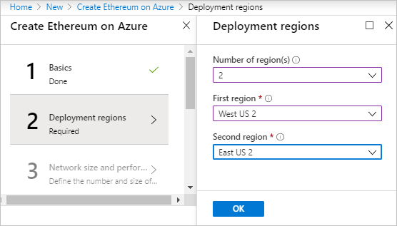
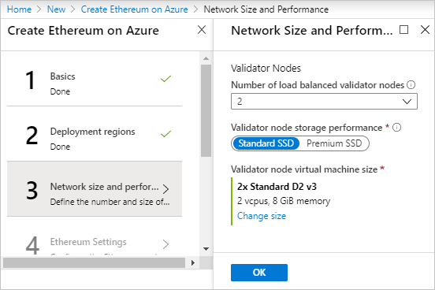
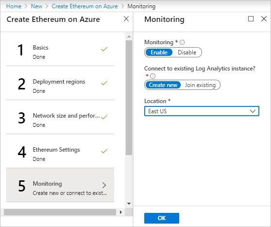
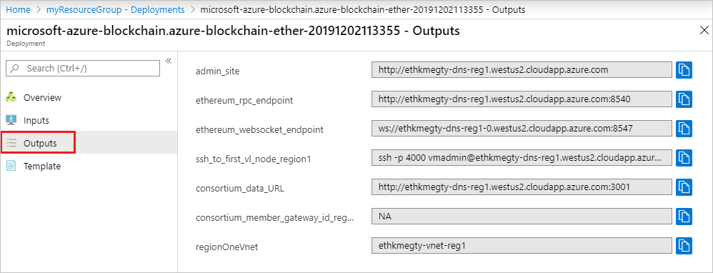
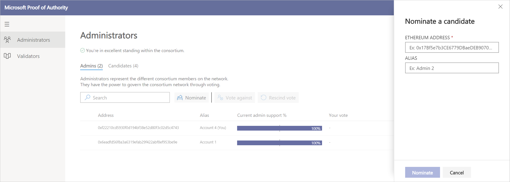
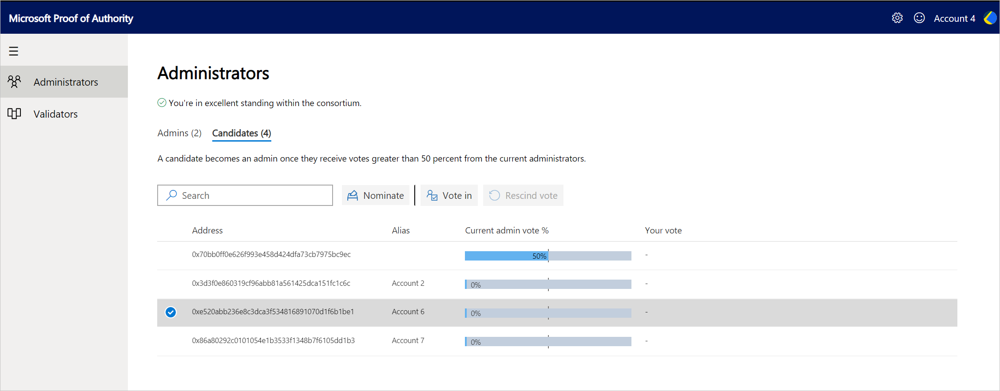

# Deploy Ethereum proof-of-authority consortium solution template on Azure

You can use [the Ethereum Proof-of-Authority Consortium preview Azure solution template](https://azuremarketplace.microsoft.com/marketplace/apps/microsoft-azure-blockchain.azure-blockchain-ethereum) to deploy, configure, and govern a multi-member consortium proof-of-authority Ethereum network with minimal Azure and Ethereum knowledge.

The solution template can be used by each consortium member to provision a blockchain network footprint using
Microsoft Azure compute, networking, and storage services. Each consortium member's network footprint consists of a set of load-balanced validator nodes that an application or user can interact with to submit Ethereum transactions.

[!INCLUDE [Preview note](./includes/preview.md)]

## Choose an Azure Blockchain solution

Before choosing to use the Ethereum proof-of-authority consortium solution template, compare your scenario with the common use cases of available Azure Blockchain options.

> [!IMPORTANT]
> Consider using [Azure Blockchain Service](../service/overview.md) rather than the Ethereum on Azure solution template. Azure Blockchain Service is a supported managed Azure Service. Parity Ethereum transitioned to community driven development and maintenance. For more information, see [Transitioning Parity Ethereum to OpenEthereum DAO](https://www.parity.io/parity-ethereum-openethereum-dao/).

Option | Service model | Common use case
-------|---------------|-----------------
Solution templates | IaaS | Solution templates are Azure Resource Manager templates you can use to provision a fully configured blockchain network topology. The templates deploy and configure Microsoft Azure compute, networking, and storage services for a given blockchain network type. Solution templates are provided without a service level agreement. Use the [Microsoft Q&A question page](/answers/topics/azure-blockchain-workbench.html) for support.
[Azure Blockchain Service](../service/overview.md) | PaaS | Azure Blockchain Service Preview simplifies the formation, management, and governance of consortium blockchain networks. Use Azure Blockchain Service for solutions requiring PaaS, consortium management, or contract and transaction privacy.
[Azure Blockchain Workbench](../workbench/overview.md) | IaaS and PaaS | Azure Blockchain Workbench Preview is a collection of Azure services and capabilities designed to help you create and deploy blockchain applications to share business processes and data with other organizations. Use Azure Blockchain Workbench for prototyping a blockchain solution or a blockchain application proof of concept. Azure Blockchain Workbench is provided without a service level agreement. Use the [Microsoft Q&A question page](/answers/topics/azure-blockchain-workbench.html) for support.

## Solution architecture

Using the Ethereum solution template, you can deploy a single or multi-region based multi-member Ethereum proof-of-authority consortium network.


Each consortium member deployment includes:

* Virtual Machines for running the PoA validators
* Azure Load Balancer for distributing RPC, peering, and governance DApp requests
* Azure Key Vault for securing the validator identities
* Azure Storage for hosting persistent network information and coordinating leasing
* Azure Monitor for aggregating logs and performance statistics
* VNet Gateway (optional) for allowing VPN connections across private VNets

By default, the RPC and peering endpoints are accessible over public IP to enable simplified connectivity across subscriptions and clouds. For application level access-controls, you can use [Parity's permissioning contracts](https://openethereum.github.io/Permissioning.html). Networks deployed behind VPNs, which leverage VNet gateways for cross-subscription connectivity are supported. Since VPN and VNet deployments are more complex, you may want to start with a public IP model when prototyping a solution.

Docker containers are used for reliability and modularity. Azure Container Registry is used to host and serve versioned images as part of each deployment. The container images consist of:

* Orchestrator - Generates identities and governance contracts. Stores identities in an identity store.
* Parity client - Leases identity from the identity store. Discovers and connects to peers.
* EthStats Agent - Collects local logs and stats via RPC and pushes information to Azure Monitor.
* Governance DApp - Web interface for interacting with Governance contracts.

### Validator nodes

In the proof-of-authority protocol, validator nodes take the place of traditional miner nodes. Each validator has a unique Ethereum identity allowing it to participate in the block creation process. Each consortium member can provision two or more validator nodes across five regions, for geo-redundancy. Validator nodes communicate with other validator nodes to come to consensus on the state of the underlying distributed ledger. To ensure fair participation on the network, each consortium member is prohibited from using more validators than the first member on the network. For example, if the first member deploys three validators, each member can only have up to three validators.

### Identity store

An identity store is deployed in each member's subscription that securely holds the generated Ethereum identities. For each validator, the orchestration container generates an Ethereum private key and stores it in Azure Key Vault.

## Deploy Ethereum consortium network

In this walk through, let's assume you are creating a multi-party Ethereum consortium network. The following flow is an example of a multi-party deployment:

1. Three members each generate an Ethereum account using MetaMask
1. *Member A* deploys Ethereum PoA, providing their Ethereum public address
1. *Member A* provides the consortium URL to *Member B* and *Member C*
1. *Member B* and *Member C* deploy, Ethereum PoA, providing their Ethereum Public Address and *Member A*'s consortium URL
1. *Member A* votes in *Member B* as an admin
1. *Member A* and *Member B* both vote *Member C* as an admin

The next sections show you how to configure the first member's footprint in the network.

### Create resource

In the [Azure portal](https://portal.azure.com), select **Create a resource** in the upper left-hand corner.

Select **Blockchain** > **Ethereum Proof-of-Authority Consortium (preview)**.

### Basics

Under **Basics**, specify values for standard parameters for any deployment.


Parameter | Description | Example value
----------|-------------|--------------
Create a new network or join existing network | You can create a new consortium network or join a pre-existing consortium network. Joining an existing network requires additional parameters. | Create new
Email Address | You receive an email notification when your deployment completes with information about your deployment. | A valid email address
VM user name | Administrator username of each deployed VM | 1-64 alphanumeric characters
Authentication type | The method to authenticate to the virtual machine. | Password
Password | The password for the administrator account for each of the virtual machines deployed. All VMs initially have the same password. You can change the password after provisioning. | 12-72 characters 
Subscription | The subscription to which to deploy the consortium network |
Resource Group| The resource group to which to deploy the consortium network. | myResourceGroup
Location | The Azure region for resource group. | West US 2

Select **OK**.

### Deployment regions

Under *Deployment regions*, specify the number of regions
and locations for each. You can deploy in maximum of five regions. The first region should match the resource group location from *Basics* section. For development or test networks, you can use a single region per member. For production, deploy across two or more regions for high-availability.



Parameter | Description | Example value
----------|-------------|--------------
Number of region(s)|Number of regions to deploy the consortium network| 2
First region | First region to deploy the consortium network | West US 2
Second region | Second region to deploy the consortium network. Additional regions are visible when number of regions is two or greater. | East US 2

Select **OK**.

### Network size and performance

Under *Network size and performance*, specify inputs for the size of the consortium network. The validator node storage size dictates the potential size of the blockchain. The size can be changed after deployment.



Parameter | Description | Example value
----------|-------------|--------------
Number of load balanced validator nodes | The number of validator nodes to provision as part of the network. | 2
Validator node storage performance | The type of managed disk for each of the deployed validator nodes. For details on pricing, see [storage pricing](https://azure.microsoft.com/pricing/details/managed-disks/) | Standard SSD
Validator node virtual machine size | The virtual machine size used for validator nodes. For details on pricing, see [virtual machine pricing](https://azure.microsoft.com/pricing/details/virtual-machines/windows/) | Standard D2 v3

Virtual machine and storage tier affect network performance.  Use the following table to help choose cost efficiency:

Virtual Machine SKU|Storage Tier|Price|Throughput|Latency
---|---|---|---|---
F1|Standard SSD|low|low|high
D2_v3|Standard SSD|medium|medium|medium
F16s|Premium SSD|high|high|low

Select **OK**.

### Ethereum settings

Under *Ethereum Settings*, specify Ethereum-related configuration settings.


Parameter | Description | Example value
----------|-------------|--------------
Consortium Member ID | The ID associated with each member participating in the consortium network. It's used to configure IP address spaces to avoid collision. For a private network, Member ID should be unique across different organizations in the same network.  A unique member ID is needed even when the same organization deploys to multiple regions. Make note of the value of this parameter since you need to share it with other joining members to ensure there's no collision. The valid range is 0 through 255. | 0
Network ID | The network ID for the consortium Ethereum network being deployed. Each Ethereum network has its own Network ID, with 1 being the ID for the public network. The valid range is 5 through 999,999,999 | 10101010
Admin Ethereum Address | The Ethereum account address used for participating in PoA governance. You can use MetaMask to generate an Ethereum address. |
Advanced Options | Advanced options for Ethereum settings | Enable
Deploy using Public IP | If Private VNet is selected, the network is deployed behind a VNet Gateway and removes peering access. For Private VNet, all members must use a VNet Gateway for the connection to be compatible. | Public IP
Block Gas Limit | The starting block gas limit of the network. | 50000000
Block Reseal Period (sec) | The frequency at which empty blocks will be created when there are no transactions on the network. A higher frequency will have faster finality but increased storage costs. | 15
Transaction Permission Contract | Bytecode for the Transaction Permissioning contract. Restricts smart contract deployment and execution to a permitted list of Ethereum accounts. |

Select **OK**.

### Monitoring

Monitoring allows you to configure a log resource for your network. The monitoring agent collects and surfaces useful
metrics and logs from your network providing the ability to quickly check the network health or debug issues.



Parameter | Description | Example value
----------|-------------|--------------
Monitoring | Option to enable monitoring | Enable
Connect to existing Azure Monitor logs | Option to create a new Azure Monitor logs instance or join an existing instance | Create new
Location | The region where the new instance is deployed | East US
Existing log analytics workspace ID (Connect to existing Azure Monitor logs = Join Existing)|Workspace ID of the existing Azure Monitor logs instance|NA
Existing log analytics primary key (Connect to existing Azure Monitor logs = Join Existing)|The primary key used to connect to the existing Azure Monitor logs instance|NA

Select **OK**.

### Summary

Click through the summary to review the inputs specified and run basic pre-deployment validation. Before deploying, you can download the template and parameters.

Select **Create** to deploy.

If the deployment includes VNet Gateways, the deployment can take up 45 to 50 minutes.

## Deployment output

Once the deployment has completed, you can access the necessary parameters using the Azure portal.

### Confirmation email

If you provide an email address ([Basics Section](#basics)), an email is sent that includes the deployment information and links to this documentation.


### Portal

Once the deployment has completed successfully and all resources have been provisioned, you can view the output parameters in your resource group.

1. Go to your resource group in the portal.
1. Select **Overview > Deployments**.

    

1. Select the **microsoft-azure-blockchain.azure-blockchain-ether-...** deployment.
1. Select the **Outputs** section.

    

## Growing the consortium

To expand your consortium, you must first connect the physical network. If deploying behind a VPN, see the section [Connecting VNet Gateway](#connecting-vnet-gateways) configure the network connection as part of the new member deployment. Once your deployment completes, use the [Governance DApp](#governance-dapp) to become a network admin.

### New member deployment

Share the following information with the joining member. The information is found in your post-deployment email or in the portal deployment output.

* Consortium Data URL
* The number of nodes you deployed
* VNet Gateway Resource ID (if using VPN)

The deploying member should use the same Ethereum Proof-of-Authority consortium solution template when deploying their network presence using the following guidance:

* Select **Join Existing**
* Choose the same number of validator nodes as the rest of the members on the network to ensure fair representation
* Use the same Admin Ethereum address
* Use the provided *Consortium Data Url* in the *Ethereum Settings*
* If the rest of the network is behind a VPN, select **Private VNet** under the advanced section

### Connecting VNet gateways

This section is only required if you deployed using a private VNet. You can skip this section if you are using public IP addresses.

For a private network, the different members are connected via VNet gateway connections. Before a member can join the network and see transaction traffic, an existing member must do a final configuration on their VPN gateway to accept the connection. The Ethereum nodes of the joining member won't run until a connection is established. To reduce chances of a single point of failure, create redundant network connections in the consortium.

After the new member deploys, the existing member must complete the bi-directional connection by setting up a VNet gateway connection to the new member. The existing member needs:

* The VNet gateway ResourceID of the connecting member. See [deployment output](#deployment-output).
* The shared connection key.

The existing member must run the following PowerShell script to complete the connection. You can use Azure Cloud Shell located in the top-right navigation bar in the portal.


```powershell
$MyGatewayResourceId = "<EXISTING_MEMBER_RESOURCEID>"
$OtherGatewayResourceId = "<NEW_MEMBER_RESOURCEID]"
$ConnectionName = "Leader2Member"
$SharedKey = "<NEW_MEMBER_KEY>"

## $myGatewayResourceId tells me what subscription I am in, what ResourceGroup and the VNetGatewayName
$splitValue = $MyGatewayResourceId.Split('/')
$MySubscriptionid = $splitValue[2]
$MyResourceGroup = $splitValue[4]
$MyGatewayName = $splitValue[8]

## $otherGatewayResourceid tells me what the subscription and VNet GatewayName are
$OtherGatewayName = $OtherGatewayResourceId.Split('/')[8]
$Subscription=Select-AzSubscription -SubscriptionId $MySubscriptionid

## create a PSVirtualNetworkGateway instance for the gateway I want to connect to
$OtherGateway=New-Object Microsoft.Azure.Commands.Network.Models.PSVirtualNetworkGateway
$OtherGateway.Name = $OtherGatewayName
$OtherGateway.Id = $OtherGatewayResourceId
$OtherGateway.GatewayType = "Vpn"
$OtherGateway.VpnType = "RouteBased"

## get a PSVirtualNetworkGateway instance for my gateway
$MyGateway = Get-AzVirtualNetworkGateway -Name $MyGatewayName -ResourceGroupName $MyResourceGroup

## create the connection
New-AzVirtualNetworkGatewayConnection -Name $ConnectionName -ResourceGroupName $MyResourceGroup -VirtualNetworkGateway1 $MyGateway -VirtualNetworkGateway2 $OtherGateway -Location $MyGateway.Location -ConnectionType Vnet2Vnet -SharedKey $SharedKey -EnableBgp $True
```

## Governance DApp

At the heart of proof-of-authority is decentralized governance. Since proof-of-authority relies upon a permitted list of network authorities to keep the network healthy, it's important to provide a fair mechanism to make modifications to this permission list. Each deployment comes with a set of smart-contracts and portal for on-chain governance of this permitted list. Once a proposed change reaches a majority vote by consortium members, the change is enacted. Voting allows new consensus participants to be added or compromised participants to be removed in a transparent way that encourages an honest network.

The governance DApp is a set of pre-deployed [smart contracts](https://github.com/Azure-Samples/blockchain/tree/master/ledger/template/ethereum-on-azure/permissioning-contracts) and a web application that are used to govern the authorities on the network. Authorities are broken up into admin identities and validator nodes.
Admins have the power to delegate consensus participation to a set of validator nodes. Admins also may vote other admins into or out of the network.


* **Decentralized Governance:** Changes in network authorities are administered through on-chain voting by select administrators.
* **Validator Delegation:** Authorities can manage their validator nodes that are set up in each PoA deployment.
* **Auditable Change History:** Each change is recorded on the blockchain providing transparency and auditability.

### Getting started with governance

To perform any kind of transactions through the Governance DApp, you need to use an Ethereum wallet. The most straightforward approach is to use an in-browser wallet such as [MetaMask](https://metamask.io); however, because these smart contracts are deployed on the network you may also automate your interactions to the Governance contract.

After installing MetaMask, navigate to the Governance DApp in the browser.  You can locate the URL through Azure portal in the deployment output.  If you don't have an in-browser wallet installed you won't be able to perform any actions; however, you can view the administrator state.

### Becoming an admin

If you're the first member that deployed on the network, then you automatically become an admin and your parity nodes are listed as validators. If you're joining the network, you need to get voted in as an admin by a majority (greater than 50%) of the existing admin set. If you choose not to become an admin, your nodes still sync and validate the blockchain; however, they don't participate in the block creation process. To start the voting process to become an admin, select **Nominate** and enter your Ethereum address and alias.



### Candidates

Selecting the **Candidates** tab shows you the current set of candidate administrators.  Once a candidate reaches a majority vote by the current admins, the candidate gets promoted to an admin.  To vote on a candidate, select the row and select **Vote in**. If you change your mind on a vote, select the candidate and select **Rescind vote**.



### Admins

The **Admins** tab shows the current set of admins and provides you the ability to vote against.  Once an admin loses more than 50% support, they are removed as an admin on the network. Any validator nodes that the admin owns lose validator status and become transaction nodes on the network. An admin may be removed for any number of reasons; however, it's up to the consortium to agree on a policy in advance.


### Validators

Selecting the **Validators** tab displays the current deployed parity nodes for the instance and their current status (Node type). Each consortium member has a different set of validators in this list, since this view represents the current deployed consortium member. If the instance is newly deployed and you haven't added your validators, you get the option to **Add Validators**. Adding validators automatically chooses a regionally balanced set of parity nodes and assigns them to your validator set. If you have deployed more nodes than the allowed capacity, the remaining nodes become transaction nodes on the network.

The address of each validator is automatically assigned via the [identity store](#identity-store) in Azure.  If a node goes down, it relinquishes its identity, allowing another node in your deployment to take its place. This process ensures that your consensus participation is highly available.


### Consortium name

Any admin may update the consortium name.  Select the gear icon in the top left to update the consortium name.

### Account menu

On the top-right, is your Ethereum account alias and identicon.  If you're an admin, you have the ability to update your alias.


## Support and feedback<a id="tutorials"></a>

For Azure Blockchain news, visit the [Azure Blockchain blog](https://azure.microsoft.com/blog/topics/blockchain/) to stay up to date on blockchain service offerings and information from the Azure Blockchain engineering team.

To provide product feedback or to request new features, post or vote for an idea via the [Azure feedback forum for blockchain](https://aka.ms/blockchainuservoice).

### Community support

Engage with Microsoft engineers and Azure Blockchain community experts.

* [Microsoft Q&A question page](/answers/topics/azure-blockchain-workbench.html). Engineering support for blockchain templates is limited to deployment issues.
* [Microsoft Tech Community](https://techcommunity.microsoft.com/t5/Blockchain/bd-p/AzureBlockchain)
* [Stack Overflow](https://stackoverflow.com/questions/tagged/azure-blockchain-workbench)

## Next steps

For more Azure Blockchain solutions, see the [Azure Blockchain documentation](../index.yml).
