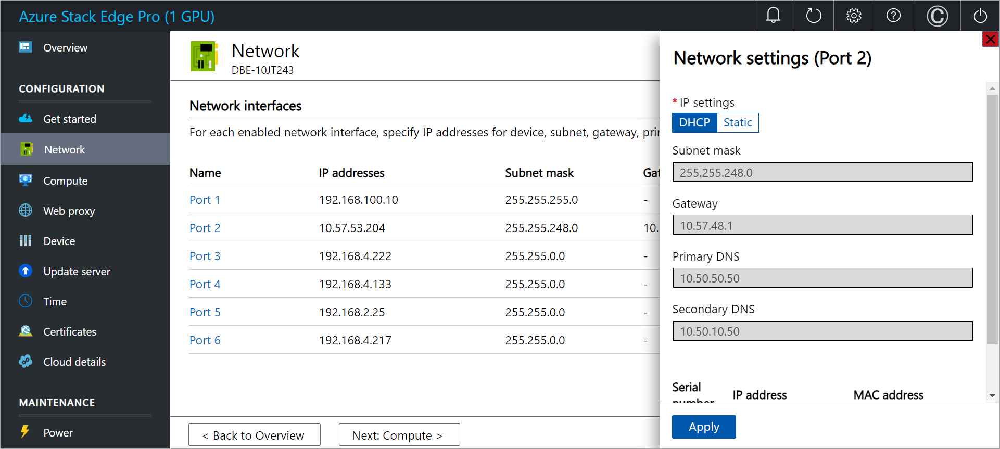
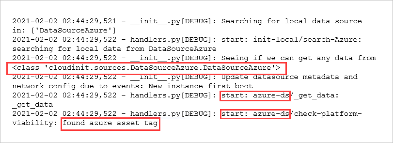
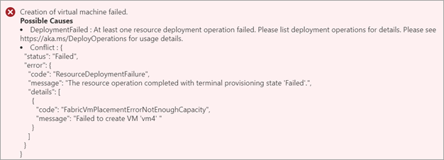

# Troubleshoot VM deployment in Azure Stack Edge Pro GPU

[!INCLUDE [applies-to-GPU-and-pro-r-and-mini-r-skus](../../includes/azure-stack-edge-applies-to-gpu-pro-r-mini-r-sku.md)]

This article describes how to troubleshoot common errors when deploying virtual machines on an Azure Stack Edge Pro GPU device. The article provides guidance for investigating the most common issues that cause VM provisioning timeouts and issues during network interface and VM creation.

To diagnose any VM provisioning failure, you'll review guest logs for the failed virtual machine. <!--For steps to collect VM guest logs and include them in a Support package, see [Collect guest logs for VMs on Azure Stack Edge Pro](azure-stack-edge-gpu-collect-virtual-machine-guest-logs.md).-->

For guidance on issues that prevent successful upload of a VM image before your VM deployment, see [Troubleshoot virtual machine image uploads in Azure Stack Edge Pro GPU](azure-stack-edge-gpu-troubleshoot-virtual-machine-image-upload.md).


## VM provisioning timeout

This section provides troubleshooting for most common causes of a VM provisioning timeout.

When VM provisioning times out, you see the following error: 

 

The following issues are the top causes of VM provisioning timeouts:
- The IP address that you assigned to the VM is already in use. [Learn more](#vm-provisioning-timeout)
- The VM image that you used to deploy the VM wasn't prepared correctly. [Learn more](#vm-image-not-prepared-correctly)
- The default gateway and DNS server couldn't be reached from the guest VM. [Learn more](#gateway-dns-server-couldnt-be-reached-from-guest-vm)
- During a `cloud init` installation, `cloud init` either didn't run or there were issues while it was running. (Linux VMs only) [Learn more](#cloud-init-issues-linux-vms)
- For a Linux VM deployed using a custom VM image, the Provisioning flags in the /etc/waagent.conf file are not correct. (Linux VMs only) [Learn more](#provisioning-flags-set-incorrectly-linux-vms)

### IP assigned to the VM is already in use

**Error description:**  The VM was assigned a static IP address that is already in use, and VM provisioning failed. This error happens when the IP address is in use in the subnet on which the VM is deployed. When you deploy a VM via the Azure portal, the process checks for an existing IP address within your device but can't check IP addresses of other services or virtual machines that might also be on your subnet. 

**Suggested solution:** Use a static IP address that is not in use, or use a dynamic IP address provided by the DHCP server.

To check for a duplicate IP address:

- Run the following `ping` and Test-NetConnection (`tnc`) commands from any appliance on the same network:

  ```
  ping <IP address>
  tnc <IP address>
  tnc <IP address> -CommonTCPPort “RDP”
  ```

If you get a response, the IP address that you assigned to the new VM is already in use.

### VM image not prepared correctly

**Error description:** To prepare a VM image for use on an Azure Stack Edge Pro GPU device, you must follow a specific workflow. You must create a gen1 virtual machine in Azure, customize the VM, generalize the VHD, and then download the OS VHD for that virtual machine. The prepared image must be a gen1 VHD with the "vhd" filename extension and the fixed type.

For an overview of requirements, see [Create custom VM images for an Azure Stack Edge Pro GPU device](azure-stack-edge-gpu-create-virtual-machine-image.md). For guidance on resolving VM image issues, see [Troubleshoot virtual machine image uploads in Azure Stack Edge Pro GPU](azure-stack-edge-gpu-troubleshoot-virtual-machine-image-upload.md).  

**Suggested solution:** Complete the workflow for preparing your VM image. For guidance, see one of the following articles:

* [Custom VM image workflows for Windows and Linux VMs](azure-stack-edge-gpu-create-virtual-machine-image.md)
* [Prepare a generalized image from a Windows VHD](azure-stack-edge-gpu-prepare-windows-vhd-generalized-image.md)
* [Prepare a generalized image using an ISO](azure-stack-edge-gpu-prepare-windows-generalized-image-iso.md)
* [Use a specialized image to deploy VMs](azure-stack-edge-gpu-deploy-virtual-machine-portal.md)


### Gateway, DNS server couldn't be reached from guest VM

**Error description:** If the default gateway and DNS server can't be reached during VM deployment, VM provisioning will time out, and the VM deployment will fail.

**Suggested solution:** Verify that the default gateway and DNS server can be reached from the VM. Then repeat VM deployment.

To verify that the default gateway and DNS server can be reached from the VM, do the following steps:
1. [Connect to the VM](azure-stack-edge-gpu-deploy-virtual-machine-portal.md#connect-to-a-vm).
2. Run the following commands:

   ```
   ping <default gateway IP address>
   ping <DNS server IP address>
   ```

   To find out the IP addresses for the default gateway and DNS servers, go to the local UI for your device. Select the port you're interested in, and view the network settings.

    


### `cloud init` issues (Linux VMs)

**Error description:** `cloud init` did not run, or there were issues while `cloud init` was running. `cloud-init` is used to customize a Linux VM when the VM boots for the first time. For more information, see [cloud-init support for virtual machines in Azure](../virtual-machines/linux/using-cloud-init.md).

**Suggested solutions:** To find issues that occurred when `cloud init` was run:
1. [Connect to the VM](azure-stack-edge-gpu-deploy-virtual-machine-portal.md#connect-to-a-vm).
1. Check for `cloud init` errors in the following log files:

   - /var/log/cloud-init-output.log
   - /var/log/cloud-init.log
   - /var/log/waagent/log 

To check for some of the most common issues that prevent `cloud init` from running successfully, do these steps:

1. Make sure the VM image is based on `cloud init`. Run the following command:

   `cloud-init --version`

   The command should return the cloud init version number. If the image is not `cloud init`-based, the command won't return version information.

   To get help with `cloud init` options, run the following command:

   `cloud-init --help` 

2. Make sure the `cloud init` instance can run successfully with the data source set to *Azure*. 

   When the data source is set to *Azure*, the entry in the *cloud init* logs looks similar to the following one.

    

   If the data source is not set to Azure, you may need to revise your `cloud init` script. For more information, see [Diving deeper into cloud-init](../virtual-machines/linux/cloud-init-deep-dive.md).


### Provisioning flags set incorrectly (Linux VMs)

**Error description:** To successfully deploy a Linux VM in Azure, provisioning must be disabled on the image, and provisioning using `cloud init` must be enabled. The Provisioning flags that set these values are configured correctly for standard VM images. If you use a custom VM image, you need to make sure they're correct. 

**Suggested solution:** Make sure the Provisioning flags in the */etc/waagent.conf* file have the following values:<!--Move details to "Create a custom VM image" when the 2 active PRs against that article have been merged. Not before Friday release.-->

   | Capability                      | Required value                |
   |---------------------------------|-------------------------------|
   | Enable provisioning             | `Provisioning.Enabled=n`      |
   | Rely on cloud-init to provision | `Provisioning.UseCloudInit=y` |


##	Network interface creation issues

This section provides guidance for issues that cause network interface creation to fail during a VM deployment.


### NIC creation timeout

**Error description:** Creation of the network interface on the VM didn't complete within the allowed timeout period. This failure can be caused by DHCP server issues in your environment. 

To verify whether the network interface was created successfully, do these steps:

1. In the Azure portal, go to the Azure Stack Edge resource for your device (go to **Edge Services** > **Virtual machines**). Then select **Deployments**, and navigate to the VM deployment. 

1. If a network interface was not created successfully, you'll see the following error.

   

**Suggested solution:** Create the VM again, and assign it a static IP address.


## VM creation issues

This section covers common issues that occur during VM creation.

### Not enough memory to create the VM

**Error description:** When VM creation fails because of insufficient memory, you'll see the following error.
 


**Suggested solution:** Check the available memory on the device, and choose the VM size accordingly. For more information, see [Supported virtual machine sizes on Azure Stack Edge](azure-stack-edge-gpu-virtual-machine-sizes.md).

The memory available for the deployment of a VM is constrained by several factors:

- The amount of available memory on the device. For more information, see compute and memory specifications in [Azure Stack Edge Pro GPU technical specifications](azure-stack-edge-gpu-technical-specifications-compliance.md#compute-and-memory-specifications) and [Azure Stack Edge Mini R technical specifications](azure-stack-edge-mini-r-technical-specifications-compliance.md#compute-memory).

- If Kubernetes is enabled, the compute memory required for Kubernetes and apps on the Kubernetes cluster.
- The overhead for each virtual machine in Hyper-V.

**Suggested solutions:**

- Use a VM size that requires less memory.
- Stop any VMs that aren't in use from the portal before you deploy the new VM.
- Delete any VMs that are no longer in use.


### Insufficient number of GPUs to create GPU VM

If you try to deploy a VM on a GPU device that already has Kubernetes enabled, no GPUs will be available, and VM provisioning will fail with the following error:


**Possible causes:**
If Kubernetes is enabled before the VM is created, Kubernetes will use all the available GPUs, and you won’t be able to create any GPU-size VMs. You can create as many GPU-size VMs as the number of available GPUs. Your Azure Stack Edge device can be equipped with 1 or 2 GPUs.

**Suggested solution:** For VM deployment options on a 1-GPU or 2-GPU device with Kubernetes configured, see [GPU VMs and Kubernetes](azure-stack-edge-gpu-deploy-gpu-virtual-machine.md#gpu-vms-and-kubernetes).


## Next steps

<!-- Remove link while cmdlet issue is fixed. - * [Collect a Support package that includes guest logs for a failed VM](azure-stack-edge-gpu-collect-virtual-machine-guest-logs.md)-->
* [Troubleshoot issues with a failed GPU extension installation](azure-stack-edge-gpu-collect-virtual-machine-guest-logs.md)
* [Troubleshoot issues with Azure Resource Manager](azure-stack-edge-gpu-troubleshoot-azure-resource-manager.md)

