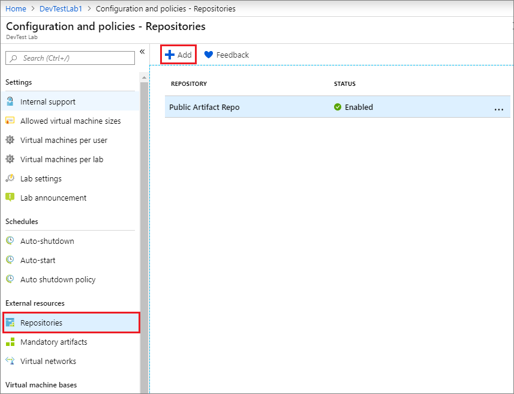
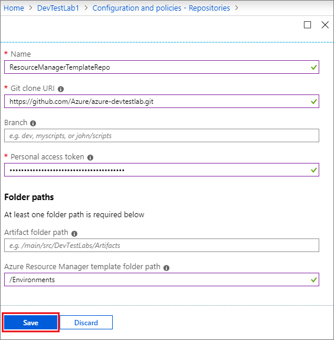
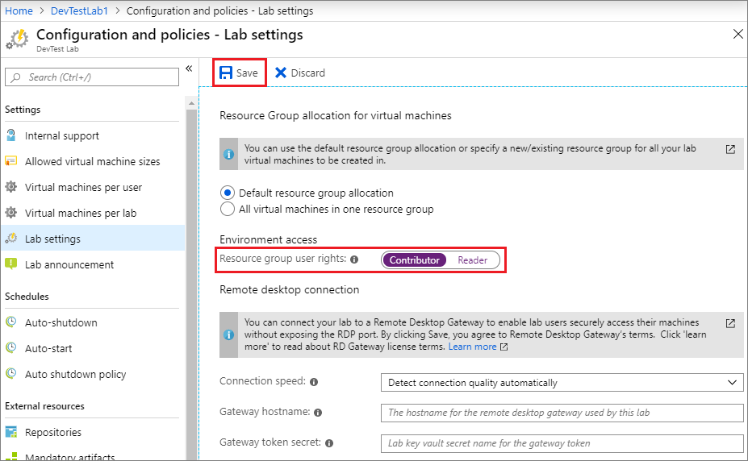
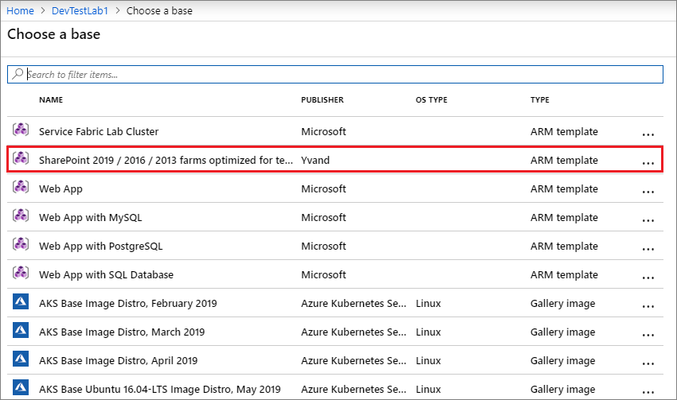
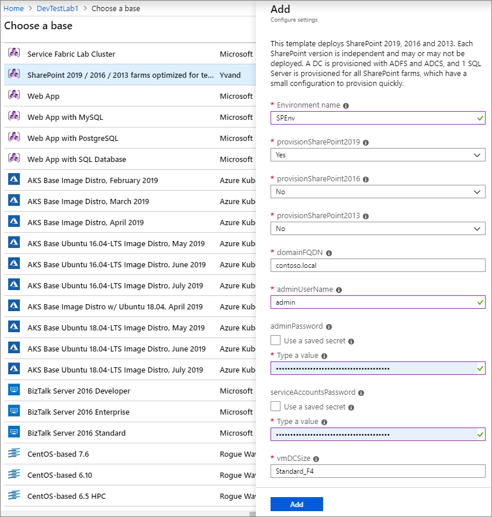
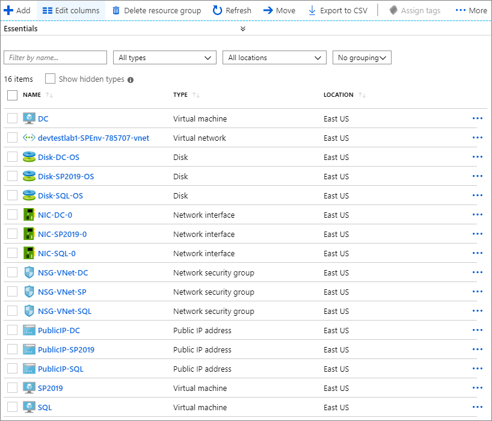
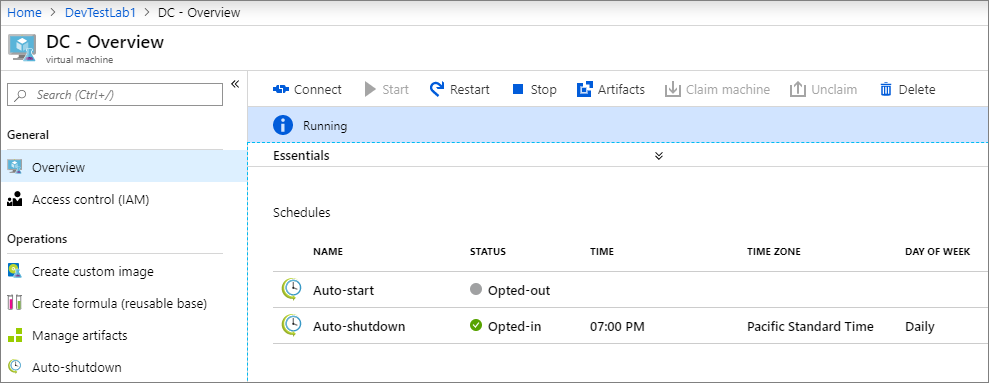

# Create multi-VM environments and PaaS resources with Azure Resource Manager templates

Azure DevTest Labs environments allow users to readily deploy complex infrastructures in a consistent way within the confines of the lab. You can use [Azure Resource Manager templates](../azure-resource-manager/templates/syntax.md) to create environments with sets of resources in DevTest Labs. These environments can contain any Azure resources that Resource Manager templates can create.

You can easily [add one virtual machine (VM) at a time](devtest-lab-add-vm.md) to a lab by using the [Azure portal](https://portal.azure.com). However, scenarios like multi-tier web apps or a SharePoint farm need a mechanism to create multiple VMs in a single step. By using Azure Resource Manager templates, you can define the infrastructure and configuration of your Azure solution, and repeatedly deploy multiple VMs in a consistent state.

Azure Resource Manager templates also provide the following benefits:

- Azure Resource Manager templates are loaded directly from your GitHub or Azure Repos source control repository.
- Your users can create an environment by picking a configured Azure Resource Manager template from the Azure portal, just as they do with other types of [VM bases](devtest-lab-comparing-vm-base-image-types.md).
- You can provision Azure PaaS resources as well as IaaS VMs in an environment from an Azure Resource Manager template.
- You can track the cost of environments in the lab, in addition to individual VMs created by other types of bases. PaaS resources are created and will appear in cost tracking. However, VM auto shutdown does not apply to PaaS resources.

To learn more about the benefits of using Resource Manager templates to deploy, update, or delete many lab resources in a single operation, see [Benefits of using Resource Manager templates](../azure-resource-manager/management/overview.md#the-benefits-of-using-resource-manager).

> [!NOTE]
> When you use a Resource Manager template as a base to create lab VMs, there are some differences between creating multiple VMs or a single VM. For more information, see [Use a virtual machine's Azure Resource Manager template](devtest-lab-use-resource-manager-template.md).
>

## Use DevTest Labs public environments
Azure DevTest Labs has a [public repository of Azure Resource Manager templates](https://github.com/Azure/azure-devtestlab/tree/master/Environments) that you can use to create environments without having to connect to an external GitHub source yourself. This public repository is similar to the public repository of artifacts that's available in the Azure portal for every lab that you create. The environment repository lets you quickly get started with pre-authored environment templates that have few input parameters. These templates provide you with a smooth getting started experience for PaaS resources within labs.

In the public repository, the DevTest Labs team and others have created and shared frequently-used templates like Azure Web Apps, Service Fabric Cluster, and a development SharePoint Farm environment. You can use these templates directly, or customize them to suit your needs. For more information, see [Configure and use public environments in DevTest Labs](devtest-lab-configure-use-public-environments.md). After you create your own templates, you can store them in this repository to share them with others, or set up your own Git repository.

<a name="configure-your-own-template-repositories"></a>
## Create your own template repositories

As one of the best practices with infrastructure-as-code and configuration-as-code, you should manage environment templates in source control. Azure DevTest Labs follows this practice, and loads all Azure Resource Manager templates directly from your GitHub or Azure Repos repositories. As a result, you can use Resource Manager templates across the entire release cycle, from the test environment to the production environment.

There are several rules to follow to organize your Azure Resource Manager templates in a repository:

- You must name the master template file *azuredeploy.json*.

- If you want to use parameter values defined in a parameter file, the parameter file must be named *azuredeploy.parameters.json*.

  You can use the parameters `_artifactsLocation` and `_artifactsLocationSasToken` to construct the parametersLink URI value, allowing DevTest Labs to automatically manage nested templates. For more information, see [Deploy nested Azure Resource Manager templates for testing environments](deploy-nested-template-environments.md).

- You can define metadata to specify the template display name and description in a file named *metadata.json*, as follows:

  ```json
  {
    "itemDisplayName": "<your template name>",
    "description": "<description of the template>"
  }
  ```


## Add template repositories to the lab

After you create and configure your repository, you can add it to your lab by using the Azure portal:

1. Sign in to the [Azure portal](https://portal.azure.com).
1. Select **All Services**, and then select **DevTest Labs** from the list.
1. From the list of labs, select the lab you want.
1. On the lab's **Overview** pane, select **Configuration and policies**.

   

1. From the **Configuration and policies** settings list, select **Repositories**. The **Public Artifact Repo** repository is automatically generated for all labs, and connects to the [DevTest Labs public GitHub repository](https://github.com/Azure/azure-devtestlab).

1. To add your Azure Resource Manager template repository, select **Add**.

   

1. In the **Repositories** pane, enter the following information:

   - **Name**: Enter a repository name to use in the lab.
   - **Git clone URL**: Enter the Git HTTPS clone URL from GitHub or Azure Repos.
   - **Branch** (optional): Enter the branch name to access your Azure Resource Manager template definitions.
   - **Personal access token**: Enter the personal access token that is used to securely access your repository.
     - To get your token from Azure Repos, under your profile, select **User settings** > **Security** > **Personal access tokens**.
     - To get your token from GitHub, under your profile, select **Settings** > **Developer Settings** > **Personal access tokens**.
   - **Folder paths**: Enter the folder path that is relative to your Git clone URI for either your artifact definitions or your Azure Resource Manager template definitions.

1. Select **Save**.

   

Once you add an Azure Resource Manager template to the lab, your lab users can create environments by using the template.

## Configure access rights for lab users

Lab users have **Reader** role by default, so they can't change the resources in an environment resource group. For example, they can't stop or start their resources.

To give your lab users **Contributor** role so they can edit the resources in their environments, follow these steps:

1. In the [Azure portal](https://portal.azure.com), on your lab's **Overview** pane, select **Configuration and policies**, and then select **Lab settings**.

1. In the **Lab settings** pane, select **Contributor**, and then select **Save** to grant write permissions to lab users.

   

The next section walks through creating environments from an Azure Resource Manager template.

## Create environments from templates in the Azure portal

Once you add an Azure Resource Manager template to the lab, your lab users can create environments in the Azure portal by following these steps:

1. Sign in to the [Azure portal](https://portal.azure.com).

1. Select **All Services**, and then select **DevTest Labs** from the list.

1. From the list of labs, select the lab you want.

1. On the lab's page, select **Add**.

1. The **Choose a base** pane displays the base images you can use, with the Azure Resource Manager templates listed first. Select the Azure Resource Manager template you want.

   

1. On the **Add** pane, enter an **Environment name** value to display to environment users.

   The Azure Resource Manager template defines the rest of the input fields. If the template *azuredeploy.parameter.json* file defines default values, the input fields show those values.

   For parameters of type *secure string*, you can use secrets from your Azure Key Vault. To learn about storing secrets in a key vault and using them when creating lab resources, see [Store secrets in Azure Key Vault](devtest-lab-store-secrets-in-key-vault.md).  

   

   > [!NOTE]
   > The following parameter values don't appear in the input fields, even if the template specifies them. Instead, the form shows blank input fields where lab users must enter values when creating the environment.
   >
   > - GEN-UNIQUE
   > - GEN-UNIQUE-[N]
   > - GEN-SSH-PUB-KEY
   > - GEN-PASSWORD

1. Select **Add** to create the environment.

   The environment starts provisioning immediately, with the status displaying in the **My virtual machines** list. The lab automatically creates a new resource group to provision all the resources defined in the Azure Resource Manager template.

1. Once the environment is created, select the environment in the **My virtual machines** list to open the resource group pane and browse all of the resources the environment provisioned.

   

   You can also expand the environment to view just the list of VMs the environment provisioned.

   

1. Select any of the environments to view the available actions, such as applying artifacts, attaching data disks, changing auto-shutdown time, and more.

   

<a name="automate-deployment-of-environments"></a>
## Automate environment creation with PowerShell

It's feasible to use the Azure portal to add a single environment to a lab, but when a development or testing scenario must create multiple environments, automated deployment is a better experience.

Before you proceed, make sure you have an Azure Resource Manager template that defines the resources to create. [Add and configure the template in a Git repository](#configure-your-own-template-repositories), and [add the repository to the lab](#add-template-repositories-to-the-lab).

The following sample script creates an environment in your lab. The comments help you understand the script better.

1. Save the following sample PowerShell script to your hard drive as *deployenv.ps1*.

   [!INCLUDE [updated-for-az](../../includes/updated-for-az.md)]

   ```powershell
   #Requires -Module Az.Resources

   [CmdletBinding()]

   param (
   # ID of the Azure Subscription for the lab
   [string] [Parameter(Mandatory=$true)] $SubscriptionId,

   # Name of the existing lab in which to create the environment
   [string] [Parameter(Mandatory=$true)] $LabName,

   # Name of the connected repository in the lab
   [string] [Parameter(Mandatory=$true)] $RepositoryName,

   # Name of the template (folder name in the Git repository)
   [string] [Parameter(Mandatory=$true)] $TemplateName,

   # Name of the environment to be created in the lab
   [string] [Parameter(Mandatory=$true)] $EnvironmentName,

   # The parameters to be passed to the template. Each parameter is prefixed with "-param_".
   # For example, if the template has a parameter named "TestVMName" with a value of "MyVMName",
   # the string in $Params will have the form: -param_TestVMName MyVMName.
   # This convention allows the script to dynamically handle different templates.
   [Parameter(ValueFromRemainingArguments=$true)]
       $Params
   )

   # Sign in to Azure.
   # Comment out the following statement to completely automate the environment creation.
   Connect-AzAccount

   # Select the subscription that has the lab.  
   Set-AzContext -SubscriptionId $SubscriptionId | Out-Null

   # Get information about the user, specifically the user ID, which is used later in the script.  
   $UserId = $((Get-AzADUser -UserPrincipalName ((Get-AzContext).Account).Id).Id)

   # Get information about the lab, such as lab location.
   $lab = Get-AzResource -ResourceType "Microsoft.DevTestLab/labs" -Name $LabName
   if ($lab -eq $null) { throw "Unable to find lab $LabName in subscription $SubscriptionId." }

   # Get information about the repository in the lab.
   $repository = Get-AzResource -ResourceGroupName $lab.ResourceGroupName `
       -ResourceType 'Microsoft.DevTestLab/labs/artifactsources' `
       -ResourceName $LabName `
       -ApiVersion 2016-05-15 `
       | Where-Object { $RepositoryName -in ($_.Name, $_.Properties.displayName) } `
       | Select-Object -First 1
   if ($repository -eq $null) { throw "Unable to find repository $RepositoryName in lab $LabName." }

   # Get information about the Resource Manager template base for the environment.
   $template = Get-AzResource -ResourceGroupName $lab.ResourceGroupName `
       -ResourceType "Microsoft.DevTestLab/labs/artifactSources/armTemplates" `
       -ResourceName "$LabName/$($repository.Name)" `
       -ApiVersion 2016-05-15 `
       | Where-Object { $TemplateName -in ($_.Name, $_.Properties.displayName) } `
       | Select-Object -First 1
   if ($template -eq $null) { throw "Unable to find template $TemplateName in lab $LabName." }

   # Build the template parameters with parameter name and values.  
   $parameters = Get-Member -InputObject $template.Properties.contents.parameters -MemberType NoteProperty | Select-Object -ExpandProperty Name
   $templateParameters = @()

   # Extract the custom parameters from $Params and format as name/value pairs.
   $Params | ForEach-Object {
       if ($_ -match '^-param_(.*)' -and $Matches[1] -in $parameters) {
           $name = $Matches[1]                
       } elseif ( $name ) {
           $templateParameters += @{ "name" = "$name"; "value" = "$_" }
           $name = $null #reset name variable
       }
   }

   # Once name/value pairs are isolated, create an object to hold the necessary template properties.
   $templateProperties = @{ "deploymentProperties" = @{ "armTemplateId" = "$($template.ResourceId)"; "parameters" = $templateParameters }; }

   # Now, create or deploy the environment in the lab by using the New-AzResource command.
   New-AzResource -Location $Lab.Location `
       -ResourceGroupName $lab.ResourceGroupName `
       -Properties $templateProperties `
       -ResourceType 'Microsoft.DevTestLab/labs/users/environments' `
       -ResourceName "$LabName/$UserId/$EnvironmentName" `
       -ApiVersion '2016-05-15' -Force

   Write-Output "Environment $EnvironmentName completed."
   ```

1. Run the script as follows, using your specific values for SubscriptionId, LabName, ResourceGroupName, RepositoryName, TemplateName (folder in the Git repo), and EnvironmentName.

   ```powershell
   ./deployenv.ps1 -SubscriptionId "000000000-0000-0000-0000-0000000000000" -LabName "mydevtestlab" -ResourceGroupName "mydevtestlabRG000000" -RepositoryName "myRepository" -TemplateName "My Environment template name" -EnvironmentName "myGroupEnv"
   ```

You can also use Azure CLI to deploy resources with Resource Manager templates. For more information, see [Deploy resources with Resource Manager templates and Azure CLI](../azure-resource-manager/templates/deploy-cli.md).

> [!NOTE]
> Only a user with lab owner permissions can create VMs from a Resource Manager template by using Azure PowerShell. If you want to automate VM creation using a Resource Manager template and you only have user permissions, you can use the CLI command [az lab vm create](/cli/azure/lab/vm#az_lab_vm_create).

## Resource Manager template limitations in DevTest Labs

Consider these limitations when using Resource Manager templates in DevTest Labs:

- You can't create formulas or custom images from lab VMs that were created from a Resource Manager template.

- Most policies aren't evaluated when you deploy Resource Manager templates.

For example, you might have a lab policy that a user can create only five VMs. However, a user can deploy a Resource Manager template that creates dozens of VMs. Policies that aren't evaluated include:

  - Number of VMs per user

  - Number of premium VMs per lab user

  - Number of premium disks per lab user

## Next steps
- Once you create a VM, you can connect to the VM by selecting **Connect** on the VM's management pane.
- View and manage resources in an environment by selecting the environment in the **My virtual machines** list in your lab.
- Explore the [Azure Resource Manager templates from the Azure Quickstart template gallery](https://github.com/Azure/azure-quickstart-templates).