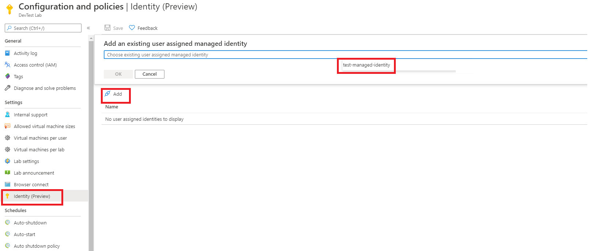

# Use Azure managed identities to deploy environments in a lab 

As a lab owner, you can use a managed identity to deploy environments in a lab. This feature is helpful in scenarios where the environment contains or has references to Azure resources such as key vaults, shared image galleries, and networks that are external to the environment’s resource group. It enables creation of sandbox environments that aren't limited to the resource group of that environment. 

By default, when you create an environment, the lab creates a system-assigned identity to access Azure resources and services on a lab user’s behalf while deploying the Azure Resource Manager template (ARM template). Learn more about [why a lab creates a system-assigned identity](configure-lab-identity.md#scenarios-for-using-labs-system-assigned-identity). For new and existing labs, a system-assigned identity is created by default the first time a lab environment is created.  

Note that as a lab owner, you can choose to grant the lab’s system-assigned identity permissions to access Azure resources outside the lab or you can use your own user-assigned identity for the scenario. The lab’s system-assigned identity is valid only for the life of the lab. The system-assigned identify is deleted when you delete the lab. When you have environments in multiple labs that need to use an identity, consider using a user-assigned identity.  

> [!NOTE]
> Currently, a single user-assigned identity is supported per lab. 

## Prerequisites

- [Create, list, delete, or assign a role to a user-assigned managed identity using the Azure portal](../active-directory/managed-identities-azure-resources/how-to-manage-ua-identity-portal.md). 
    
    Make sure your managed identity was created in the same region and subscription as your lab. The managed identity does not need to be in the same resource group.

## Use Azure portal

In this section you, as a lab owner, use the Azure portal to add a user-managed identity to the lab. 

1. Sign in to the [Azure portal](https://portal.azure.com).
1. Search for **DevTest Labs**.
1. From the list of labs, select the lab you want.
1. Select **Configuration and policies** -> **Identity (Preview)**. 
1. To add a user assigned identity, select the **User Assigned** tab.
1. Press **Add** .
1. Select an existing user you have created and/or have access to from the drop-down.
 
    
1. Press **Save** on top of the page.

    Once saved, the lab will use this identity while deploying all lab environments. You can also access the identity resource in Azure by selecting the identity from the list. 

The lab owner doesn't need to do anything special while deploying an environment as long as the identity added to the lab has permissions to the external resources that the environment needs to access. 

To change the user-managed identity assigned to the lab, remove the identity attached to the lab first and then add another one to the lab. To remove an identity attached to the lab, select **... (ellipsis)**, and click **Remove**. 

## Use API

1. After creating an identity, note the resource ID of this identity. It should look like the following sample: 

    `/subscriptions/0000000000-0000-0000-0000-00000000000000/resourceGroups/{rg}/providers/Microsoft.ManagedIdentity/userAssignedIdentities/{identityName}`.

1. Perform a PUT HTTPS method on the lab resource to add a user-assigned identity or enable a system-assigned identity for the lab.

   > [!NOTE]
   > Regardless of whether you create a user-assigned identity, the lab automatically creates a system-assigned identity the first time a lab environment is created. However, if a user-assigned identity is already configured for the lab, the DevTest Lab service continues to use that identity to deploy lab environments. 
 
    ```json
    
    PUT https://management.azure.com/subscriptions/{subId}/resourceGroups/{rg}/providers/Microsoft.Devtestlab/labs/{labname}

    {
        "location": "{location}",
        "properties": {
          **lab properties**
         } 
        "identity":{
            "type": "SystemAssigned,UserAssigned",
            "userAssignedIdentities":{
                "/subscriptions/0000000000-0000-0000-0000-00000000000000/resourceGroups/{rg}/providers/Microsoft.ManagedIdentity/userAssignedIdentities/{identityName}":{}
            }
        } 
    }
    
    ```
 
Once the user assigned identity is added to the lab, the Azure DevTest Labs service will use it while deploying Azure Resource Manager environments. For example, if you need your Resource Manager template to access an external shared image gallery image, make sure that the identity you added to the lab has minimum required permissions for the shared image gallery resource. 
