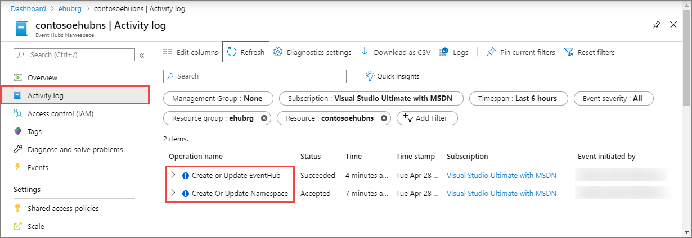

# Set up diagnostic logs for an Azure event hub

You can view two types of logs for Azure Event Hubs:

* **[Activity logs](../azure-monitor/essentials/platform-logs-overview.md)**: These logs have information about operations done on a job. The logs are always enabled. You can see activity log entries by selecting **Activity log** in the left pane for your event hub namespace in the Azure portal. For example: "Create or Update Namespace", "Create or Update Event Hub".

    
* **[Diagnostic logs](../azure-monitor/essentials/platform-logs-overview.md)**: Diagnostic logs provide richer information about operations and actions that are conducted against your namespace by using the API, or through management clients on the language SDK. 
    
    The following section shows you how to enable diagnostic logs for an Event Hubs namespace.

## Enable diagnostic logs
Diagnostic logs are disabled by default. To enable diagnostic logs, follow these steps:

1.	In the [Azure portal](https://portal.azure.com), navigate to your Event Hubs namespace. 
2. Select **Diagnostics settings** under **Monitoring** in the left pane, and then select **+ Add diagnostic setting**. 

    
4. In the **Category details** section, select the **types of diagnostic logs** that you want to enable. You'll find details about these categories later in this article. 
5. In the **Destination details** section, set the archive target (destination) that you want; for example, a storage account, an event hub, or a Log Analytics workspace.

    
6.	Select **Save** on the toolbar to save the diagnostics settings.

    New settings take effect in about 10 minutes. After that, logs appear in the configured archival target, in the **Diagnostics logs** pane.

    For more information about configuring diagnostics, see the [overview of Azure diagnostic logs](../azure-monitor/essentials/platform-logs-overview.md).

## Diagnostic logs categories
[!INCLUDE [event-hubs-diagnostic-log-schema](../../includes/event-hubs-diagnostic-log-schema.md)]

## Next steps
- [Introduction to Event Hubs](./event-hubs-about.md)
- [Event Hubs samples](sdks.md)
- Get started with Event Hubs
    - [.NET Core](event-hubs-dotnet-standard-getstarted-send.md)
    - [Java](event-hubs-java-get-started-send.md)
    - [Python](event-hubs-python-get-started-send.md)
    - [JavaScript](event-hubs-node-get-started-send.md)
