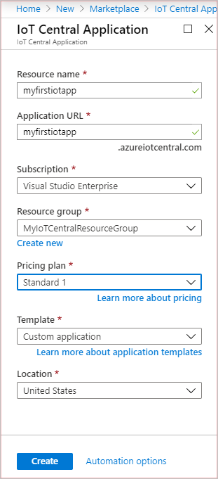
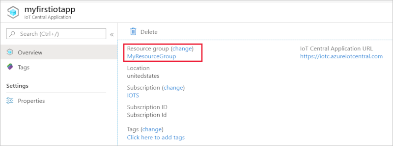
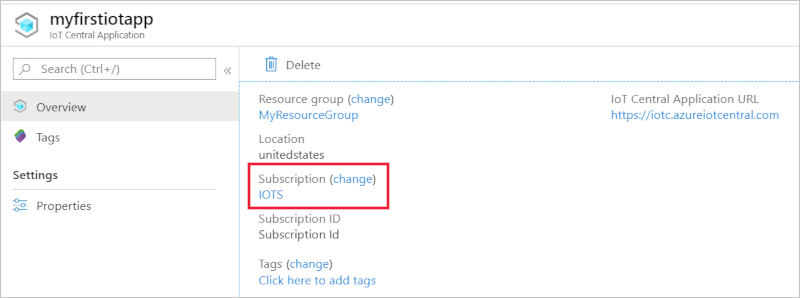

# Manage IoT Central from the Azure portal

[!INCLUDE [iot-central-selector-manage](../../../includes/iot-central-selector-manage.md)]

You can use the [Azure portal](https://portal.azure.com) to create and manage IoT Central applications.

## Create IoT Central applications

[!INCLUDE [Warning About Access Required](../../../includes/iot-central-warning-contribitorrequireaccess.md)]

To create an application, navigate to the [IoT Central Application](https://ms.portal.azure.com/#create/Microsoft.IoTCentral) page in the Azure portal:

* **Resource name** is a unique name you can choose for your IoT Central application in your Azure resource group.

* **Application URL** is the URL you can use to access your application.

* **Template** is the type of IoT Central application you want to create. You can create a new application either from the list of industry-relevant templates to help you get started quickly, or start from scratch using the **Custom application** template.

* **Location** is the [geography](https://azure.microsoft.com/global-infrastructure/geographies/) where you'd like to create your application. Typically, you should choose the location that's physically closest to your devices to get optimal performance. Azure IoT Central is currently available in the following locations:

  * Asia Pacific
  * Australia
  * Europe
  * Japan
  * United Kingdom
  * United States

  Once you choose a location, you can't later move your application to a different location.

After filling out all fields, select **Create**. To learn more, see [Create an IoT Central application](howto-create-iot-central-application.md).

## Manage existing IoT Central applications

If you already have an Azure IoT Central application, you can delete it, or move it to a different subscription or resource group in the Azure portal.

> [!NOTE]
> Applications created using the *free* plan do not require an Azure subscriptions, and therefore you won't find them listed in your Azure subscription on the Azure portal. You can only see and manage free apps from the IoT Central portal.

To get started, search for your application in the search bar at the top of the Azure portal. You can also view all your applications by searching for _IoT Central Applications_ and selecting the service:

When you select an application in the search results, the Azure portal shows you its overview. You can navigate to the application by selecting the **IoT Central Application URL**:

To move the application to a different resource group, select **change** beside the resource group. On the **Move resources** page, choose the resource group you'd like to move this application to:

To move the application to a different subscription, select  **change** beside the subscription. On the **Move resources** page, choose the subscription you'd like to move this application to:

## Next steps

Now that you've learned how to manage Azure IoT Central applications from the Azure portal, here is the suggested next step:

> [!div class="nextstepaction"]
> [Administer your application](howto-administer.md)