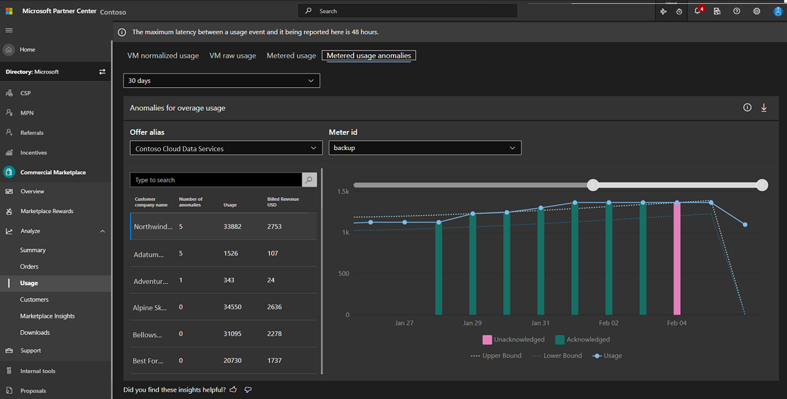
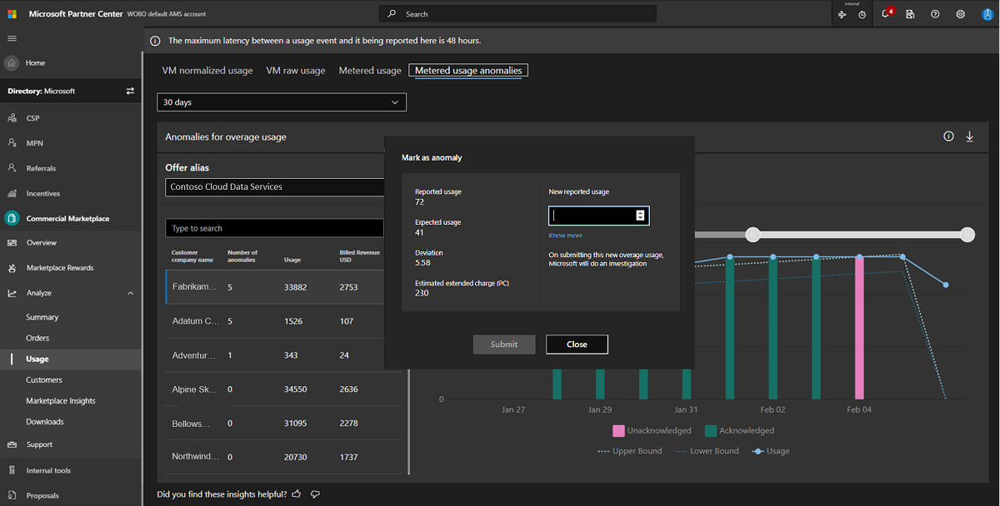
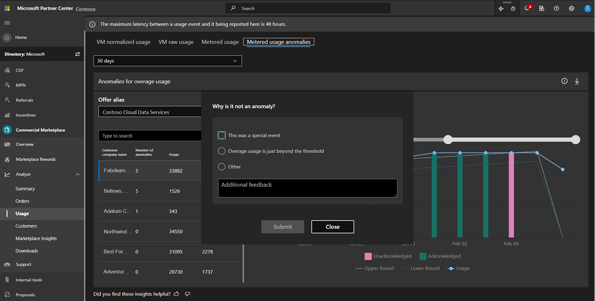
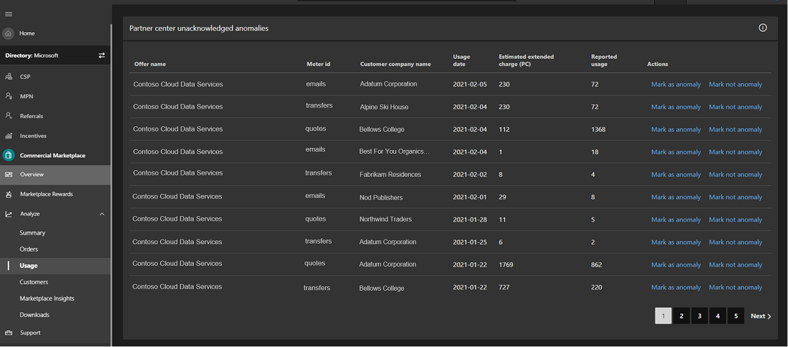
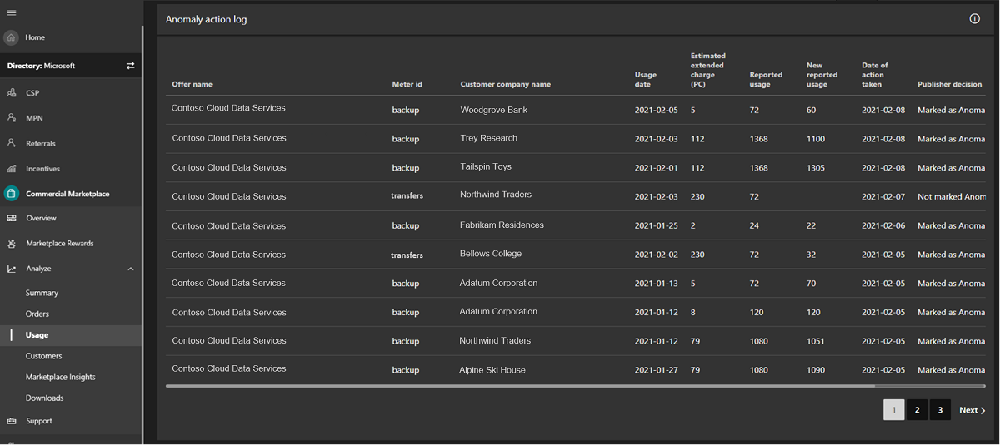
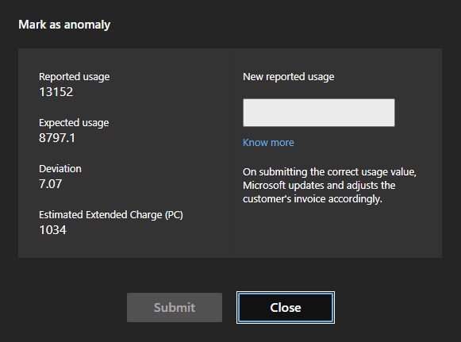

# Manage metered billing anomalies in Partner Center

The custom metered billing option is currently available to [Software as a service](plan-saas-offer.md) (SaaS) offers and [Azure Applications](plan-azure-application-offer.md#types-of-plans) with a Managed application plan.

If you are using the metered billing option to create offers in the commercial marketplace program that lets you charge for usage based on non-standard units, you need to know when your customer has used more of a service than expected.

## Use the Anomaly detection feature

Microsoft relies on you, the partner, to report your customers’ overage usage of their SaaS or Azure Managed application offers before Microsoft invoices the customer. If the wrong usage is reported, the customer could potentially receive an incorrect invoice, undermining both Microsoft’s and the partner’s credibility.

To help ensure that your customers are billed correctly, use the **Anomaly detection** feature for both SaaS Apps and Azure application managed application plans. This feature monitors usage against metered billing and predicts the expected value of usage within the expected range. If the usage is outside the expected range, it is treated as unexpected, (an anomaly,) and you will receive an alert notification on your Offer Overview page in the commercial marketplace program of Partner Center. You can track your customers’ usage daily for every custom meter dimension that you’ve set.

## View and manage metered usage anomalies

1. Sign-in to [Partner Center](https://partner.microsoft.com/dashboard/home).
1. In the left-navigation menu, select **Commercial Marketplace** > **Analyze**.
1. Select the **Metered usage anomalies** tab.

     
    ***Figure 1: Metered usage anomalies tab***

1. For any usage anomalies detected against metered billing, as a publisher you will be asked to investigate and confirm if the anomaly is true or not. Select **Mark as anomaly** to confirm the diagnosis.

      
    ***Figure 2: Mark as an anomaly dialog box***

1. If you believe that the overage usage anomaly we detected is not genuine, you can provide that feedback by selecting **Not an anomaly** for the Partner Center flagged anomaly on the particular overage usage.

    
    ***Figure 3: Why is it not an anomaly? dialog box***

1. You can scroll down the page to see an inventory list of unacknowledged anomalies. The list provides an inventory of anomalies that you have not acknowledged. You can choose to mark any of the Partner Center flagged anomalies as genuine or false.

    
    ***Figure 4: Partner Center unacknowledged anomalies list***

    By default, flagged anomalies that have an estimated financial impact greater than 100 USD are shown in Partner Center. However, you can select **All** from the **Estimated financial impact of anomaly** list to see all flagged anomalies.

    :::image type="content" source="./media/anomaly-detection/all-anomalies.png" alt-text="Screenshot of all metered usage anomalies for the selected offer.":::

1. You would also see an anomaly action log that shows the actions you took on the overage usages. In the action log, you will be able to see which overage usage events were marked as genuine or false.

    
   ***Figure 5: Anomaly action log***

1. Partner Center analytics will not support restatement of overage usage events in the export reports. Partner Center lets you enter the corrected overage usage for an anomaly and the details are passed on to Microsoft teams for investigation. Based on the investigation, Microsoft will issue credit refunds to the overcharged customer, as appropriate. When you select any of the flagged anomalies, you can select **Mark as anomaly** to mark the usage overage anomaly as genuine.

    
   ***Figure: 6: Mark as anomaly dialog box***

The first time an overage usage is flagged as irregular in Partner Center, you will get a window of 30 days from that instance to mark the anomaly as genuine or false. After the 30-day period, as the publisher you would not be able to act on the anomalies.

> [!IMPORTANT]
> Under-reported overage usage units are not eligible for restatement and financial adjustment.

You can see all the anomalies (acknowledged or otherwise) for the selected computation period. The various computation periods are the last 30 days, last 60 days, and last 90 days.

> [!IMPORTANT]
> You are requested to act on the flagged anomalies within 30 days of the time from when the anomalies are first reported in Partner Center.

The filter modal in the widget lets you select individual offers and individual custom meters.

After you mark an overage usage as an anomaly or acknowledge a model that flagged an anomaly as genuine, you can’t change the selection to “Not an Anomaly”.

> [!IMPORTANT]
> You can re-submit overage usages in the event of overcharge situations.

## See also
- [Metered billing for SaaS using the commercial marketplace metering service](./partner-center-portal/saas-metered-billing.md)
- [Managed application metered billing](marketplace-metering-service-apis.md)
- [Anomaly detection service for metered billing](./partner-center-portal/anomaly-detection-service-for-metered-billing.md)
