# Backup to Azure with Veeam

This article helps you integrate a Veeam infrastructure with Azure Blob storage. It includes prerequisites, considerations, implementation, and operational guidance. This article addresses using Azure as an offsite backup target and a recovery site if a disaster occurs, which prevents normal operation within your primary site.

> [!NOTE]
> Veeam also offers a lower recovery time objective (RTO) solution, Veeam Backup & Replication with support for Azure VMware Solution workloads. This solution lets you have a standby VM that can help you recover more quickly in the event of a disaster in an Azure production environment. Veeam also offers Direct Restore to Microsoft Azure and other dedicated tools to back up Azure and Office 365 resources. These capabilities are outside the scope of this document.

## Reference architecture

The following diagram provides a reference architecture for on-premises to Azure and in-Azure deployments.

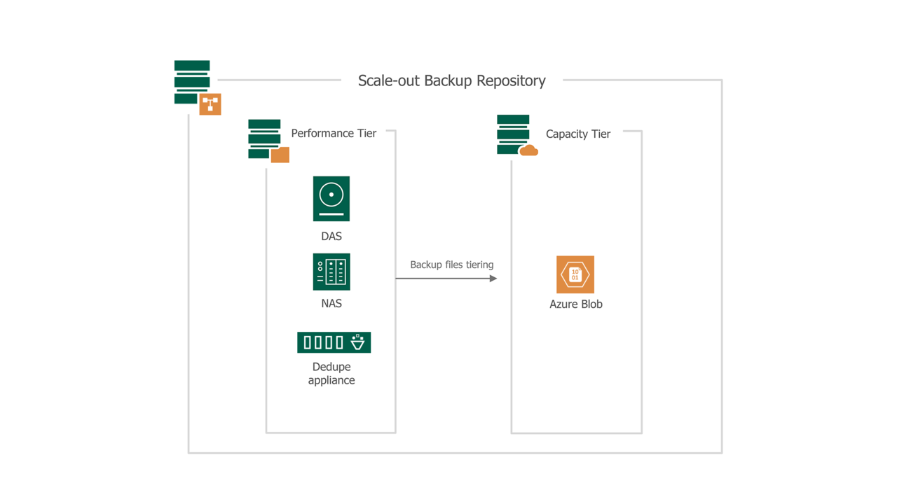

Your existing Veeam deployment can easily integrate with Azure by adding an Azure storage account, or multiple accounts, as a cloud backup repository. Veeam also allows you to recover backups from on-premises within Azure giving you a recovery-on-demand site in Azure.

## Veeam interoperability matrix

| Workload | GPv2 and Blob Storage | Cool tier support | Archive tier support | Data Box Family support |
|-----------------------|--------------------|--------------------|-------------------------|-------------------------|
| On-premises VMs/data | v10a | v10a | N/A | 10a* |
| Azure VMs | v10a | v10a | N/A | 10a* |
| Azure Blob | v10a | v10a | N/A | 10a* |
| Azure Files | v10a | v10a | N/A | 10a* |

Veeam has offered support for above Azure features in older versions of their product as well, for optimal experience leveraging the latest product version is strongly recommended.

*Veeam Backup and Replication support REST API only for Azure Data Box. Therefore, Azure Data Box Disk is not supported. Please see details for Data Box support [here](https://helpcenter.veeam.com/docs/backup/hyperv/osr_adding_data_box.html?ver=110).

## Before you begin

A little upfront planning will help you use Azure as an offsite backup target and recovery site.

### Get started with Azure

Microsoft offers a framework to follow to get you started with Azure. The [Cloud Adoption Framework](/azure/architecture/cloud-adoption/) (CAF) is a detailed approach to enterprise digital transformation and comprehensive guide to planning a production grade cloud adoption. The CAF includes a step-by-step [Azure Setup Guide](/azure/cloud-adoption-framework/ready/azure-setup-guide/) to help you get up and running quickly and securely. You can find an interactive version in the [Azure portal](https://portal.azure.com/?feature.quickstart=true#blade/Microsoft_Azure_Resources/QuickstartCenterBlade). You'll find sample architectures, specific best practices for deploying applications, and free training resources to put you on the path to Azure expertise.

### Consider the network between your location and Azure

Whether using cloud resources to run production, test and development, or as a backup target and recovery site, it's important to understand your bandwidth needs for initial backup seeding and for ongoing day-to-day transfers.

Azure Data Box provides a way to transfer your initial backup baseline to Azure without requiring more bandwidth. This is useful if the baseline transfer is estimated to take longer than you can tolerate. You can use the Data Transfer estimator when you create a storage account to estimate the time required to transfer your initial backup.

Remember, you'll require enough network capacity to support daily data transfers within the required transfer window (backup window) without impacting production applications. This section outlines the tools and techniques that are available to assess your network needs.

#### Determine how much bandwidth you'll need

Multiple assessment options are available to determine change rate and total backup set size for the initial baseline transfer to Azure. Here are some examples of assessment and reporting tools:

- [MiTrend](https://mitrend.com/)
- [Apt are](https://www.veritas.com/insights/aptare-it-analytics)
- [Datavoss](https://www.datavoss.com/)

#### Determine unutilized internet bandwidth

It's important to know how much typically unutilized bandwidth (or *headroom*) you have available on a day-to-day basis. This helps you assess whether you can meet your goals for:

- initial time to upload when you're not using Azure Data Box for offline seeding
- completing daily backups based on the change rate identified earlier and your backup window

Use the following methods to identify the bandwidth headroom that your backups to Azure are free to consume.

- If you're an existing Azure ExpressRoute customer, view your [circuit usage](../../../../../expressroute/expressroute-monitoring-metrics-alerts.md#circuits-metrics) in the Azure portal.
- Contact your ISP. They should be able to share reports that show your existing daily and monthly utilization.
- There are several tools that can measure utilization by monitoring your network traffic at the router/switch level. These include:

  - [Solarwinds Bandwidth Analyzer Pack](https://www.solarwinds.com/network-bandwidth-analyzer-pack?CMP=ORG-BLG-DNS)
  - [Paessler PRTG](https://www.paessler.com/bandwidth_monitoring)
  - [Cisco Network Assistant](https://www.cisco.com/c/en/us/products/cloud-systems-management/network-assistant/index.html)
  - [WhatsUp Gold](https://www.whatsupgold.com/network-traffic-monitoring)

### Choose the right storage options

When you use Azure as a backup target, you'll make use of [Azure Blob storage](../../../../blobs/storage-blobs-introduction.md). Blob storage is Microsoft's object storage solution. Blob storage is optimized for storing massive amounts of unstructured data, which is data that does not adhere to any data model or definition. Additionally, Azure Storage is durable, highly available, secure, and scalable. You can select the right storage for your workload to provide the [level of resiliency](../../../../common/storage-redundancy.md) to meet your internal SLAs. Blob storage is a pay-per-use service. You're [charged monthly](../../../../blobs/storage-blob-storage-tiers.md#pricing-and-billing) for the amount of data stored, accessing that data, and in the case of cool and archive tiers, a minimum required retention period. The resiliency and tiering options applicable to backup data are summarized in the following tables.

**Blob storage resiliency options:**

|  |Locally-redundant  |Zone-redundant  |Geo-redundant  |Geo-zone-redundant  |
|---------|---------|---------|---------|---------|
|**Effective # of copies**     | 3         | 3         | 6         | 6 |
|**# of availability zones**     | 1         | 3         | 2         | 4 |
|**# of region**s     | 1         | 1         | 2         | 2 |
|**Manual failover to secondary region**     | N/A         | N/A         | Yes         | Yes |

**Blob storage tiers:**

|  | Hot tier   |Cool tier   | Archive tier |
| ----------- | ----------- | -----------  | -----------  |
| **Availability** | 99.9%         | 99%         | Offline      |
| **Usage charges** | Higher storage costs, Lower access, and transaction costs | Lower storage costs, higher access, and transaction costs | Lowest storage costs, highest access, and transaction costs |
| **Minimum data retention required** | NA | 30 days | 180 days |
| **Latency (time to first byte)** | Milliseconds | Milliseconds | Hours |

#### Sample backup to Azure cost model

With pay-per-use can be daunting to customers who are new to the cloud. While you pay for only the capacity used, you do also pay for transactions (read and or writes) and [egress for data](https://azure.microsoft.com/pricing/details/bandwidth/) read back to your on-premises environment when [Azure Express Route direct local or Express Route unlimited data plan](https://azure.microsoft.com/pricing/details/expressroute/) are in use where data egress from Azure is included. You can use the [Azure Pricing Calculator](https://azure.microsoft.com/pricing/calculator/) to perform "what if" analysis. You can base the analysis on list pricing or on [Azure Storage Reserved Capacity pricing](../../../../../cost-management-billing/reservations/save-compute-costs-reservations.md), which can deliver up to 38% savings. Here's an example pricing exercise to model the monthly cost of backing up to Azure. This is only an example. *Your pricing may vary due to activities not captured here.*

|Cost factor  |Monthly cost  |
|---------|---------|
|100 TB of backup data on cool storage     |$1556.48         |
|2 TB of new data written per day x 30 days     |$42 in transactions          |
|Monthly estimated total     |$1598.48         |
|---------|---------|
|One time restore of 5 TB to on-premises over public internet   | $527.26         |

> [!Note]
> This estimate was generated in the Azure Pricing Calculator using East US Pay-as-you-go pricing and is based on the Veeam default of 512 kb chunk size for WAN transfers. This example may not be applicable towards your requirements.

## Implementation guidance

This section provides a brief guide for how to add Azure Storage to an on-premises Veeam deployment. For detailed guidance and planning considerations, we recommend you take a look at the following Veeam Guidance for their [Capacity Tier](https://helpcenter.veeam.com/docs/backup/vsphere/capacity_tier.html?ver=110).

1. Open the Azure portal, and search for **Storage Accounts**. You can also click on the default service icon.

      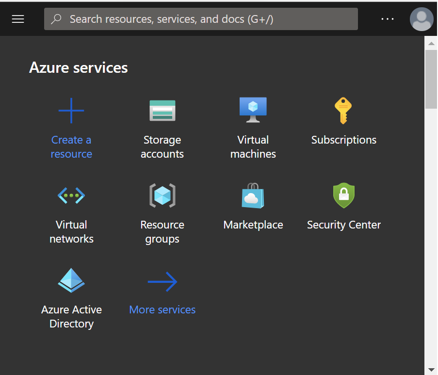

      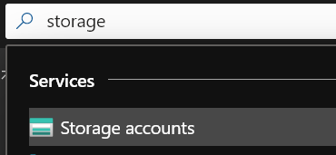

2. Select **Create** to add an account. Select or create a resource group, provide a unique name, choose the region, select **Standard** performance, always leave account kind as **Storage V2**, choose the replication level which meets your SLAs, and the default tier your backup software will apply. An Azure Storage account makes hot, cool, and archive tiers available within a single account and Veeam policies allow you to use multiple tiers to effectively manage the lifecycle of your data.

    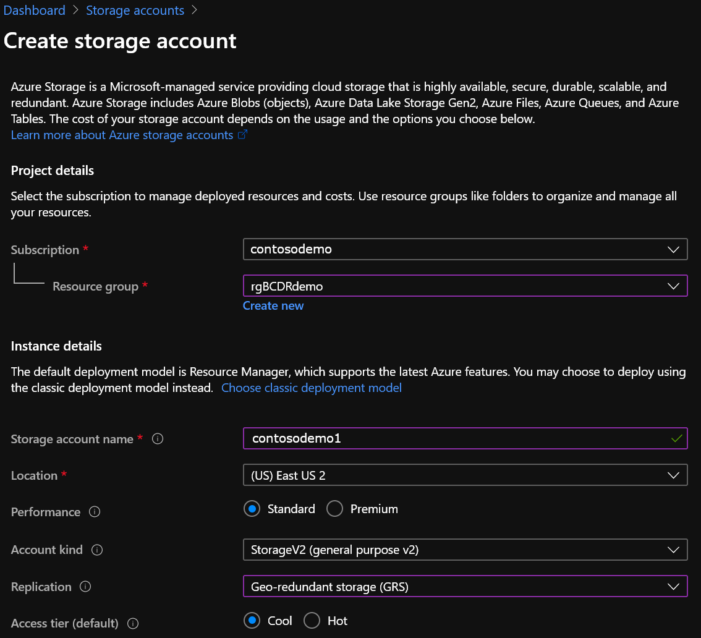

3. Keep the default networking and data protection options for now. Do **not** enable Soft Delete for Storage Accounts storing Veeam capacity tiers.

 4. Next, we recommend the default settings from the **Advanced** screen for backup to Azure use cases.

    

5. Add tags for organization if you use tagging, and create your account.

6. Two quick steps are all that are now required before you can add the account to your Veeam environment. Navigate to the account you created in the Azure portal and select **Containers** under the **Blob service** menu. Add a container and choose a meaningful name. Then, navigate to the **Access keys** item under **Settings** and copy the **Storage account name** and one of the two access keys. You will need the container name, account name, and access key in the next steps.

    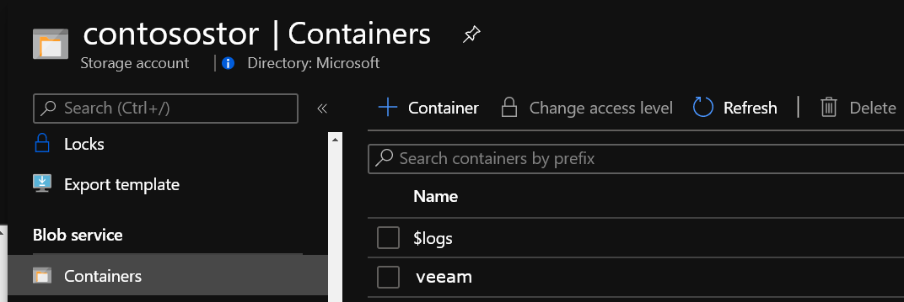

    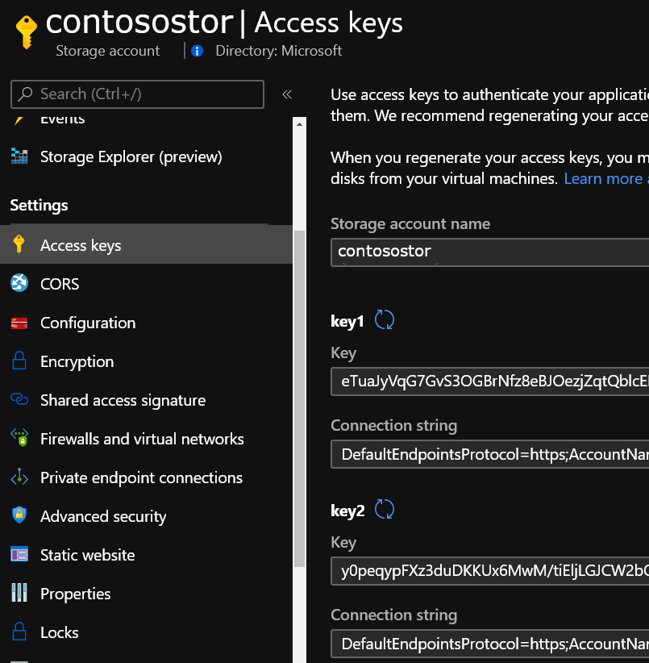

    > [!Note]
    > Veeam Backup and Replication offers additional options to connect to Azure. For the use case of this article, using Microsoft Azure Blob Storage as a backup target, using the above method is the recommended best practice.

7. *(Optional)* You can add more layers of security to your deployment.

     1. Configure role-based access to limit who can make changes to your storage account. For more information, see [Built-in roles for management operations](../../../../common/authorization-resource-provider.md#built-in-roles-for-management-operations).

     1. Restrict access to the account to specific network segments with [storage firewall settings](../../../../common/storage-network-security.md) to prevent access attempts from outside your corporate network.

        

     1. Set a [delete lock](../../../../../azure-resource-manager/management/lock-resources.md) on the account to prevent accidental deletion of the storage account.

        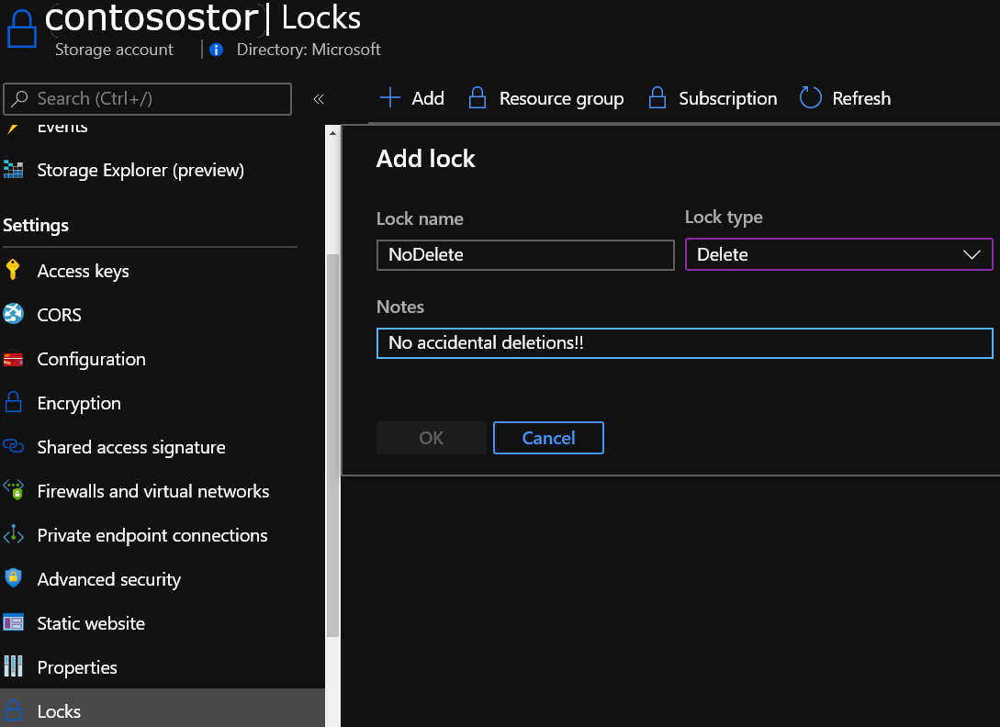

     1. Configure additional [security best practices](../../../../../storage/blobs/security-recommendations.md).

8. In the Veaam Backup and Replication Management Console, navigate to **Backup Infrastructure** -> right-click in the overview pane and select **Add Backup Repository** to open the configuration wizard. In the dialog box, select **Object storage** -> **Microsoft Azure Blob Storage** -> **Azure Blob Storage**.

    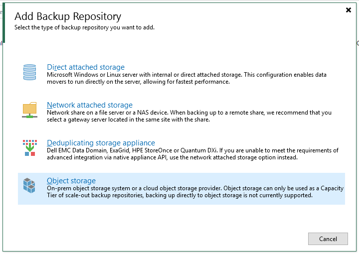

    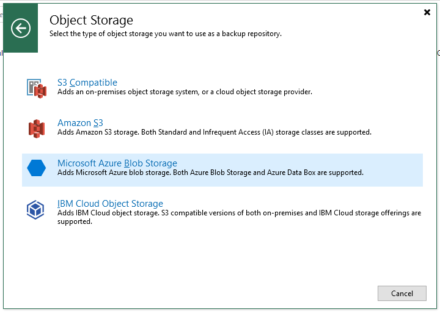

    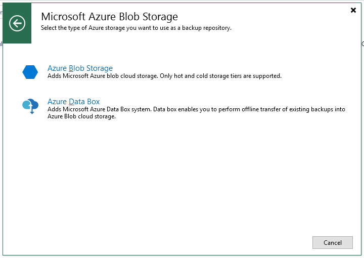

9. Next, specify a name and a description of your new Blob storage repository.

    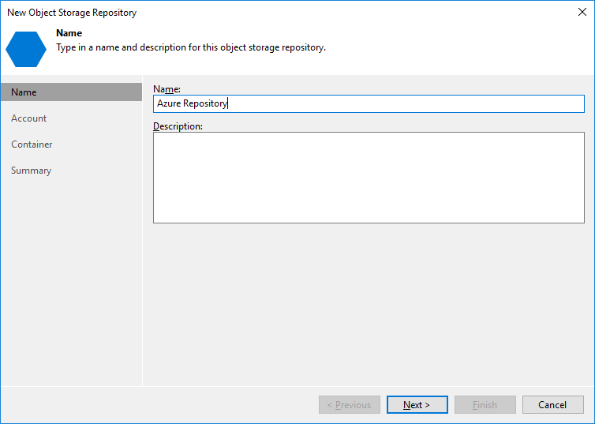

10. In the next step, add the credentials to access your Azure storage account. Select **Microsoft Azure Storage Account** in the Cloud Credential Manager, and enter your storage account name and access key. Select **Azure Global** in the region selector, and any gateway server if applicable.

    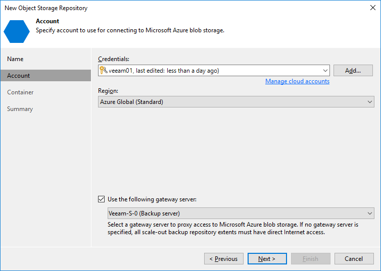

    > [!Note]
    > If you choose not to use a Veeam gateway server, make sure that all scale-out repository extents have direct internet access.

11. On the container register, select your Azure Storage container and select or create a folder to store your backups in. You can also define a soft limit on the overall storage capacity to be used by Veeam, which is recommended. Review the displayed information in the summary section and complete the configuration tool. You can now select the new repository in your backup job configuration.

    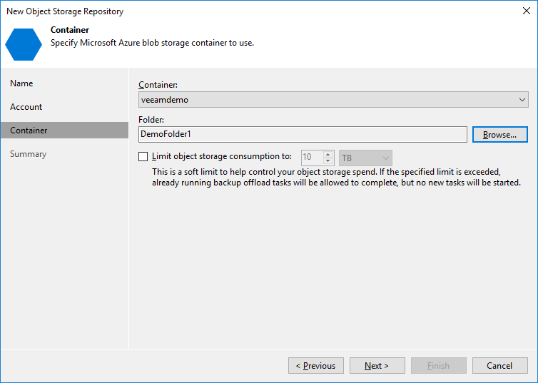

    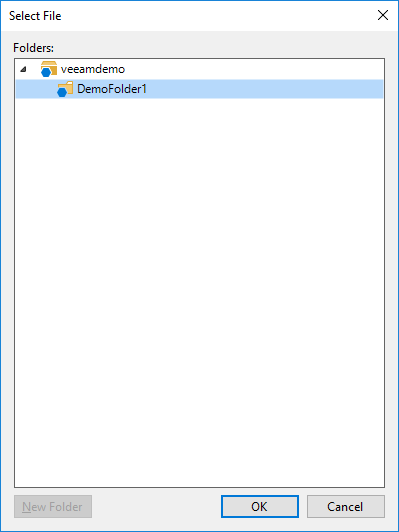

## Operational guidance

### Azure alerts and performance monitoring

It is advisable to monitor both your Azure resources and Veeam's ability to leverage them as you would with any storage target you rely on to store your backups. A combination of Azure Monitor and Veeam's monitoring capabilities (the **Statistics** tab in the **Jobs** node of the Veeam Management Console or more advanced options like Veeam One Reporter) will help you keep your environment healthy.

#### Azure portal

Azure provides a robust monitoring solution in the form of [Azure Monitor](../../../../../azure-monitor/essentials/monitor-azure-resource.md). You can [configure Azure Monitor](../../../../blobs/monitor-blob-storage.md) to track Azure Storage capacity, transactions, availability, authentication, and more. The full reference of metrics tracked may be found [here](../../../../blobs/monitor-blob-storage-reference.md). A few useful metrics to track are BlobCapacity - to make sure you remain below the maximum [storage account capacity limit](../../../../common/scalability-targets-standard-account.md), Ingress and Egress - to track the amount of data being written to and read from your Azure storage account, and SuccessE2ELatency - to track the roundtrip time for requests to and from Azure Storage and your MediaAgent.

You can also [create log alerts](../../../../../service-health/alerts-activity-log-service-notifications-portal.md) to track Azure Storage service health and view the [Azure status dashboard](https://status.azure.com/status) at any time.

#### Veeam reporting

- [Configure Veeam One Reporting](https://helpcenter.veeam.com/docs/one/reporter/configure_reporter.html?ver=100)
- [Veeam backup and replication alarms](https://helpcenter.veeam.com/docs/one/monitor/backup_alarms.html?ver=100)

### How to open support cases

When you need help with your backup to Azure solution, you should open a case with both Veeam and Azure. This helps our support organizations to collaborate, if necessary.

#### To open a case with Veeam

On the [Veeam customer support site](https://www.veeam.com/support.html), sign in, and open a case.

To understand the support options available to you by Veeam, see the [Veeam Customer Support Policy](https://www.veeam.com/veeam_software_support_policy_ds.pdf).

You may also call to open a case: [Worldwide support numbers](https://www.veeam.com/contacts.html?ad=in-text-link#support-numbers)

#### To open a case with Azure

In the [Azure portal](https://portal.azure.com) search for **support** in the search bar at the top. Select **Help + support** -> **New Support Request**.

> [!NOTE]
> When you open a case, be specific that you need assistance with Azure Storage or Azure Networking. Do not specify Azure Backup. Azure Backup is the name of an Azure service and your case will be routed incorrectly.

### Links to relevant Veeam documentation

See the following Veeam documentation for further detail:

- [Veeam User Guide](https://helpcenter.veeam.com/docs/backup/hyperv/overview.html?ver=100)
- [Veeam Architecture Guide](https://helpcenter.veeam.com/docs/backup/vsphere/backup_architecture.html?ver=100)

### Marketplace offerings

You can continue to use the Veeam solution you know and trust to protect your workloads running on Azure. Veeam has made it easy to deploy their solution in Azure and protect Azure Virtual Machines and many other Azure services.

- [Deploy Veeam Backup & Replication via the Azure Marketplace](https://azuremarketplace.microsoft.com/marketplace/apps/veeam.veeam-backup-replication?tab=overview)
- [Veeam's Azure backup and recovery website](https://www.veeam.com/backup-azure.html?ad=menu-products)

## Next steps

See the following resources on the Veeam website for information about specialized usage scenarios:

- [Veeam How to Videos](https://www.veeam.com/how-to-videos.html?ad=menu-resources)
- [Veeam Technical Documentations](https://www.veeam.com/documentation-guides-datasheets.html?ad=menu-resources)
- [Veeam Knowledge Base and FAQ](https://www.veeam.com/knowledge-base.html?ad=menu-resources)