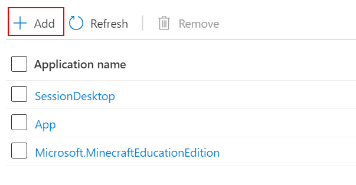
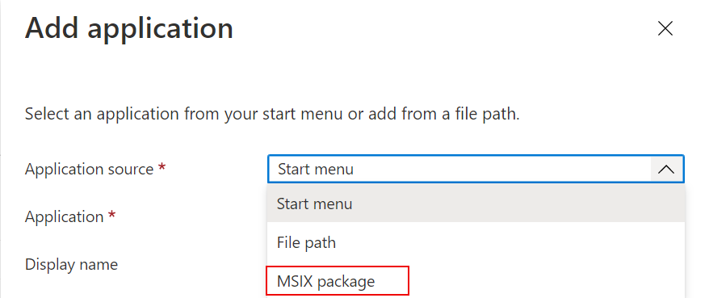

# Set up MSIX app attach with the Azure portal

This article will walk you through how to set up MSIX app attach in a Azure Virtual Desktop environment.

## Requirements

Here's what you need to configure MSIX app attach:

- A functioning Azure Virtual Desktop deployment. To learn how to deploy Azure Virtual Desktop (classic), see [Create a tenant in Azure Virtual Desktop](./virtual-desktop-fall-2019/tenant-setup-azure-active-directory.md). To learn how to deploy Azure Virtual Desktop with Azure Resource Manager integration, see [Create a host pool with the Azure portal](./create-host-pools-azure-marketplace.md).
- A Azure Virtual Desktop host pool with at least one active session host.
- The MSIX packaging tool.
- An MSIX-packaged application expanded into an MSIX image that's uploaded into a file share.
- A file share in your Azure Virtual Desktop deployment where the MSIX package will be stored.
- The file share where you uploaded the MSIX image must also be accessible to all virtual machines (VMs) in the host pool. Users will need read-only permissions to access the image.
- If the certificate isn't publicly trusted, follow the instructions in [Install certificates](app-attach.md#install-certificates).

## Turn off automatic updates for MSIX app attach applications

Before you get started, you must disable automatic updates for MSIX app attach applications. To disable automatic updates, you'll need to run the following commands in an elevated command prompt:

```cmd
rem Disable Store auto update:

reg add HKLM\Software\Policies\Microsoft\WindowsStore /v AutoDownload /t REG_DWORD /d 0 /f
Schtasks /Change /Tn "\Microsoft\Windows\WindowsUpdate\Automatic app update" /Disable
Schtasks /Change /Tn "\Microsoft\Windows\WindowsUpdate\Scheduled Start" /Disable

rem Disable Content Delivery auto download apps that they want to promote to users:

reg add HKCU\Software\Microsoft\Windows\CurrentVersion\ContentDeliveryManager /v PreInstalledAppsEnabled /t REG_DWORD /d 0 /f

reg add HKLM\SOFTWARE\Microsoft\Windows\CurrentVersion\ContentDeliveryManager\Debug /v ContentDeliveryAllowedOverride /t REG_DWORD /d 0x2 /f

```

## Configure the MSIX app attach management interface

Next, you'll need to download and configure the the MSIX app attach management interface for the Azure portal.

To set up the management interface:

1. [Open the Azure portal](https://portal.azure.com).
2. If you get a prompt asking if you consider the extension trustworthy, select **Allow**.

      > [!div class="mx-imgBorder"]
      > 


## Add an MSIX image to the host pool

Next you'll need to add the MSIX image to your host pool.

To add the MSIX image:

1. Open the Azure portal.

2. Enter **Azure Virtual Desktop** into the search bar, then select the service name.

3. Select the host pool where you plan to put the MSIX apps.

4. Select **MSIX packages** to open the data grid with all **MSIX packages** currently added to the
host pool.

5. Select **+ Add** to open the **Add MSIX package** tab.

6. In the **Add MSIX package** tab, enter the following values:

      - For **MSIX image path**, enter a valid UNC path pointing to the MSIX image on the file share. (For example, `\\storageaccount.file.core.windows.net\msixshare\appfolder\MSIXimage.vhd`.) When you're done, select **Add** to interrogate the MSIX container to check if the path is valid.

      - For **MSIX package**, select the relevant MSIX package name from the drop-down menu. This menu will only be populated if you've entered a valid image path in **MSIX image path**.

      - For **Package applications**, make sure the list contains all MSIX applications you want to be available to users in your MSIX package.

      - Optionally, enter a **Display name** if you want your package to have a more user-friendly in your user deployments.

      - Make sure the **Version** has the correct version number.

      - Select the **Registration type** you want to use. Which one you use depends on your needs:

    - **On-demand registration** postpones the full registration of the MSIX application until the user starts the application. This is the registration type we recommend you use.

    - **Log on blocking** only registers while the user is signing in. We don't recommend this type because it can lead to longer sign-in times for users.

7.  For **State**, select your preferred state.
    -  The **Active** status lets users interact with the package.
    -  The **Inactive** status causes Azure Virtual Desktop to ignore the package and not deliver it to users.

8. When you're done, select **Add**.

## Publish MSIX apps to an app group

Next, you'll need to publish the apps into the package. You'll need to do this for both desktop and remote app application groups.

If you already have an MSIX image, skip ahead to [Publish MSIX apps to an app group](#publish-msix-apps-to-an-app-group). If you want to test legacy applications, follow the instructions in [Create an MSIX package from a desktop installer on a VM](/windows/msix/packaging-tool/create-app-package-msi-vm/) to convert the legacy application to an MSIX package.

To publish the apps:

1. In the Azure Virtual Desktop resource provider, select the **Application groups** tab.

2. Select the application group you want to publish the apps to.

   >[!NOTE]
   >MSIX applications can be delivered with MSIX app attach to both remote app and desktop app groups

3. Once you're in the app group, select the **Applications** tab. The **Applications** grid will display all existing apps within the app group.

4. Select **+ Add** to open the **Add application** tab.

      > [!div class="mx-imgBorder"]
      > 

5. For **Application source**, choose the source for your application.
    - If you're using a Desktop app group, choose **MSIX package**.
      
      > [!div class="mx-imgBorder"]
      > 
    
    - If you're using a remote app group, choose one of the following options:
        
        - Start menu
        - App path
        - MSIX package

    - For **Application name**, enter a descriptive name for the application.

    You can also configure the following optional features:
   
    - For **Display name**, enter a new name for the package that your users will see.

    - For **Description**, enter a short description of the app package.

    - If you're using a remote app group, you can also configure these options:

        - **Icon path**
        - **Icon index**
        - **Show in web feed**

6. When you're done, select **Save**.

>[!NOTE]
>When a user is assigned to remote app group and desktop app group from the same host pool the desktop app group will be displayed in the feed.

## Assign a user to an app group

After assigning MSIX apps to an app group, you'll need to grant users access to them. You can assign access by adding users or user groups to an app group with published MSIX applications. Follow the instructions in [Manage app groups with the Azure portal](manage-app-groups.md) to assign your users to an app group.

>[!NOTE]
>MSIX app attach remote apps may disappear from the feed when you test remote apps during public preview. The apps don't appear because the host pool you're using in the evaluation environment is being served by an RD Broker in the production environment. Because the RD Broker in the production environment doesn't register the presence of the MSIX app attach remote apps, the apps won't appear in the feed.

## Change MSIX package state

Next, you'll need to change the MSIX package state to either **Active** or **Inactive**, depending on what you want to do with the package. Active packages are packages your users can interact with once they're published. Inactive packages are ignored by Azure Virtual Desktop, so your users can't interact with the apps inside.

### Change state with the Applications list

To change the package state with the Applications list:

1. Go to your host pool and select **MSIX packages**. You should see a list of all existing MSIX packages within the host pool.

2. Select the MSIX packages whose states you need to change, then select **Change state**.

### Change state with update package

To change the package state with an update package:

1. Go to your host pool and select **MSIX packages**. You should see a list of all existing MSIX packages within the host pool.

2. Select the name of the package whose state you want to change from the MSIX package list. This will open the **Update package** tab.

3. Toggle the **State** switch to either **Inactive** or **Active**, then select **Save.**

## Change MSIX package registration type

To change the package's registration type:

1. Select **MSIX packages**. You should see a list of all existing MSIX packages within the host pool.

2. Select **Package name in** the **MSIX packages grid** this will open the blade to update the package.

3. Toggle the **Registration type** via the **On-demand/Log on blocking** button as desired and select **Save.**

## Remove an MSIX package

To remove an MSIX package from your host pool:

1. Select **MSIX packages**.  You should see a list of all existing MSIX packages within the host pool.

2. Select the ellipsis on the right side the name of the package you want to delete, then select **Remove**.

## Remove MSIX apps

To remove individual MSIX apps from your package:

1. Go to the host pool and select **Application groups**.

2. Select the application group you want to remove MSIX apps from.

3. Open the **Applications** tab.

4. Select the app you want to remove, then select **Remove**.

## Next steps

Ask our community questions about this feature at the [Azure Virtual Desktop TechCommunity](https://techcommunity.microsoft.com/t5/Windows-Virtual-Desktop/bd-p/WindowsVirtualDesktop).

You can also leave feedback for Azure Virtual Desktop at the [Azure Virtual Desktop feedback hub](https://support.microsoft.com/help/4021566/windows-10-send-feedback-to-microsoft-with-feedback-hub-app).

Here are some other articles you might find helpful:

- [MSIX app attach glossary](app-attach-glossary.md)
- [MSIX app attach FAQ](app-attach-faq.md)
